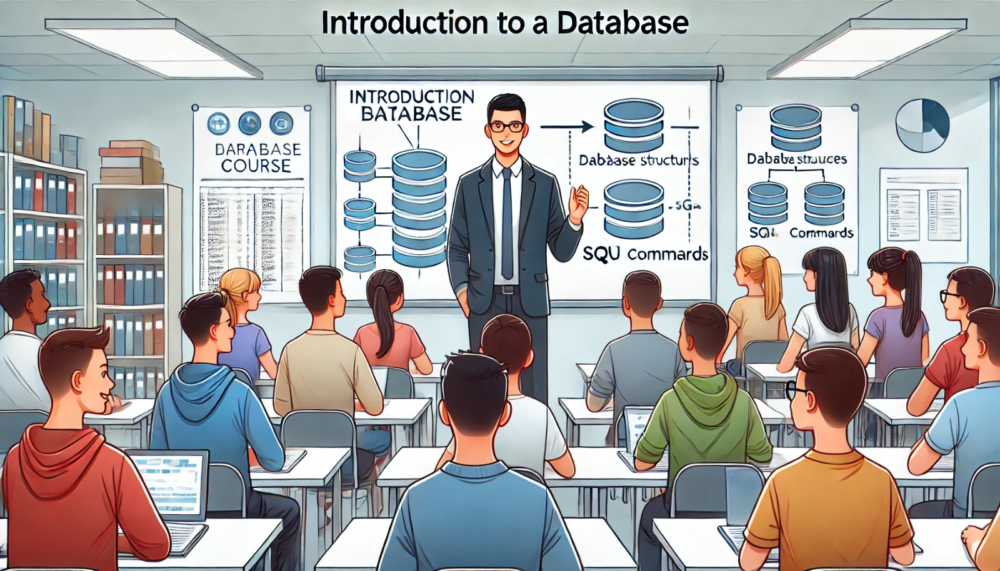

### Aula 1: Introdução ao Curso e Objetivos

**Bem-vindos ao Curso de Bancos de Dados II!**

Nesta primeira aula, vamos explorar o que esperar do curso, os objetivos que desejamos alcançar e como essas habilidades se aplicam no mundo real. Este curso é essencial para quem busca se aprofundar em como os sistemas de gerenciamento de banco de dados (SGBDs) funcionam e como podemos utilizá-los de forma eficaz e segura.

#### O que são Bancos de Dados?

Antes de mais nada, vamos entender o básico: um banco de dados é simplesmente uma coleção organizada de dados. Estes dados são normalmente organizados de forma a facilitar o acesso, a gestão e a atualização. No contexto de empresas e organizações, os bancos de dados são cruciais para armazenar informações desde dados de clientes até inventários de produtos.

#### O que são Sistemas de Gerenciamento de Banco de Dados (SGBDs)?

Um Sistema de Gerenciamento de Banco de Dados é um software que ajuda a criar, manter e manipular um banco de dados. É o que torna possível realizar operações como adicionar, alterar ou procurar dados de maneira eficiente. Exemplos populares incluem PostgreSQL, MySQL e Oracle.

#### Objetivos do Curso

Durante este curso, vocês aprenderão a:

1. **Elaborar e Gerenciar Bancos de Dados:**
   - Como estruturar um banco de dados de forma lógica.
   - Como gerenciar o acesso e a integridade dos dados.

2. **Otimizar e Garantir a Segurança dos SGBDs:**
   - Técnicas para aumentar a eficiência das consultas.
   - Estratégias para garantir que os dados estejam seguros e possam ser recuperados em caso de falha.

3. **Usar Linguagens de Banco de Dados:**
   - Aprendizado profundo sobre SQL, a linguagem padrão para gerenciamento de banco de dados.
   - Comandos para definição, manipulação, controle e consulta de dados.

4. **Aplicar Conhecimentos em Situações Reais:**
   - Usaremos casos práticos para entender como tudo isso se aplica no dia a dia de um profissional da área.

#### Metodologia de Ensino

Neste curso, cada conceito será introduzido teoricamente e, em seguida, praticado por meio de exercícios em classe. Haverá uma combinação de leituras, discussões em grupo e tarefas individuais. No final do curso, vocês participarão de um projeto prático que consolidará todos os conceitos aprendidos.

#### Por Que Este Curso é Importante?

Com a crescente quantidade de dados gerados diariamente e a necessidade de sistemas de informação eficientes, os profissionais capacitados em bancos de dados estão em alta demanda. As habilidades que vocês desenvolverão aqui são essenciais para carreiras em tecnologia da informação, análise de dados, desenvolvimento de software e muitas outras áreas.

---

**Próximos Passos:**
Preparem-se para embarcar em uma jornada detalhada e prática no mundo dos bancos de dados. Certifiquem-se de revisar os conceitos básicos de bancos de dados e SQL antes da próxima aula, onde começaremos a explorar o projeto lógico de banco de dados.

**Até lá, bem-vindos e boa sorte a todos!**