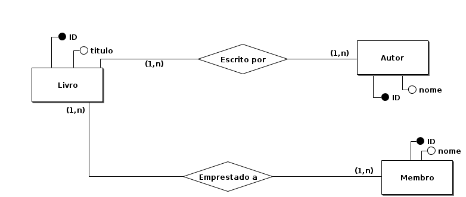
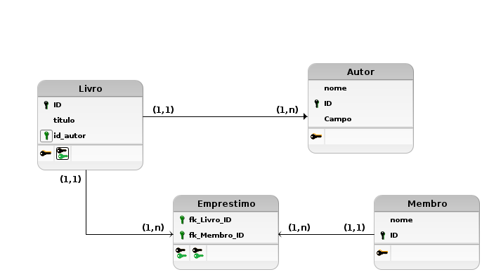

### Aula 2: Modelo Conceitual e Lógico de Banco de Dados

**Bem-vindos de volta!**

Hoje, vamos mergulhar nos fundamentos dos modelos conceitual e lógico de banco de dados e praticar com a ferramenta gráfica BRModelo. Esses modelos são essenciais para entender como os dados são estruturados antes de serem implementados em um sistema de gerenciamento de banco de dados (SGBD).

#### O que é um Modelo Conceitual?

O modelo conceitual é o primeiro passo no design de um banco de dados. Ele é uma representação visual de alto nível das informações que queremos armazenar. Neste modelo, não nos preocupamos com detalhes técnicos; em vez disso, focamos em identificar quais são os dados e como eles se relacionam entre si. É como desenhar um mapa do que é importante para o nosso sistema.

**Exemplo:**
Suponha que você esteja criando um banco de dados para uma escola. No modelo conceitual, você identifica elementos como 'Aluno', 'Professor' e 'Turma'. Você também define como eles se relacionam, por exemplo, cada aluno está matriculado em uma ou mais turmas, e cada turma tem um professor.

#### O que é um Modelo Lógico?

Após termos o modelo conceitual, passamos para o modelo lógico. Este modelo é mais detalhado e técnico. Aqui, definimos exatamente como os dados serão armazenados em tabelas, quais serão os campos (colunas) de cada tabela e como as tabelas se relacionam através de chaves primárias e estrangeiras.

**Exemplo:**
Continuando com o exemplo da escola:
- **Tabela Aluno:** pode ter campos como 'ID do Aluno', 'Nome', 'Data de Nascimento'.
- **Tabela Professor:** campos como 'ID do Professor', 'Nome', 'Disciplina'.
- **Tabela Turma:** 'ID da Turma', 'Nome da Turma', 'ID do Professor' (chave estrangeira que liga 'Turma' a 'Professor').

#### Importância dos Modelos

1. **Comunicação e Planejamento:** Esses modelos ajudam a equipe de desenvolvimento a se comunicar e planejar o banco de dados de forma clara.
2. **Estruturação dos Dados:** Eles garantem que todos os dados necessários sejam capturados e corretamente organizados.
3. **Facilidade de Implementação:** Com um bom planejamento, a implementação do banco de dados se torna mais direta e menos suscetível a erros.

#### Atividades Práticas

**Preparação: Instalação do BRModelo**

1. **Baixar e Instalar o BRModelo:**
   - Acesse o site oficial do BRModelo: [BRModelo](http://www.sis4.com/brModelo/index.html).
   - Baixe a versão apropriada para o seu sistema operacional.
   - Certifique-se de ter o Java 8 ou o OpenJDK 8 instalado. Se necessário, baixe e instale:
     - **Java 8:** [Download Java 8](https://www.oracle.com/java/technologies/javase-jdk8-downloads.html)
     - **OpenJDK 8:** [Download OpenJDK 8](https://openjdk.java.net/install/)

2. **Iniciar o BRModelo:**
   - Após a instalação, abra o BRModelo. Ele já começará com uma janela de diagrama conceitual aberta.

**Exercício 1: Desenvolver um Modelo Conceitual para uma Biblioteca**

1. **Adicionar Entidades:**
   - Na janela de diagrama conceitual, clique no ícone de "Entidade" para adicionar as entidades "Livro", "Autor" e "Membro" ao seu diagrama.
   - Clique na área de trabalho para posicionar cada entidade.

2. **Nomear Entidades:**
   - Clique duas vezes em cada entidade para abrir as propriedades e nomeie-as conforme necessário.

3. **Adicionar Atributos:**
   - Clique no ícone de "Atributo" e adicione atributos às suas entidades, como "Título" para "Livro", "Nome" para "Autor", etc.
   - Clique na entidade desejada para adicionar o atributo.

4. **Definir Relacionamentos:**
   - Clique no ícone de "Relacionamento" para conectar as entidades, definindo os relacionamentos como "1:N" (um para muitos) entre "Autor" e "Livro" e "N:M" (muitos para muitos) entre "Livro" e "Membro".
   - Clique nas entidades para criar os relacionamentos.

**Exemplo de Diagrama Conceitual:**

**Exercício 2: Converter o Modelo Conceitual em um Modelo Lógico**

1. **Adicionar Chaves Primárias:**
   - Para cada entidade, adicione um atributo que funcionará como chave primária (Primary Key), como "ID do Livro" para "Livro", "ID do Autor" para "Autor" e "ID do Membro" para "Membro".
   - Clique duas vezes no atributo para definir suas propriedades e marque como chave primária (PK).

2. **Adicionar Chaves Estrangeiras:**
   - Defina os relacionamentos usando chaves estrangeiras (Foreign Keys), como "ID do Autor" em "Livro" e "ID do Livro" e "ID do Membro" na tabela de relacionamento "Empréstimo".
   - Use a ferramenta de relacionamento para conectar essas chaves estrangeiras.

3. **Detalhamento dos Atributos:**
   - Adicione mais detalhes aos atributos, como tipo de dado (texto, número, etc.) e restrições (não nulo, único, etc.).
   - Clique duas vezes em cada atributo para definir suas propriedades detalhadas.

**Exemplo de Diagrama Lógico:**

#### Conclusão

Com a ferramenta BRModelo, você pode facilmente criar modelos conceituais e lógicos de banco de dados. Esses diagramas ajudam a visualizar e planejar a estrutura do banco de dados antes de implementá-lo, garantindo uma organização eficiente e uma implementação mais tranquila.

**Atividade para os Alunos:**
1. **Criar um Modelo Conceitual:**
   - Escolham um tema para o banco de dados (como uma biblioteca, uma loja online, um sistema escolar) e criem um modelo conceitual usando o BRModelo.
   
2. **Converter para Modelo Lógico:**
   - Convertam o modelo conceitual para um modelo lógico, definindo chaves primárias, chaves estrangeiras e detalhando os atributos.

3. **Apresentação e Discussão:**
   - Apresentem seus diagramas à turma e discutam as decisões de design e possíveis melhorias.

Esta prática proporcionará uma compreensão sólida dos conceitos e a aplicação prática necessária para projetar bancos de dados eficientes.