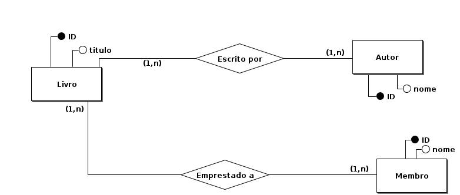

### Aulas 2 e 3: Modelo Conceitual e Lógico de Banco de Dados & Tradução de Modelo Conceitual para Modelo Lógico

**Bem-vindos de volta!**

Hoje, vamos explorar profundamente os fundamentos dos modelos conceitual e lógico de banco de dados, e aprender a traduzir um modelo conceitual para um modelo lógico. Essa aula geminada é essencial para entender como os dados são estruturados e organizados antes de serem implementados em um sistema de gerenciamento de banco de dados (SGBD).

#### O que é um Modelo Conceitual?

O modelo conceitual é o primeiro passo no design de um banco de dados. Ele é uma representação visual de alto nível das informações que queremos armazenar. Neste modelo, não nos preocupamos com detalhes técnicos; em vez disso, focamos em identificar quais são os dados e como eles se relacionam entre si. É como desenhar um mapa do que é importante para o nosso sistema.

**Exemplo:**
Suponha que você esteja criando um banco de dados para uma escola. No modelo conceitual, você identifica elementos como 'Aluno', 'Professor' e 'Turma'. Você também define como eles se relacionam, por exemplo, cada aluno está matriculado em uma ou mais turmas, e cada turma tem um professor.

#### O que é um Modelo Lógico?

Após termos o modelo conceitual, passamos para o modelo lógico. Este modelo é mais detalhado e técnico. Aqui, definimos exatamente como os dados serão armazenados em tabelas, quais serão os campos (colunas) de cada tabela e como as tabelas se relacionam através de chaves primárias e estrangeiras.

**Exemplo:**
Continuando com o exemplo da escola:
- **Tabela Aluno:** pode ter campos como 'ID do Aluno', 'Nome', 'Data de Nascimento'.
- **Tabela Professor:** campos como 'ID do Professor', 'Nome', 'Disciplina'.
- **Tabela Turma:** 'ID da Turma', 'Nome da Turma', 'ID do Professor' (chave estrangeira que liga 'Turma' a 'Professor').

#### Passos para Traduzir um Modelo Conceitual para um Modelo Lógico

Vamos usar um exemplo simples de uma biblioteca para ilustrar esse processo.

**Modelo Conceitual:**

Entidades e Relacionamentos:
- **Livro**: Título
- **Autor**: Nome
- **Membro**: Nome
- Relacionamentos:
  - Um autor escreve muitos livros (1:N)
  - Um livro pode ser emprestado a muitos membros e um membro pode pegar muitos livros emprestados (N:M)

**Passo 1: Identificar Entidades e Atributos**

Primeiro, listamos todas as entidades e seus atributos:
- Livro: Título
- Autor: Nome
- Membro: Nome

**Passo 2: Adicionar Chaves Primárias**

Cada entidade precisa de uma chave primária, que é um identificador único para cada registro:
- Livro: ID do Livro (PK), Título
- Autor: ID do Autor (PK), Nome
- Membro: ID do Membro (PK), Nome

**Passo 3: Definir Relacionamentos com Chaves Estrangeiras**

Em seguida, adicionamos as chaves estrangeiras para definir os relacionamentos:
- Um autor pode escrever muitos livros:
  - Na tabela "Livro", adicionamos "ID do Autor" como chave estrangeira (FK).
- Um livro pode ser emprestado a muitos membros e um membro pode pegar muitos livros emprestados:
  - Criamos uma tabela intermediária chamada "Empréstimo" para gerenciar esse relacionamento N:M.
  - A tabela "Empréstimo" terá "ID do Livro" e "ID do Membro" como chaves estrangeiras (FKs).

#### Atividades Práticas

**Preparação: Instalação do BRModelo**

1. **Baixar e Instalar o BRModelo:**
   - http://www.sis4.com/brModelo/index.html
   - Baixe a versão apropriada para o seu sistema operacional.
   - Certifique-se de ter o Java 8 ou o OpenJDK 8 instalado. Se necessário, baixe e instale:
   - https://www.oracle.com/java/technologies/javase-jdk8-downloads.html
   - https://openjdk.java.net/install/

2. **Iniciar o BRModelo:**
   - Após a instalação, abra o BRModelo. Ele já começará com uma janela de diagrama conceitual aberta.

**Exercício 1: Desenvolver um Modelo Conceitual para uma Biblioteca**

1. **Adicionar Entidades:**
   - Na janela de diagrama conceitual, clique no ícone de "Entidade" para adicionar as entidades "Livro", "Autor" e "Membro" ao seu diagrama.
   - Clique na área de trabalho para posicionar cada entidade.

2. **Nomear Entidades:**
   - Clique duas vezes em cada entidade para abrir as propriedades e nomeie-as conforme necessário.

3. **Adicionar Atributos:**
   - Clique no ícone de "Atributo" e adicione atributos às suas entidades, como "Título" para "Livro", "Nome" para "Autor", etc.
   - Clique na entidade desejada para adicionar o atributo.

4. **Definir Relacionamentos:**
   - Clique no ícone de "Relacionamento" para conectar as entidades, definindo os relacionamentos como "1:N" (um para muitos) entre "Autor" e "Livro" e "N:M" (muitos para muitos) entre "Livro" e "Membro".
   - Clique nas entidades para criar os relacionamentos.

**Exemplo de Diagrama Conceitual:**

**Exercício 2: Converter o Modelo Conceitual em um Modelo Lógico**

1. **Adicionar Chaves Primárias:**
   - Para cada entidade, adicione um atributo que funcionará como chave primária (Primary Key), como "ID do Livro" para "Livro", "ID do Autor" para "Autor" e "ID do Membro" para "Membro".
   - Clique duas vezes no atributo para definir suas propriedades e marque como chave primária (PK).

2. **Adicionar Chaves Estrangeiras:**
   - Defina os relacionamentos usando chaves estrangeiras (Foreign Keys), como "ID do Autor" em "Livro" e "ID do Livro" e "ID do Membro" na tabela de relacionamento "Empréstimo".
   - Use a ferramenta de relacionamento para conectar essas chaves estrangeiras.

3. **Detalhamento dos Atributos:**
   - Adicione mais detalhes aos atributos, como tipo de dado (texto, número, etc.) e restrições (não nulo, único, etc.).
   - Clique duas vezes em cada atributo para definir suas propriedades detalhadas.

**Exemplo de Diagrama Lógico:**

#### Conclusão

Traduzir um modelo conceitual para um modelo lógico é um passo fundamental no design de banco de dados. Essa tradução ajuda a definir claramente como os dados serão armazenados e relacionados, facilitando a implementação prática no SGBD.

**Atividade para os Alunos:**
1. **Criar um Modelo Conceitual:**
   - Escolham um tema para o banco de dados (como uma loja online, um sistema de reservas de hotel) e criem um modelo conceitual usando o BRModelo.
   
2. **Converter para Modelo Lógico:**
   - Convertam o modelo conceitual para um modelo lógico, definindo chaves primárias, chaves estrangeiras e detalhando os atributos.

3. **Apresentação e Discussão:**
   - Apresentem seus modelos lógicos à turma e discutam as decisões de design e possíveis melhorias.

Esta prática proporcionará uma compreensão sólida dos conceitos e a aplicação prática necessária para projetar bancos de dados eficientes.