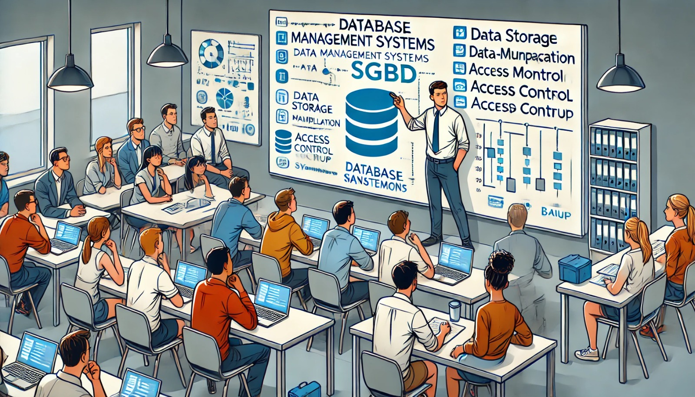

### Aula 10: Conceito e Instalação de SGBDs

Nesta aula, vamos aprender sobre o conceito de SGBD (Sistema de Gerenciamento de Banco de Dados) e a importância de instalar um SGBD em seu sistema. Esses sistemas são fundamentais para armazenar, organizar e gerenciar os dados de forma eficiente.

#### O que é um SGBD?

Um **SGBD** (Sistema de Gerenciamento de Banco de Dados) é um software que permite criar, gerenciar e manipular bancos de dados. Ele fornece uma interface para que usuários e aplicativos possam interagir com os dados de maneira organizada e segura.

**Exemplos de SGBDs Populares:**
- **PostgreSQL:** Um SGBD poderoso e de código aberto, usado em aplicações que precisam de alta performance e robustez.
- **MySQL:** Muito popular em aplicações web, como blogs e lojas online.
- **SQL Server:** Um SGBD da Microsoft, amplamente utilizado em empresas.
- **Oracle Database:** Um dos SGBDs mais poderosos e usados em grandes corporações.

#### Funções Principais de um SGBD

Um SGBD tem várias funções essenciais que ajudam a gerenciar e proteger os dados. Algumas delas incluem:

1. **Armazenamento de Dados:**
   - O SGBD armazena os dados em tabelas, que podem ser organizadas e relacionadas para facilitar o acesso.

2. **Manipulação de Dados:**
   - Permite a inserção, atualização, exclusão e consulta de dados através de comandos SQL (Structured Query Language).

3. **Controle de Acesso:**
   - O SGBD garante que apenas pessoas autorizadas possam acessar ou modificar os dados, proporcionando segurança.

4. **Backup e Recuperação:**
   - O SGBD facilita a criação de backups e a recuperação de dados, garantindo que informações importantes não sejam perdidas.

5. **Integridade dos Dados:**
   - Mantém os dados consistentes e corretos, mesmo quando há múltiplos usuários acessando o banco de dados ao mesmo tempo.

#### Por que Instalar um SGBD?

Instalar um SGBD em seu sistema permite que você crie e gerencie bancos de dados locais, teste aplicativos, e armazene dados de maneira organizada e segura. Ter um SGBD instalado é essencial para desenvolver aplicações que precisam de um banco de dados robusto e confiável.

#### Como os SGBDs Facilitam o Trabalho

1. **Organização dos Dados:**
   - Os SGBDs permitem que você organize grandes volumes de dados em tabelas e bancos de dados, facilitando o acesso e a análise das informações.

2. **Automação de Tarefas:**
   - Com um SGBD, você pode automatizar tarefas como backups regulares e manutenção do banco de dados, reduzindo o risco de perda de dados.

3. **Suporte a Vários Usuários:**
   - SGBDs são projetados para suportar múltiplos usuários ao mesmo tempo, garantindo que todos possam acessar e trabalhar com os dados simultaneamente, sem conflitos.

4. **Segurança:**
   - Os SGBDs oferecem recursos avançados de segurança, como controle de acesso baseado em funções, criptografia de dados e auditoria de atividades.

#### Exercício Prático: Compreendendo o Conceito de SGBD

Vamos praticar o que aprendemos sobre SGBDs com algumas perguntas.

**Questões de Múltipla Escolha**

1. **O que é um SGBD?**
   - a) Um tipo de hardware
   - b) Um software para gerenciar e manipular bancos de dados
   - c) Um sistema de segurança de dados
   - d) Um tipo de banco de dados

2. **Qual das seguintes funções é desempenhada por um SGBD?**
   - a) Armazenamento de dados
   - b) Controle de acesso
   - c) Backup e recuperação
   - d) Todas as anteriores

3. **Qual é a principal vantagem de usar um SGBD?**
   - a) Facilitar a organização e manipulação de grandes volumes de dados
   - b) Substituir a necessidade de sistemas operacionais
   - c) Aumentar o espaço de armazenamento físico
   - d) Eliminar a necessidade de senhas e segurança

4. **Por que é importante instalar um SGBD?**
   - a) Para criar e gerenciar bancos de dados locais
   - b) Para deletar todos os dados de um sistema
   - c) Para substituir sistemas operacionais
   - d) Para acessar a internet

**Respostas:**
1. b) Um software para gerenciar e manipular bancos de dados
2. d) Todas as anteriores
3. a) Facilitar a organização e manipulação de grandes volumes de dados
4. a) Para criar e gerenciar bancos de dados locais
