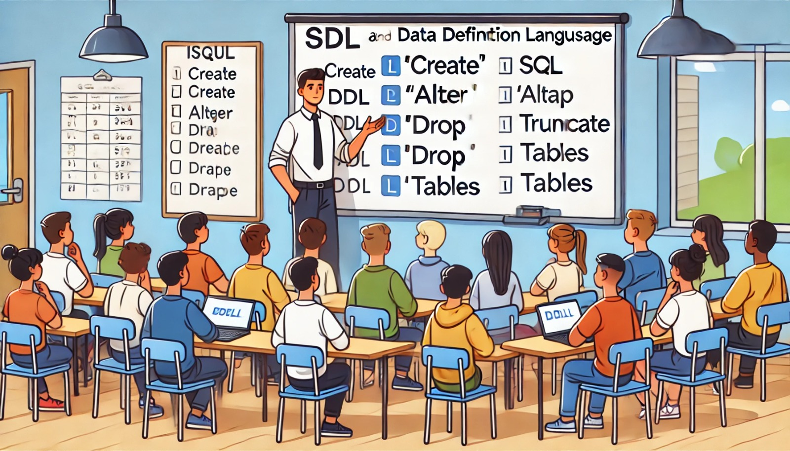

### Aula 13: Introdução à Linguagem SQL e DDL

**Bem-vindos de volta!**

Hoje, vamos começar a explorar a linguagem SQL, que é a base de todo o trabalho com bancos de dados. Especificamente, vamos nos concentrar em uma parte importante do SQL chamada **DDL (Data Definition Language)**, ou Linguagem de Definição de Dados.

#### O que é SQL?

SQL, que significa **Structured Query Language** (Linguagem de Consulta Estruturada), é a linguagem usada para comunicar-se com bancos de dados. Com SQL, você pode realizar várias tarefas, como inserir, atualizar, excluir e consultar dados. Além disso, SQL permite criar e modificar a estrutura do banco de dados.

#### O que é DDL?

DDL, ou **Linguagem de Definição de Dados**, é uma parte do SQL usada para definir e modificar a estrutura do banco de dados. Com DDL, você pode criar, alterar e excluir tabelas, além de definir restrições, como chaves primárias e estrangeiras.

##### Principais Comandos DDL

Aqui estão os principais comandos DDL que você usará para trabalhar com a estrutura do banco de dados:

1. **CREATE:** O comando `CREATE` é usado para criar novos objetos no banco de dados, como tabelas, índices, ou bancos de dados inteiros.

   **Exemplo:** Criando uma tabela chamada "Alunos":
   ```sql
   CREATE TABLE Alunos (
       ID_Aluno SERIAL PRIMARY KEY,
       Nome VARCHAR(100),
       Data_Nascimento DATE,
       Turma VARCHAR(10)
   );
   ```

2. **ALTER:** O comando `ALTER` é usado para modificar a estrutura de uma tabela existente. Você pode adicionar, alterar ou excluir colunas, ou modificar restrições.

   **Exemplo:** Adicionando uma nova coluna chamada "Email" na tabela "Alunos":
   ```sql
   ALTER TABLE Alunos
   ADD Email VARCHAR(100);
   ```

3. **DROP:** O comando `DROP` é usado para excluir objetos do banco de dados, como tabelas, índices ou bancos de dados inteiros.

   **Exemplo:** Excluindo a tabela "Alunos":
   ```sql
   DROP TABLE Alunos;
   ```

4. **TRUNCATE:** O comando `TRUNCATE` é usado para remover todos os registros de uma tabela, mas mantendo a estrutura da tabela intacta. É uma maneira rápida de limpar uma tabela sem excluí-la.

   **Exemplo:** Limpando todos os dados da tabela "Alunos":
   ```sql
   TRUNCATE TABLE Alunos;
   ```

#### Como Usar DDL na Prática

Quando você começa a trabalhar com um banco de dados, os primeiros passos geralmente envolvem a definição da estrutura das tabelas. Por exemplo, se você está criando um sistema de gerenciamento de alunos, a primeira coisa a fazer é definir as tabelas para armazenar os dados dos alunos, professores, turmas, etc.

- **Criar tabelas** permite que você defina como os dados serão armazenados.
- **Alterar tabelas** ajuda a ajustar a estrutura à medida que as necessidades mudam.
- **Excluir tabelas** e outros objetos é útil para limpar o banco de dados de itens que não são mais necessários.

#### Exercício Prático: Comandos DDL

Vamos praticar o que aprendemos sobre DDL com algumas perguntas.

**Questões de Múltipla Escolha**

1. **Qual comando DDL é usado para criar uma nova tabela no banco de dados?**
   - a) ALTER
   - b) CREATE
   - c) DROP
   - d) INSERT

2. **O que o comando ALTER permite que você faça em uma tabela existente?**
   - a) Consultar dados na tabela
   - b) Adicionar, modificar ou excluir colunas
   - c) Inserir novos registros na tabela
   - d) Excluir a tabela inteira

3. **Qual comando é usado para excluir permanentemente uma tabela do banco de dados?**
   - a) DELETE
   - b) TRUNCATE
   - c) ALTER
   - d) DROP

4. **Qual comando DDL pode ser usado para limpar todos os dados de uma tabela, mantendo a estrutura da tabela?**
   - a) DELETE
   - b) TRUNCATE
   - c) ALTER
   - d) DROP

**Respostas:**
1. b) CREATE
2. b) Adicionar, modificar ou excluir colunas
3. d) DROP
4. b) TRUNCATE

#### Conclusão

Aprender SQL e DDL é o primeiro passo para trabalhar de forma eficaz com bancos de dados. Com esses comandos, você pode definir e organizar a estrutura dos dados, garantindo que o banco de dados atenda às necessidades da aplicação. Na próxima aula, exploraremos outras partes do SQL, como inserir e consultar dados, mas por agora, pratique o uso de DDL para se familiarizar com a criação e modificação de tabelas.