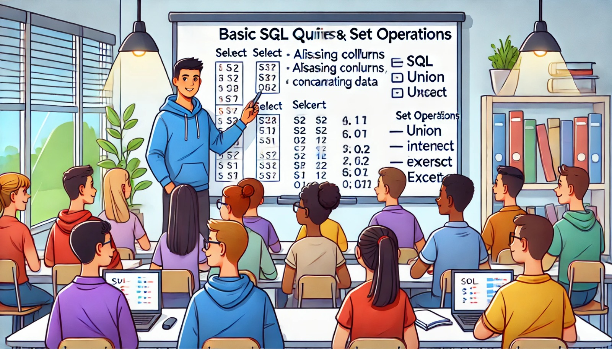

### Aula 18: Consultas Básicas e Operações de Conjunto

**Bem-vindos de volta!**

Hoje, vamos continuar aprendendo sobre consultas SQL, focando em consultas básicas e operações de conjunto. Essas operações permitem combinar e manipular dados de diferentes maneiras, ajudando você a obter exatamente as informações que precisa de um banco de dados.

#### Consultas Básicas

As consultas básicas em SQL envolvem o uso do comando **SELECT** para buscar e visualizar dados de uma tabela. Já vimos como selecionar colunas específicas, aplicar filtros e ordenar resultados. Agora, vamos explorar mais algumas maneiras de refinar essas consultas.

**Selecionando Dados com Alias**

Você pode usar alias para dar nomes temporários a colunas ou tabelas, tornando suas consultas mais legíveis.

**Exemplo:**

```sql
SELECT Nome AS Aluno, Turma AS Classe
FROM Alunos;
```

- **AS Aluno** e **AS Classe**: Aqui, estamos renomeando as colunas `Nome` e `Turma` como `Aluno` e `Classe` temporariamente na consulta.

**Concatenando Colunas**

Você pode combinar dados de duas ou mais colunas em uma única coluna usando o operador `||` (concatenar).

**Exemplo:**

```sql
SELECT Nome || ' - ' || Turma AS Aluno_Turma
FROM Alunos;
```

- Isso cria uma nova coluna `Aluno_Turma` que combina o nome do aluno e a turma, separando-os por um traço.

#### Operações de Conjunto

As operações de conjunto em SQL permitem combinar os resultados de duas ou mais consultas. As três operações principais que vamos aprender hoje são **UNION**, **INTERSECT** e **EXCEPT**.

1. **UNION**: Combina os resultados de duas consultas, eliminando duplicatas.

**Exemplo:**

```sql
SELECT Nome FROM Alunos
UNION
SELECT Nome FROM Professores;
```

- Isso retorna uma lista de todos os nomes únicos presentes nas tabelas `Alunos` e `Professores`.

2. **INTERSECT**: Retorna os resultados que aparecem em ambas as consultas.

**Exemplo:**

```sql
SELECT Nome FROM Alunos
INTERSECT
SELECT Nome FROM Professores;
```

- Isso retorna os nomes que estão presentes tanto na tabela `Alunos` quanto na tabela `Professores`.

3. **EXCEPT**: Retorna os resultados que aparecem na primeira consulta, mas não na segunda.

**Exemplo:**

```sql
SELECT Nome FROM Alunos
EXCEPT
SELECT Nome FROM Professores;
```

- Isso retorna os nomes que estão na tabela `Alunos`, mas não na tabela `Professores`.

#### Resumo

- **Consultas Básicas**: Usamos SELECT para buscar dados, e podemos usar alias para renomear colunas e concatenar para combinar valores.
- **Operações de Conjunto**:
  - **UNION**: Combina resultados de duas consultas, removendo duplicatas.
  - **INTERSECT**: Retorna apenas os resultados comuns a ambas as consultas.
  - **EXCEPT**: Retorna resultados que estão na primeira consulta, mas não na segunda.

#### Exercícios Práticos

Vamos praticar o que aprendemos com algumas perguntas de múltipla escolha.

1. **Qual comando SQL é usado para combinar os resultados de duas consultas, removendo duplicatas?**
   - a) INTERSECT
   - b) UNION
   - c) EXCEPT
   - d) SELECT

2. **O que o comando INTERSECT faz?**
   - a) Combina todos os resultados de duas consultas
   - b) Retorna resultados que estão apenas na primeira consulta
   - c) Retorna resultados que estão nas duas consultas
   - d) Exclui resultados duplicados

3. **Qual comando SQL é usado para retornar os resultados da primeira consulta que não aparecem na segunda?**
   - a) INTERSECT
   - b) UNION
   - c) EXCEPT
   - d) SELECT

4. **Como você renomearia a coluna 'Nome' como 'Aluno' em uma consulta SQL?**
   - a) SELECT Nome AS Aluno
   - b) SELECT Nome RENAME Aluno
   - c) SELECT Aluno FROM Nome
   - d) SELECT Nome || Aluno

**Respostas:**
1. b) UNION
2. c) Retorna resultados que estão nas duas consultas
3. c) EXCEPT
4. a) SELECT Nome AS Aluno

#### Conclusão

Com as consultas básicas e as operações de conjunto, você pode combinar e manipular dados de várias tabelas para obter informações mais precisas e detalhadas. Esses conceitos são fundamentais para realizar análises complexas e trabalhar de forma eficaz com bancos de dados.