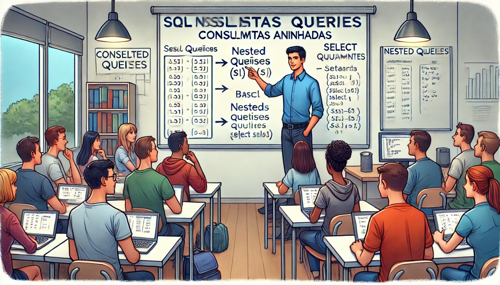

### Aula 20: Consultas Aninhadas

**Bem-vindos de volta!**

Hoje, vamos aprender sobre **consultas aninhadas** em SQL, também conhecidas como **subconsultas**. As consultas aninhadas permitem fazer consultas dentro de outras consultas, oferecendo uma maneira mais poderosa e flexível de buscar dados.

#### O que é uma Consulta Aninhada?

Uma **consulta aninhada** é uma consulta SQL que está dentro de outra consulta SQL. A subconsulta (consulta interna) é executada primeiro, e o resultado dela é usado pela consulta externa. Isso é útil quando você quer buscar dados com base em resultados de outra consulta.

**Exemplo básico:**

```sql
SELECT Nome
FROM Alunos
WHERE ID_Aluno IN (SELECT ID_Aluno FROM Matrículas WHERE Turma = '5A');
```

- A consulta interna (subconsulta) encontra todos os `ID_Aluno` da tabela `Matrículas` que pertencem à turma `5A`.
- A consulta externa usa esses IDs para buscar os nomes dos alunos na tabela `Alunos`.

#### Tipos de Consultas Aninhadas

Existem dois principais tipos de consultas aninhadas:

1. **Consultas em Operações de Comparação:**
   - A subconsulta retorna um único valor que é comparado com o valor da consulta externa.

**Exemplo:**

```sql
SELECT Nome, Valor
FROM Vendas
WHERE Valor > (SELECT AVG(Valor) FROM Vendas);
```

- A subconsulta calcula a média (`AVG`) dos valores na tabela `Vendas`.
- A consulta externa retorna todas as vendas que têm um valor maior que a média.

2. **Consultas com Operadores de Conjunto:**
   - A subconsulta retorna vários valores, que são comparados com os valores da consulta externa.

**Exemplo:**

```sql
SELECT Nome
FROM Alunos
WHERE ID_Aluno IN (SELECT ID_Aluno FROM Matrículas WHERE Turma = '5B');
```

- A subconsulta retorna todos os `ID_Aluno` da turma `5B`.
- A consulta externa usa esses IDs para mostrar os nomes dos alunos dessa turma.

#### Subconsultas no SELECT

As consultas aninhadas podem ser usadas no comando `SELECT` para criar colunas calculadas.

**Exemplo:**

```sql
SELECT Nome, 
       (SELECT AVG(Nota) FROM Notas WHERE Notas.ID_Aluno = Alunos.ID_Aluno) AS Media_Nota
FROM Alunos;
```

- A subconsulta calcula a média das notas para cada aluno, e o resultado aparece como uma nova coluna na consulta externa.

#### Subconsultas com EXISTS

O operador **EXISTS** é usado para verificar se uma subconsulta retorna algum resultado. Ele é útil quando você quer checar a existência de registros.

**Exemplo:**

```sql
SELECT Nome
FROM Alunos
WHERE EXISTS (SELECT 1 FROM Matrículas WHERE Alunos.ID_Aluno = Matrículas.ID_Aluno AND Turma = '5C');
```

- A subconsulta verifica se há algum registro de matrícula na turma `5C` para os alunos. Se existir, o aluno é incluído no resultado.

#### Resumo

- **Consultas aninhadas** permitem usar o resultado de uma consulta dentro de outra.
- Elas podem ser usadas com operadores de comparação, em `SELECT`, ou com `IN` e `EXISTS`.
- São uma forma poderosa de obter dados complexos em várias tabelas ou com cálculos.

#### Exercícios Práticos

Vamos praticar o que aprendemos com algumas perguntas de múltipla escolha.

1. **O que é uma consulta aninhada?**
   - a) Uma consulta que cria uma nova tabela
   - b) Uma consulta SQL dentro de outra consulta
   - c) Uma consulta que altera os dados
   - d) Uma consulta que apaga registros

2. **Qual operador você usaria para comparar o resultado de uma subconsulta com vários valores?**
   - a) EXISTS
   - b) IN
   - c) AVG
   - d) COUNT

3. **O que a função EXISTS faz em uma consulta SQL?**
   - a) Calcula a soma dos valores
   - b) Verifica se a subconsulta retorna algum resultado
   - c) Cria uma nova coluna
   - d) Exclui registros duplicados

4. **Como você calcula a média das notas de cada aluno em uma subconsulta?**
   - a) SELECT AVG(Nota) FROM Notas WHERE ID_Aluno = Alunos.ID_Aluno
   - b) SELECT COUNT(Nota) FROM Notas
   - c) SELECT MAX(Nota) FROM Notas
   - d) SELECT SUM(Nota) FROM Notas

**Respostas:**
1. b) Uma consulta SQL dentro de outra consulta
2. b) IN
3. b) Verifica se a subconsulta retorna algum resultado
4. a) SELECT AVG(Nota) FROM Notas WHERE ID_Aluno = Alunos.ID_Aluno

#### Conclusão

Consultas aninhadas são uma ferramenta poderosa no SQL, permitindo criar consultas mais sofisticadas e flexíveis. Agora que você sabe como utilizá-las, poderá realizar operações complexas e obter informações detalhadas de seus bancos de dados!