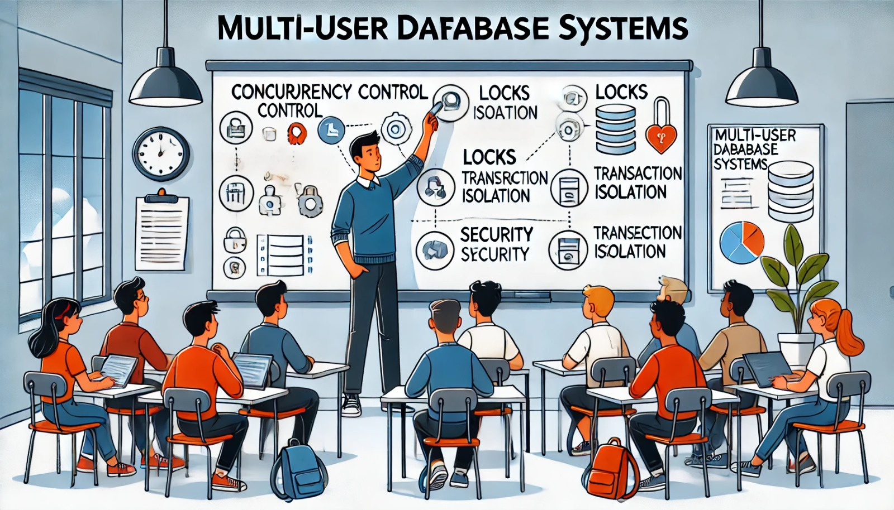

### Aula 22: Características de Sistemas Multiusuário

**Bem-vindos à Aula 22!**

Hoje, vamos aprender sobre os **sistemas multiusuário**. Esses sistemas são muito importantes quando várias pessoas precisam acessar o banco de dados ao mesmo tempo, como em empresas, escolas ou sistemas na internet.

#### O que é um Sistema Multiusuário?

Um **sistema multiusuário** é um sistema de banco de dados que permite que **múltiplos usuários** acessem e manipulem os dados ao mesmo tempo. Isso significa que várias pessoas podem consultar, inserir, atualizar ou excluir dados no banco de dados sem interferir no trabalho umas das outras.

Exemplos de sistemas multiusuário:
- **Redes de bancos**: Muitas agências acessam o mesmo banco de dados ao mesmo tempo.
- **Aplicações web**: Quando várias pessoas fazem login em um site e acessam informações simultaneamente.

#### Características Principais de um Sistema Multiusuário

Os sistemas multiusuário precisam de recursos especiais para garantir que tudo funcione corretamente. Vamos ver algumas das principais características:

1. **Controle de Concorrência**
   - Quando vários usuários tentam acessar e modificar os mesmos dados ao mesmo tempo, pode haver conflitos. O **controle de concorrência** gerencia esses conflitos e garante que os dados não sejam corrompidos.
   - Exemplo: Se dois usuários tentarem atualizar o mesmo registro ao mesmo tempo, o controle de concorrência decide quem atualiza primeiro e bloqueia o outro até que a primeira atualização seja concluída.

2. **Bloqueios (Locks)**
   - Para garantir que os dados sejam manipulados de forma correta, o sistema usa **bloqueios**. Um bloqueio impede que dois usuários façam mudanças no mesmo dado ao mesmo tempo.
   - Exemplo: Quando um usuário está editando um registro, ele "trava" esse registro até que termine, evitando que outra pessoa o altere ao mesmo tempo.

3. **Isolamento de Transações**
   - Cada operação realizada por um usuário é chamada de **transação**. O **isolamento** garante que as transações de diferentes usuários não interfiram umas nas outras.
   - Exemplo: Quando um usuário está inserindo novos dados, outros usuários não verão essas mudanças até que a transação seja finalizada e confirmada.

4. **Segurança**
   - Sistemas multiusuário oferecem um controle rígido de **acesso e permissões**. Isso significa que cada usuário tem um nível de acesso diferente, dependendo de suas funções.
   - Exemplo: Um administrador pode ter acesso total ao banco de dados, enquanto um funcionário pode apenas consultar os dados, sem permissão para fazer alterações.

5. **Desempenho**
   - Um sistema multiusuário deve garantir que o desempenho seja bom, mesmo quando muitos usuários estão acessando o banco de dados ao mesmo tempo.
   - Isso é feito por meio de otimizações no banco de dados, como **indexação** e **técnicas de tuning**.

#### Resumo das Características

- **Controle de Concorrência**: Garante que múltiplos usuários possam acessar o banco de dados simultaneamente sem conflitos.
- **Bloqueios (Locks)**: Impede que dois usuários modifiquem o mesmo dado ao mesmo tempo.
- **Isolamento de Transações**: Garante que cada operação realizada por um usuário seja independente das outras.
- **Segurança**: Controla o que cada usuário pode fazer no banco de dados.
- **Desempenho**: Garante um bom funcionamento, mesmo com muitos acessos simultâneos.

#### Exercícios Práticos

Vamos praticar o que aprendemos com algumas perguntas de múltipla escolha.

1. **O que é o controle de concorrência em um sistema multiusuário?**
   - a) Garante que todos os usuários possam acessar o banco de dados ao mesmo tempo, sem problemas.
   - b) Impede que mais de um usuário use o banco de dados ao mesmo tempo.
   - c) Permite que todos façam mudanças nos mesmos dados simultaneamente.
   - d) Cria novas tabelas para diferentes usuários.

2. **O que são bloqueios (locks) em um banco de dados?**
   - a) Um método de garantir que um usuário não possa acessar o banco de dados.
   - b) Uma forma de evitar que dois usuários modifiquem o mesmo dado ao mesmo tempo.
   - c) Um recurso que cria cópias de dados para cada usuário.
   - d) Um comando para excluir usuários.

3. **O que é o isolamento de transações?**
   - a) Permite que várias transações sejam executadas ao mesmo tempo, sem interferência.
   - b) Garante que todas as transações sejam excluídas após o uso.
   - c) Evita que uma transação afete outras que estão acontecendo ao mesmo tempo.
   - d) Remove todos os registros antigos do banco de dados.

**Respostas:**
1. a) Garante que todos os usuários possam acessar o banco de dados ao mesmo tempo, sem problemas.
2. b) Uma forma de evitar que dois usuários modifiquem o mesmo dado ao mesmo tempo.
3. c) Evita que uma transação afete outras que estão acontecendo ao mesmo tempo.

#### Conclusão

Sistemas multiusuário são essenciais para ambientes onde várias pessoas precisam acessar o banco de dados ao mesmo tempo. Com o controle de concorrência, bloqueios, isolamento de transações e segurança, o banco de dados garante que todos os usuários possam trabalhar de forma segura e eficiente.