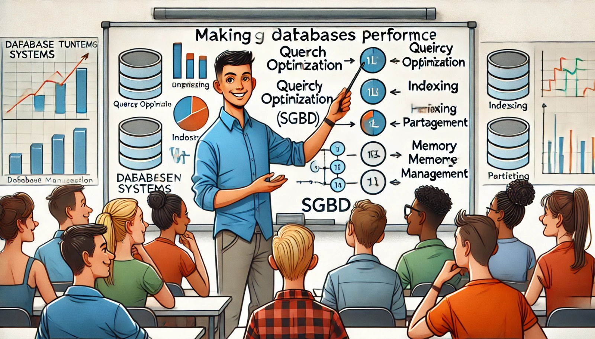

### Aula 25: Conceito de Tuning de SGBD

Hoje, vamos aprender sobre o **tuning de SGBD**, ou seja, o ajuste de desempenho de Sistemas de Gerenciamento de Banco de Dados. Isso é muito importante para garantir que os bancos de dados funcionem de maneira rápida e eficiente, principalmente quando o número de usuários e a quantidade de dados crescem.

---

### O que é Tuning de SGBD?

O **tuning de SGBD** é o processo de ajustar um banco de dados para que ele funcione da melhor forma possível. O objetivo é melhorar a **velocidade**, **eficiência** e **confiabilidade** do banco de dados, sem gastar muitos recursos. Isso é feito otimizando a maneira como o banco de dados lida com consultas e como ele gerencia seus recursos, como a memória e o armazenamento.

---

### Principais Áreas do Tuning de SGBD

Existem várias áreas onde podemos fazer ajustes para melhorar o desempenho de um banco de dados:

1. **Consultas SQL Otimizadas**:
   - Consultas mal escritas podem demorar muito para serem processadas. Otimizar as consultas SQL significa reescrevê-las para que sejam mais rápidas e usem menos recursos.
   - **Exemplo**: Ao buscar informações em uma tabela com milhões de registros, se a consulta estiver mal estruturada, ela pode demorar minutos. Uma consulta otimizada retorna o mesmo resultado em segundos.

2. **Uso de Índices**:
   - Um **índice** é como um índice de um livro: ele ajuda a encontrar informações rapidamente. Quando criamos um índice nas colunas que são frequentemente consultadas, o banco de dados pode encontrar os dados muito mais rápido.
   - **Exemplo**: Se você sempre busca por um número de identificação em uma tabela de clientes, criar um índice sobre essa coluna pode acelerar a consulta.

3. **Gerenciamento de Memória**:
   - O banco de dados usa memória para processar consultas e armazenar dados temporários. Ajustar a quantidade de memória disponível para o banco de dados pode melhorar a rapidez com que ele processa grandes volumes de dados.

4. **Particionamento de Tabelas**:
   - Quando uma tabela é muito grande, podemos **particionar** essa tabela, ou seja, dividi-la em partes menores. Isso facilita o acesso aos dados e melhora o desempenho de consultas que buscam apenas uma parte da tabela.

5. **Monitoramento e Ajustes Contínuos**:
   - O tuning de banco de dados não é algo que fazemos apenas uma vez. Conforme o banco de dados cresce ou muda, precisamos continuar monitorando seu desempenho e ajustando conforme necessário.

---

### Benefícios do Tuning de SGBD

- **Melhor Desempenho**: Consultas e operações no banco de dados serão executadas mais rapidamente.
- **Uso Eficiente de Recursos**: O banco de dados utilizará a memória e o processamento de forma mais inteligente, economizando recursos.
- **Melhor Escalabilidade**: À medida que a quantidade de dados e o número de usuários aumentam, o banco de dados continuará funcionando bem.

---

### Exemplo Prático

Imagine que você tenha uma tabela com milhões de registros de vendas. Toda vez que você faz uma consulta para buscar vendas de um determinado mês, a consulta demora muito para retornar os dados. 

**Como otimizar**: Você pode criar um **índice** na coluna que contém as datas de venda. Com isso, o banco de dados poderá localizar as vendas daquele mês muito mais rápido, sem precisar verificar todos os registros.

---

### Exercícios de Fixação

Marque as alternativas corretas:

#### 1. O que é o tuning de SGBD?
   - a) Processo de criar backups do banco de dados.
   - b) Ajustar o banco de dados para melhorar seu desempenho.
   - c) Aumentar o tamanho das tabelas do banco de dados.
   - d) Excluir registros desnecessários.

#### 2. Como os índices ajudam a melhorar o desempenho do banco de dados?
   - a) Eles copiam os dados da tabela para outra tabela.
   - b) Eles reorganizam a tabela automaticamente.
   - c) Eles ajudam a encontrar dados mais rapidamente.
   - d) Eles criam tabelas temporárias para consultas.

#### 3. O que é particionamento de tabelas?
   - a) O processo de excluir tabelas desnecessárias.
   - b) Dividir uma tabela grande em partes menores para melhorar o desempenho.
   - c) Criar novos índices para cada tabela.
   - d) Repetir os dados em várias tabelas.

#### 4. Por que devemos continuar monitorando o banco de dados após fazer ajustes de desempenho?
   - a) Para garantir que os dados estejam duplicados.
   - b) Para continuar otimizando conforme o banco de dados cresce ou muda.
   - c) Para excluir dados que não são mais usados.
   - d) Para garantir que a tabela tenha mais registros.

#### 5. Qual é o principal objetivo do tuning de consultas SQL?
   - a) Fazer a consulta ser executada mais rapidamente e consumir menos recursos.
   - b) Aumentar o número de registros retornados pela consulta.
   - c) Criar novos índices a cada execução.
   - d) Melhorar a segurança do banco de dados.

---

**Gabarito:**
1. b) Ajustar o banco de dados para melhorar seu desempenho.
2. c) Eles ajudam a encontrar dados mais rapidamente.
3. b) Dividir uma tabela grande em partes menores para melhorar o desempenho.
4. b) Para continuar otimizando conforme o banco de dados cresce ou muda.
5. a) Fazer a consulta ser executada mais rapidamente e consumir menos recursos.

---

### Conclusão

Nesta aula, aprendemos que o **tuning de SGBD** é uma maneira de melhorar o desempenho dos bancos de dados, ajustando consultas, criando índices, particionando tabelas e gerenciando a memória. Esses ajustes ajudam a garantir que o banco de dados funcione de maneira eficiente, mesmo com grandes volumes de dados e muitos usuários.