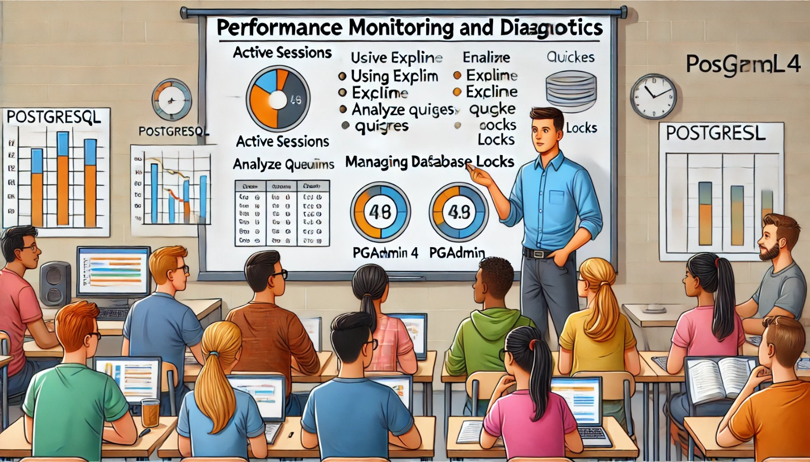

### Aula 26: Monitoramento e Diagnóstico de Desempenho no PostgreSQL Usando o pgAdmin 4



Hoje vamos aprender sobre como monitorar o desempenho de um banco de dados no **PostgreSQL** usando a ferramenta **pgAdmin 4**. Quando temos um banco de dados sendo usado por várias pessoas e com grandes volumes de dados, ele pode ficar mais lento ou ter problemas de desempenho. O **monitoramento** é a chave para identificar e resolver esses problemas antes que eles afetem o funcionamento do sistema.

---

### O Que É Monitoramento de Desempenho?

O **monitoramento de desempenho** é o processo de acompanhar em tempo real o que está acontecendo no banco de dados. Isso nos permite ver:
- Quantos usuários estão conectados.
- Quais consultas estão sendo executadas.
- O uso de recursos como CPU, memória e disco.

Esse monitoramento ajuda a identificar **gargalos**, ou seja, áreas que estão desacelerando o sistema, e permite que os administradores façam ajustes para melhorar a eficiência.

---

### Ferramentas de Monitoramento no pgAdmin 4

O **pgAdmin 4** tem várias ferramentas que ajudam no monitoramento e diagnóstico do desempenho do banco de dados.

#### 1. **Dashboard do pgAdmin 4**
O **Dashboard** é a tela inicial do pgAdmin 4. Nele, você vê gráficos e estatísticas sobre o banco de dados em tempo real, como:
- **Uso de CPU**: Quanto do processador o PostgreSQL está usando.
- **Uso de Memória**: Quanta memória o banco de dados está consumindo.
- **Sessões Ativas**: Quantas conexões ao banco estão ativas e que tipo de operações estão sendo realizadas.

Essas informações dão uma visão geral do estado de saúde do banco de dados.

#### 2. **Status do Servidor (Sessões Ativas)**
O **Status do Servidor** permite que você veja as **sessões ativas** no banco de dados. Aqui você pode visualizar:
- **Quem está conectado**: Usuários que estão usando o banco de dados.
- **Quais consultas estão sendo executadas**: Isso ajuda a identificar consultas que estão demorando muito.
- **Duração das consultas**: Consultas que estão demorando muito podem estar causando lentidão no banco de dados.

Se você encontrar consultas problemáticas, pode otimizar ou interrompê-las, melhorando o desempenho.

#### 3. **Análise de Consultas com EXPLAIN**
Quando uma consulta SQL está muito lenta, o comando **EXPLAIN** e **EXPLAIN ANALYZE** ajudam a entender o que está acontecendo. Esses comandos mostram como o PostgreSQL planeja ou executa uma consulta, e ajudam a identificar problemas como:
- **Falta de índices**: Quando uma consulta precisa procurar em toda a tabela para encontrar dados, ela demora mais.
- **Consultas mal escritas**: Algumas consultas podem ser reescritas para serem mais eficientes.

**Exemplo** de uso de **EXPLAIN**:
```sql
EXPLAIN ANALYZE SELECT * FROM escola_alunos WHERE nome_completo = 'Ana Clara';
```

O resultado mostra o caminho que o banco de dados segue para executar a consulta e quanto tempo leva.

#### 4. **Bloqueios e Conflitos de Concurrência**
O PostgreSQL utiliza **bloqueios (locks)** para proteger os dados quando várias pessoas estão modificando o banco de dados ao mesmo tempo. O **pgAdmin 4** permite visualizar esses bloqueios e ver se há **conflitos**, ou seja, quando uma transação está impedindo outra de continuar.

- Bloqueios podem causar lentidão se persistirem por muito tempo.
- Você pode cancelar transações bloqueadas para liberar o sistema.

#### 5. **Estatísticas de Tabelas e Índices**
No pgAdmin 4, você pode visualizar estatísticas detalhadas de tabelas e índices. Isso ajuda a identificar:
- **Tabelas muito grandes**: Elas podem precisar ser particionadas (divididas).
- **Índices ineficientes**: Se os índices não estão sendo usados corretamente, você pode ajustá-los para melhorar o desempenho.

---

### Por Que o Monitoramento É Importante?

- **Identificar Consultas Lentas**: Consultas que demoram muito podem sobrecarregar o sistema e precisam ser otimizadas.
- **Evitar Bloqueios**: Transações que ficam bloqueadas por muito tempo podem afetar todos os usuários.
- **Melhorar o Uso de Recursos**: O monitoramento ajuda a ajustar o uso de CPU, memória e armazenamento.

---

### Exercícios de Fixação

Marque as alternativas corretas:

#### 1. O que é o **Dashboard** no pgAdmin 4?
   - a) Um local para criar novas tabelas.
   - b) Uma visão geral em tempo real sobre o uso de CPU, memória e sessões ativas no banco de dados.
   - c) Um local para escrever consultas SQL.
   - d) Uma ferramenta para apagar registros duplicados.

#### 2. O que o comando **EXPLAIN** faz?
   - a) Ele exclui registros duplicados.
   - b) Ele cria uma tabela temporária.
   - c) Ele mostra como o PostgreSQL planeja executar uma consulta.
   - d) Ele cancela consultas lentas.

#### 3. O que são **bloqueios (locks)** em um banco de dados?
   - a) Eles impedem que duas transações alterem o mesmo dado ao mesmo tempo.
   - b) Eles apagam automaticamente registros desatualizados.
   - c) Eles criam índices automáticos nas tabelas.
   - d) Eles garantem que as consultas sejam executadas mais rapidamente.

#### 4. Como o **Status do Servidor** ajuda no monitoramento?
   - a) Ele permite visualizar e interromper consultas que estão demorando muito para serem executadas.
   - b) Ele cria novas tabelas automaticamente.
   - c) Ele faz cópias de segurança do banco de dados.
   - d) Ele exclui registros duplicados.

#### 5. Por que usar o **EXPLAIN ANALYZE**?
   - a) Para criar índices automaticamente.
   - b) Para entender quanto tempo uma consulta demora e como ela é executada.
   - c) Para criar backups automáticos do banco de dados.
   - d) Para listar todos os usuários conectados.

---

**Gabarito:**
1. b) Uma visão geral em tempo real sobre o uso de CPU, memória e sessões ativas no banco de dados.
2. c) Ele mostra como o PostgreSQL planeja executar uma consulta.
3. a) Eles impedem que duas transações alterem o mesmo dado ao mesmo tempo.
4. a) Ele permite visualizar e interromper consultas que estão demorando muito para serem executadas.
5. b) Para entender quanto tempo uma consulta demora e como ela é executada.

---

### Conclusão

Monitorar o desempenho do banco de dados com o **pgAdmin 4** é essencial para garantir que tudo funcione de forma eficiente. Com as ferramentas de monitoramento, você pode identificar consultas lentas, resolver bloqueios e ajustar o uso de recursos, garantindo um banco de dados mais rápido e confiável.