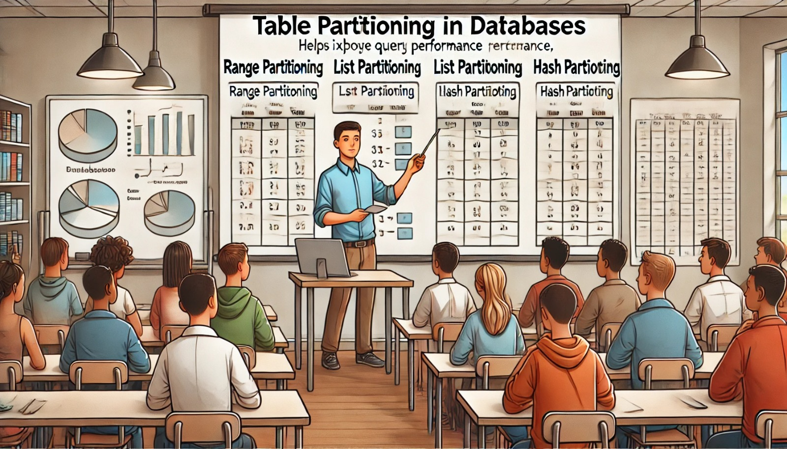

### Aula 29: Particionamento de Tabelas

**Bem-vindos à Aula 29!**

Hoje vamos aprender sobre **particionamento de tabelas** no banco de dados. Quando uma tabela fica muito grande, ela pode começar a impactar o desempenho das consultas e operações. Para resolver esse problema, usamos uma técnica chamada **particionamento**, que consiste em dividir a tabela em partes menores, chamadas **partições**.

---

### O Que É Particionamento de Tabelas?

**Particionamento de tabelas** é uma técnica usada para dividir uma tabela muito grande em partes menores, facilitando a consulta e a manutenção. Em vez de armazenar todos os dados em uma única tabela gigante, você "quebra" a tabela em várias partes. Cada parte (ou partição) contém um subconjunto dos dados e pode ser armazenada e consultada separadamente.

Essa técnica ajuda a melhorar o desempenho de consultas, porque o banco de dados pode acessar apenas a partição que contém os dados desejados, em vez de varrer a tabela inteira.

---

### Tipos de Particionamento

Existem diferentes maneiras de particionar uma tabela, dependendo da natureza dos dados e de como eles são consultados. Vamos ver os tipos mais comuns:

#### 1. **Particionamento por Faixa (Range Partitioning)**

No particionamento por faixa, você divide a tabela com base em intervalos de valores de uma coluna, como datas ou números. Cada partição armazena dados que pertencem a um intervalo específico.

**Exemplo**: Se você tem uma tabela de vendas e quer dividir os dados por ano, pode usar o particionamento por faixa na coluna de data.

```sql
CREATE TABLE vendas (
    id SERIAL,
    data_venda DATE,
    valor DECIMAL
) PARTITION BY RANGE (data_venda);

CREATE TABLE vendas_2023 PARTITION OF vendas
FOR VALUES FROM ('2023-01-01') TO ('2023-12-31');

CREATE TABLE vendas_2022 PARTITION OF vendas
FOR VALUES FROM ('2022-01-01') TO ('2022-12-31');
```

Aqui, a tabela **vendas** foi dividida em duas partições: uma para os dados de 2023 e outra para os de 2022.

#### 2. **Particionamento por Lista (List Partitioning)**

No particionamento por lista, os dados são divididos com base em uma lista de valores específicos. Cada partição armazena uma lista de valores definidos.

**Exemplo**: Você pode particionar uma tabela de produtos por categoria.

```sql
CREATE TABLE produtos (
    id SERIAL,
    nome VARCHAR(100),
    categoria VARCHAR(50)
) PARTITION BY LIST (categoria);

CREATE TABLE produtos_eletronicos PARTITION OF produtos
FOR VALUES IN ('Eletrônicos');

CREATE TABLE produtos_roupas PARTITION OF produtos
FOR VALUES IN ('Roupas');
```

Nesse caso, os produtos foram divididos em partições com base na categoria.

#### 3. **Particionamento por Hash (Hash Partitioning)**

No particionamento por hash, os dados são distribuídos de forma automática entre as partições usando uma função de hash. Essa técnica é útil quando você quer dividir os dados de forma equilibrada, mas não tem um critério óbvio de faixa ou lista.

---

### Vantagens do Particionamento

1. **Melhor Desempenho em Consultas**: O banco de dados pode consultar apenas a partição que contém os dados desejados, em vez de percorrer toda a tabela.
   
2. **Facilidade de Gerenciamento**: Tabelas muito grandes podem ser difíceis de gerenciar. Com o particionamento, você pode manter as partições separadas e mais fáceis de lidar.

3. **Manutenção Facilitada**: É mais fácil fazer operações como backups, exclusão ou atualização de dados quando você pode operar em partições individuais.

4. **Escalabilidade**: À medida que a quantidade de dados cresce, o particionamento ajuda o banco de dados a lidar melhor com grandes volumes de dados.

---

### Quando Usar Particionamento?

O particionamento é útil quando você tem uma tabela muito grande que está afetando o desempenho. Se a tabela tiver milhões de registros e as consultas estiverem demorando para ser executadas, o particionamento pode ser uma solução. Ele também é indicado quando você precisa fazer consultas frequentes em apenas uma parte dos dados, como em sistemas de vendas, onde normalmente você consulta os dados mais recentes.

---

### Atividade de Fixação (Múltipla Escolha)

Agora que entendemos o conceito de particionamento, vamos praticar com algumas questões de múltipla escolha.

#### 1. O que o particionamento de tabelas faz?
   - a) Combina várias tabelas em uma só.
   - b) Divide uma tabela grande em partes menores, chamadas partições.
   - c) Cria um índice automático para a tabela.
   - d) Exclui dados antigos da tabela.

#### 2. Qual é o benefício de particionar uma tabela?
   - a) Diminui o tempo de inserção de dados.
   - b) Reduz a quantidade de memória usada pelo banco de dados.
   - c) Melhora o desempenho de consultas, já que o banco de dados acessa apenas a partição relevante.
   - d) Facilita a exclusão automática de dados duplicados.

#### 3. O que é particionamento por faixa (Range Partitioning)?
   - a) É quando os dados são divididos em partições com base em intervalos de valores, como datas ou números.
   - b) É quando os dados são divididos aleatoriamente entre as partições.
   - c) É quando os dados são agrupados em listas de valores específicos.
   - d) É quando os dados são divididos por categorias de texto.

#### 4. O que o particionamento por lista faz?
   - a) Divide os dados com base em uma lista de valores definidos.
   - b) Distribui os dados de forma equilibrada entre as partições.
   - c) Agrupa os dados por intervalos de datas.
   - d) Cria uma cópia da tabela original em cada partição.

#### 5. Quando o particionamento de tabelas é mais útil?
   - a) Quando você precisa de mais índices na tabela.
   - b) Quando a tabela tem poucos registros.
   - c) Quando a tabela é muito grande e as consultas estão ficando lentas.
   - d) Quando você quer excluir dados automaticamente.

---

**Gabarito:**
1. b) Divide uma tabela grande em partes menores, chamadas partições.
2. c) Melhora o desempenho de consultas, já que o banco de dados acessa apenas a partição relevante.
3. a) É quando os dados são divididos em partições com base em intervalos de valores, como datas ou números.
4. a) Divide os dados com base em uma lista de valores definidos.
5. c) Quando a tabela é muito grande e as consultas estão ficando lentas.

---

### Conclusão

O **particionamento de tabelas** é uma técnica muito útil para melhorar o desempenho de consultas em tabelas grandes. Ao dividir a tabela em partes menores, o banco de dados pode acessar e processar os dados mais rapidamente, o que é especialmente importante em sistemas com grandes volumes de dados.