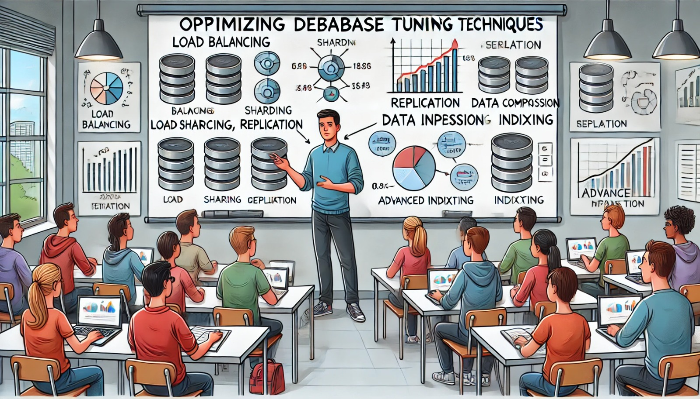

### Aula 32: Técnicas Avançadas de Tuning

**Bem-vindos à Aula 32!**

Hoje vamos falar sobre técnicas avançadas de **tuning de SGBD** (Sistema de Gerenciamento de Banco de Dados). Até agora, aprendemos a ajustar as configurações básicas do banco de dados, como memória e conexões. Agora, vamos explorar técnicas mais avançadas que ajudam a otimizar ainda mais o desempenho, especialmente em sistemas com grandes volumes de dados ou alto número de usuários.

---

### Principais Técnicas Avançadas de Tuning

1. **Balanceamento de Carga**

O **balanceamento de carga** distribui o trabalho entre vários servidores para evitar sobrecarga em um único servidor. Em um ambiente de banco de dados, isso significa distribuir consultas e transações entre diferentes instâncias do banco, evitando que um único servidor fique sobrecarregado.

**Exemplo**: Em um site de comércio eletrônico, o balanceamento de carga garante que todas as consultas dos clientes sejam divididas entre diferentes servidores, evitando lentidão.

2. **Sharding (Fragmentação)**

O **sharding** divide os dados em várias partes (ou "shards") que são armazenadas em servidores diferentes. Cada "shard" contém uma parte dos dados, e o SGBD consulta apenas o "shard" que contém os dados necessários.

**Exemplo**: Em uma rede social, os dados dos usuários podem ser divididos em diferentes servidores com base na localização (como América do Sul, Europa, etc.), tornando o acesso mais rápido.

3. **Replicação**

A **replicação** cria cópias dos dados em vários servidores. Isso ajuda a aumentar a disponibilidade dos dados, permitindo que consultas de leitura sejam feitas em servidores diferentes, enquanto o servidor principal fica dedicado a operações de escrita.

**Exemplo**: Em um sistema de relatórios, a replicação permite que as consultas sejam direcionadas para servidores de leitura, reduzindo a carga no servidor principal.

4. **Compressão de Dados**

A **compressão de dados** reduz o tamanho dos dados armazenados, ocupando menos espaço em disco. Dados comprimidos permitem que mais informações sejam armazenadas em menos espaço, o que também pode acelerar consultas, já que menos dados precisam ser lidos.

**Exemplo**: Em uma tabela de histórico de vendas, comprimir dados antigos economiza espaço sem perder informações.

5. **Otimização de Índices Avançada**

O uso de índices é uma técnica básica, mas pode ser aprimorado com estratégias avançadas, como **índices parciais** (que indexam apenas uma parte dos dados) e **índices compostos** (que combinam várias colunas). Essa técnica reduz o tamanho dos índices e melhora o desempenho das consultas.

**Exemplo**: Em uma tabela de pedidos, um índice parcial pode ser criado apenas para pedidos acima de certo valor, otimizando consultas de busca de pedidos grandes.

6. **Particionamento de Tabelas Avançado**

O particionamento básico foi visto anteriormente, mas o **particionamento avançado** permite que você divida os dados de maneira ainda mais detalhada, como por faixa de valores e data, o que melhora ainda mais o desempenho de consultas específicas.

**Exemplo**: Em uma tabela de logs de sistema, particionar dados por mês permite acessar rapidamente informações específicas sem percorrer o histórico inteiro.

---

### Vantagens das Técnicas Avançadas de Tuning

- **Desempenho Melhorado**: Consultas e operações se tornam mais rápidas, pois o banco de dados lida com dados menores e mais otimizados.
- **Maior Escalabilidade**: Essas técnicas permitem que o banco de dados suporte mais usuários e mais dados sem perder velocidade.
- **Maior Disponibilidade**: Com a replicação e o balanceamento de carga, o sistema consegue atender mais usuários sem interrupções, mesmo em caso de falhas.

---

### Quando Usar Técnicas Avançadas de Tuning?

As técnicas avançadas de tuning são úteis quando o banco de dados lida com um alto volume de dados e de acessos simultâneos. Elas são aplicadas principalmente em sistemas de grande porte, onde é necessário manter um desempenho elevado mesmo com milhões de registros e muitos usuários conectados ao mesmo tempo.

---

### Atividade de Fixação (Múltipla Escolha)

Vamos praticar o que aprendemos com algumas questões de múltipla escolha.

#### 1. O que o **balanceamento de carga** faz em um banco de dados?
   - a) Combina vários servidores em um só.
   - b) Distribui o trabalho entre diferentes servidores para evitar sobrecarga em um único servidor.
   - c) Remove dados duplicados do sistema.
   - d) Apaga dados antigos automaticamente.

#### 2. Em que consiste o **sharding**?
   - a) Dividir os dados em várias partes e armazená-las em servidores diferentes.
   - b) Criar uma cópia completa dos dados em vários servidores.
   - c) Compactar os dados para economizar espaço em disco.
   - d) Criar um índice em cada tabela do banco de dados.

#### 3. Qual é a principal vantagem da **replicação**?
   - a) Armazenar dados em apenas um servidor.
   - b) Distribuir operações de leitura entre servidores para aliviar a carga do servidor principal.
   - c) Excluir registros antigos automaticamente.
   - d) Diminuir o número de conexões no banco de dados.

#### 4. Qual técnica ajuda a economizar espaço ao reduzir o tamanho dos dados armazenados?
   - a) Sharding
   - b) Balanceamento de carga
   - c) Compressão de dados
   - d) Replicação

#### 5. Quando o **particionamento avançado** é mais útil?
   - a) Quando há poucos registros na tabela.
   - b) Quando os dados são grandes e precisam ser acessados em intervalos específicos, como por data.
   - c) Quando o banco de dados tem poucas consultas de leitura.
   - d) Quando a tabela contém apenas dados de texto.

---

**Gabarito:**
1. b) Distribui o trabalho entre diferentes servidores para evitar sobrecarga em um único servidor.
2. a) Dividir os dados em várias partes e armazená-las em servidores diferentes.
3. b) Distribuir operações de leitura entre servidores para aliviar a carga do servidor principal.
4. c) Compressão de dados
5. b) Quando os dados são grandes e precisam ser acessados em intervalos específicos, como por data.

---

### Conclusão

As **técnicas avançadas de tuning** ajudam a melhorar o desempenho e a escalabilidade de sistemas de banco de dados de grande porte. Com estratégias como balanceamento de carga, sharding, replicação, compressão de dados e particionamento avançado, o banco de dados pode lidar melhor com muitos dados e acessos simultâneos, mantendo-se rápido e eficiente para os usuários.