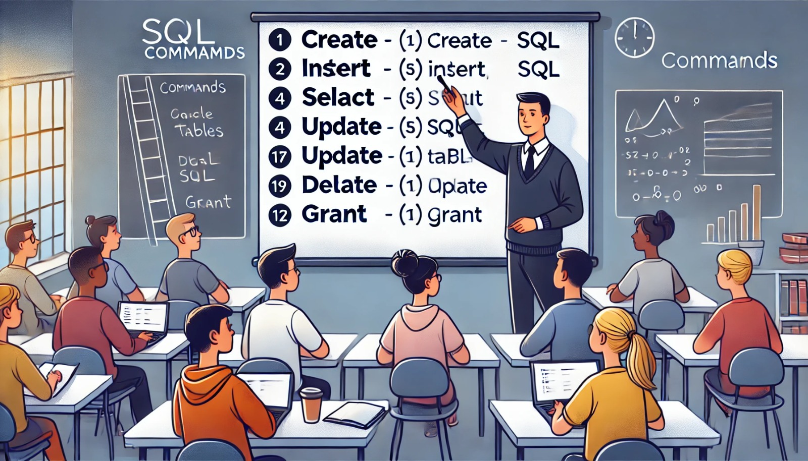

### Aula 36: Revisão de Comandos SQL

**Bem-vindos à Aula 36!**

Hoje vamos revisar os principais **comandos SQL** (Structured Query Language) usados para gerenciar e manipular dados em um banco de dados. Esses comandos permitem que você crie tabelas, insira, consulte, atualize e exclua dados, além de controlar o acesso e a segurança no sistema de gerenciamento de banco de dados.

---

### Principais Comandos SQL

Os comandos SQL são divididos em diferentes categorias, de acordo com suas funções. Vamos revisar os mais usados em cada categoria:

#### 1. Comandos DDL (Data Definition Language)

Os comandos **DDL** são usados para definir e estruturar o banco de dados, como criar e modificar tabelas.

- **CREATE**: Cria novos objetos no banco de dados, como tabelas, índices e visões.
   ```sql
   CREATE TABLE alunos (
       id SERIAL PRIMARY KEY,
       nome VARCHAR(100),
       idade INT
   );
   ```
- **ALTER**: Modifica a estrutura de uma tabela existente, como adicionar ou excluir colunas.
   ```sql
   ALTER TABLE alunos ADD COLUMN email VARCHAR(100);
   ```
- **DROP**: Exclui um objeto do banco de dados, como uma tabela ou índice.
   ```sql
   DROP TABLE alunos;
   ```

#### 2. Comandos DML (Data Manipulation Language)

Os comandos **DML** são usados para manipular os dados dentro das tabelas. Eles permitem inserir, atualizar e excluir registros.

- **INSERT**: Insere novos registros em uma tabela.
   ```sql
   INSERT INTO alunos (nome, idade) VALUES ('Maria', 20);
   ```
- **UPDATE**: Atualiza os dados em uma tabela.
   ```sql
   UPDATE alunos SET idade = 21 WHERE nome = 'Maria';
   ```
- **DELETE**: Exclui registros específicos de uma tabela.
   ```sql
   DELETE FROM alunos WHERE nome = 'Maria';
   ```

#### 3. Comandos DQL (Data Query Language)

Os comandos **DQL** são usados para consultar e recuperar dados do banco de dados. O comando principal é o **SELECT**.

- **SELECT**: Consulta dados de uma tabela.
   ```sql
   SELECT nome, idade FROM alunos WHERE idade > 18;
   ```

#### 4. Comandos DCL (Data Control Language)

Os comandos **DCL** são usados para definir permissões e controlar o acesso aos dados.

- **GRANT**: Concede permissões a um usuário.
   ```sql
   GRANT SELECT, INSERT ON alunos TO usuario;
   ```
- **REVOKE**: Revoga permissões de um usuário.
   ```sql
   REVOKE INSERT ON alunos FROM usuario;
   ```

---

### Revisão dos Principais Conceitos

1. **Criação e Modificação de Tabelas**: Com os comandos `CREATE` e `ALTER`, você pode definir a estrutura das tabelas e modificar colunas conforme necessário.
2. **Manipulação de Dados**: Com `INSERT`, `UPDATE` e `DELETE`, você controla os registros dentro das tabelas, adicionando, alterando ou excluindo dados conforme necessário.
3. **Consultas de Dados**: O `SELECT` permite recuperar dados de forma específica, usando filtros e condições.
4. **Controle de Acesso**: Com `GRANT` e `REVOKE`, você garante a segurança do banco de dados, definindo quem pode visualizar ou modificar os dados.

---

### Atividade de Fixação (Múltipla Escolha)

Vamos revisar com algumas questões de múltipla escolha sobre os comandos SQL.

#### 1. Qual comando é usado para criar uma nova tabela?
   - a) ALTER
   - b) CREATE
   - c) INSERT
   - d) DROP

#### 2. Qual comando insere um novo registro em uma tabela?
   - a) DELETE
   - b) UPDATE
   - c) INSERT
   - d) SELECT

#### 3. O que o comando `SELECT` faz?
   - a) Modifica os dados em uma tabela.
   - b) Exclui registros de uma tabela.
   - c) Insere novos registros em uma tabela.
   - d) Consulta dados de uma tabela.

#### 4. Qual comando altera a estrutura de uma tabela existente?
   - a) CREATE
   - b) ALTER
   - c) DROP
   - d) SELECT

#### 5. Qual comando concede permissões de acesso a um usuário?
   - a) GRANT
   - b) REVOKE
   - c) DELETE
   - d) UPDATE

---

**Gabarito:**
1. b) CREATE
2. c) INSERT
3. d) Consulta dados de uma tabela.
4. b) ALTER
5. a) GRANT

---

### Conclusão

Compreender os comandos SQL é essencial para trabalhar com bancos de dados. Desde a criação de tabelas até a manipulação de dados e o controle de acesso, esses comandos fornecem as ferramentas necessárias para gerenciar e manter o banco de dados de forma eficiente. A prática desses comandos ajuda a ganhar confiança e habilidade em SQL, tornando a administração do banco de dados mais fácil e organizada.