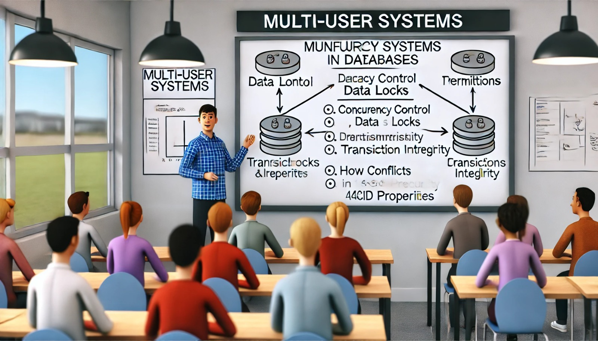

### Aula 37: Revisão de Sistemas Multiusuário

**Bem-vindos à Aula 37!**

Hoje vamos revisar o conceito de **sistemas multiusuário** em bancos de dados. Em sistemas multiusuário, várias pessoas ou aplicativos podem acessar e modificar o banco de dados ao mesmo tempo. Esses sistemas são comuns em ambientes corporativos, redes sociais, e-commerce, entre outros. Vamos entender como eles funcionam, os desafios que apresentam e como mantêm a segurança e a integridade dos dados.

---

### O Que é um Sistema Multiusuário?

Um **sistema multiusuário** é um banco de dados que permite acesso simultâneo de vários usuários. Esse tipo de sistema precisa gerenciar as ações de cada usuário para garantir que os dados estejam sempre corretos e que o desempenho do banco de dados não seja prejudicado.

Por exemplo, imagine um sistema de vendas online: os clientes fazem pedidos ao mesmo tempo, e o banco de dados precisa registrar todos esses pedidos sem erros e sem demorar. Esse é o papel do sistema multiusuário.

---

### Principais Desafios dos Sistemas Multiusuário

1. **Controle de Concorrência**
   - Quando vários usuários acessam o banco ao mesmo tempo, podem ocorrer problemas de concorrência, como duas pessoas tentando atualizar o mesmo registro. O controle de concorrência evita esses conflitos, garantindo que as ações de um usuário não interfiram nas ações de outro.

2. **Bloqueios (Locks)**
   - Os bloqueios são uma técnica usada para garantir que dois usuários não possam modificar o mesmo dado ao mesmo tempo. Existem diferentes tipos de bloqueios, como bloqueios de leitura e escrita, que ajudam a controlar o acesso aos dados.

3. **Integridade dos Dados**
   - Em um sistema multiusuário, é essencial manter a integridade dos dados, ou seja, garantir que os dados sejam consistentes e corretos, mesmo com vários acessos simultâneos. As transações e regras de integridade ajudam a manter a qualidade dos dados.

4. **Segurança e Permissões**
   - É necessário definir quem pode acessar, ler e modificar cada tabela ou dado específico. Através de permissões e regras de acesso, o sistema mantém os dados protegidos, permitindo que cada usuário acesse apenas as informações autorizadas.

---

### Como o Sistema Multiusuário Lida com Esses Desafios?

1. **Transações**
   - Uma **transação** é uma sequência de operações no banco de dados que precisa ser executada de forma completa ou não ser executada. Se uma transação falha, o banco de dados volta ao estado inicial, garantindo a integridade dos dados. Transações seguem as regras ACID:
     - **Atomicidade**: Todas as operações ocorrem ou nenhuma ocorre.
     - **Consistência**: Os dados estão sempre corretos após uma transação.
     - **Isolamento**: Transações não interferem entre si.
     - **Durabilidade**: Os dados são preservados após a conclusão.

2. **Controle de Concessão de Permissões**
   - Em sistemas multiusuário, as permissões são configuradas para limitar o que cada usuário pode fazer. Alguns usuários podem apenas ler dados, enquanto outros podem inserir ou atualizar informações.

3. **Controle de Conflitos com Bloqueios**
   - Os bloqueios evitam que dois usuários modifiquem o mesmo dado ao mesmo tempo. Por exemplo, se um usuário está atualizando o preço de um produto, o banco de dados pode bloquear essa linha até que a alteração seja concluída.

---

### Benefícios dos Sistemas Multiusuário

1. **Acesso Simultâneo**: Permite que vários usuários acessem o sistema ao mesmo tempo, o que aumenta a eficiência e melhora o atendimento ao cliente.
2. **Proteção e Controle de Dados**: Com o controle de permissões, é possível restringir o acesso e proteger informações sensíveis.
3. **Consistência e Integridade**: Com transações e bloqueios, o banco de dados garante que os dados permaneçam consistentes e precisos, mesmo em cenários de alta concorrência.

---

### Atividade de Fixação (Múltipla Escolha)

Vamos praticar o que aprendemos com algumas questões de múltipla escolha.

#### 1. O que é um sistema multiusuário?
   - a) Um sistema que permite apenas um usuário acessar o banco de dados por vez.
   - b) Um sistema que permite acesso simultâneo de vários usuários ao banco de dados.
   - c) Um sistema que usa apenas um tipo de transação.
   - d) Um sistema que não precisa de controle de concorrência.

#### 2. Qual é a função dos bloqueios em um sistema multiusuário?
   - a) Excluir dados desatualizados do banco de dados.
   - b) Permitir que vários usuários modifiquem o mesmo dado ao mesmo tempo.
   - c) Evitar que dois usuários modifiquem o mesmo dado ao mesmo tempo.
   - d) Aumentar o número de usuários no banco de dados.

#### 3. O que é uma transação no contexto de um banco de dados?
   - a) Um conjunto de operações que pode ser parcialmente concluído.
   - b) Uma sequência de operações que deve ser executada completamente ou não ser executada.
   - c) Uma permissão para acessar dados restritos.
   - d) Um comando para alterar permissões.

#### 4. O que significa isolamento em uma transação?
   - a) Permitir que várias transações compartilhem os mesmos dados.
   - b) Garantir que as transações não interfiram entre si.
   - c) Permitir que uma transação altere várias tabelas ao mesmo tempo.
   - d) Evitar a atualização de dados sensíveis.

#### 5. Qual é um dos benefícios dos sistemas multiusuário?
   - a) Permitir que apenas um usuário faça alterações no banco de dados.
   - b) Proteger dados sensíveis e permitir acesso simultâneo de vários usuários.
   - c) Reduzir a integridade dos dados.
   - d) Remover transações automaticamente.

---

**Gabarito:**
1. b) Um sistema que permite acesso simultâneo de vários usuários ao banco de dados.
2. c) Evitar que dois usuários modifiquem o mesmo dado ao mesmo tempo.
3. b) Uma sequência de operações que deve ser executada completamente ou não ser executada.
4. b) Garantir que as transações não interfiram entre si.
5. b) Proteger dados sensíveis e permitir acesso simultâneo de vários usuários.

---

### Conclusão

Os **sistemas multiusuário** são essenciais para ambientes onde muitos usuários ou processos acessam o banco de dados ao mesmo tempo. Através de técnicas de controle de concorrência, bloqueios, transações e permissões, esses sistemas garantem que os dados estejam sempre corretos, seguros e disponíveis, mesmo em cenários de alto uso e concorrência.