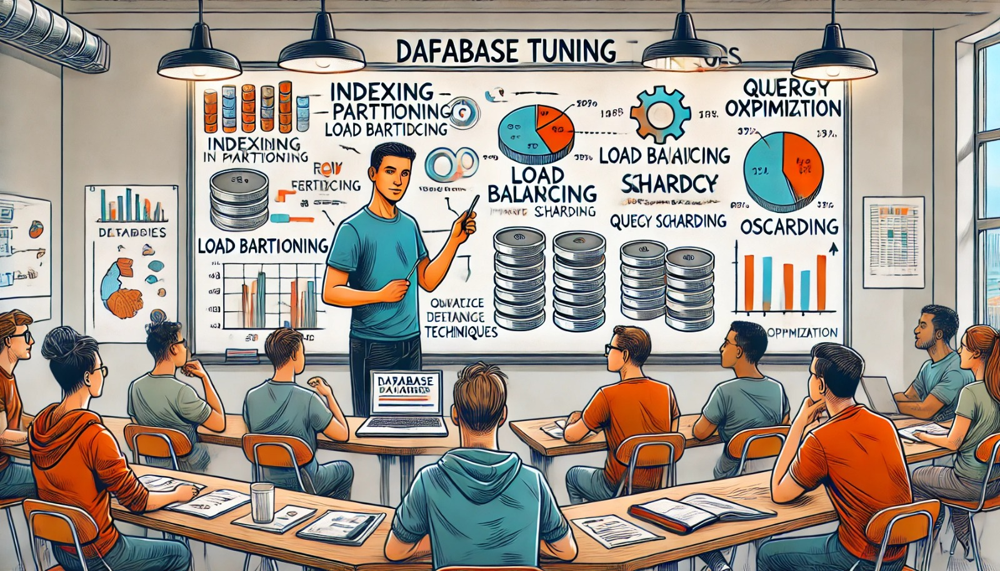

### Aula 38: Revisão de Técnicas de Tuning

**Bem-vindos à Aula 38!**

Hoje vamos revisar as principais **técnicas de tuning** para bancos de dados. O tuning, ou otimização, é essencial para garantir que o banco de dados funcione de forma rápida e eficiente, especialmente em ambientes com muitos dados e acessos simultâneos. Revisaremos as técnicas para melhorar o desempenho, reduzir o tempo de resposta e otimizar o uso de recursos.

---

### O Que é Tuning de Banco de Dados?

O **tuning** é o processo de ajustar as configurações e otimizar as consultas para melhorar o desempenho do banco de dados. É um trabalho contínuo, pois o banco de dados pode precisar de ajustes conforme o volume de dados e o número de usuários aumentam.

O tuning envolve diferentes técnicas, desde o uso de índices até o particionamento de tabelas, cada uma com um propósito específico. Vamos revisar as principais.

---

### Principais Técnicas de Tuning

1. **Uso de Índices**
   - Os **índices** são uma estrutura que permite o acesso rápido a dados específicos em uma tabela. Eles funcionam como um índice de um livro, ajudando o banco de dados a encontrar informações sem ter que varrer todas as linhas.
   - **Exemplo**: Se você consulta frequentemente uma tabela usando a coluna `nome`, um índice nesta coluna acelera a busca.

2. **Particionamento de Tabelas**
   - O **particionamento** divide uma tabela muito grande em partes menores (partições), facilitando o acesso e a gestão dos dados. Isso melhora a velocidade de consultas que acessam apenas uma parte dos dados.
   - **Exemplo**: Uma tabela de registros de vendas pode ser particionada por ano, para que as consultas que buscam dados de um ano específico sejam mais rápidas.

3. **Balanceamento de Carga**
   - O **balanceamento de carga** distribui o trabalho entre vários servidores, reduzindo a sobrecarga em um único servidor. Ele é ideal para ambientes de alto tráfego, como e-commerce ou redes sociais.
   - **Exemplo**: Em um sistema com muitos usuários, o balanceamento de carga divide as requisições entre servidores, mantendo o desempenho alto.

4. **Sharding**
   - O **sharding** divide os dados em várias partes (shards), cada uma armazenada em um servidor separado. É útil quando o volume de dados é muito grande para um único servidor.
   - **Exemplo**: Em uma rede social, os dados de usuários podem ser armazenados em shards por região, como América do Norte, Europa e Ásia.

5. **Compressão de Dados**
   - A **compressão** reduz o tamanho dos dados armazenados, economizando espaço em disco e melhorando o tempo de resposta em algumas consultas.
   - **Exemplo**: Em uma tabela de histórico de transações, dados antigos podem ser comprimidos para reduzir o uso de armazenamento.

6. **Otimização de Consultas**
   - A **otimização de consultas** envolve ajustar o código SQL para que as consultas sejam executadas da forma mais eficiente possível. Isso inclui evitar `SELECT *`, usar `JOINs` de forma adequada e escrever condições claras.
   - **Exemplo**: Em vez de usar `SELECT *`, selecione apenas as colunas necessárias para melhorar o desempenho.

---

### Por Que o Tuning é Importante?

1. **Desempenho Melhorado**: O tuning permite que o banco de dados responda mais rápido às consultas, melhorando a experiência do usuário.
2. **Uso Eficiente de Recursos**: Com o tuning, o banco de dados usa menos memória, CPU e espaço em disco, otimizando o desempenho geral do sistema.
3. **Escalabilidade**: Técnicas como balanceamento de carga e sharding ajudam o banco de dados a crescer e suportar mais usuários e dados.

---

### Passos para Aplicar o Tuning

1. **Análise do Desempenho Atual**:
   - Identifique as consultas lentas e os gargalos no sistema. Use ferramentas de monitoramento para ver quais áreas precisam de ajustes.

2. **Aplicação Gradual de Ajustes**:
   - Ajuste um parâmetro ou técnica por vez, para avaliar seu impacto. Mudanças bruscas podem causar instabilidade.

3. **Monitoramento Contínuo**:
   - O tuning é um processo contínuo. Monitorar o desempenho regularmente ajuda a identificar quando novos ajustes são necessários.

---

### Atividade de Fixação (Múltipla Escolha)

Vamos revisar o que aprendemos com algumas questões de múltipla escolha.

#### 1. Qual é a função de um índice em um banco de dados?
   - a) Excluir dados desnecessários.
   - b) Acelerar o acesso a dados específicos em uma tabela.
   - c) Criar uma cópia dos dados para backup.
   - d) Dividir os dados entre diferentes servidores.

#### 2. O que o particionamento de tabelas faz?
   - a) Aumenta a quantidade de dados armazenados.
   - b) Combina várias tabelas em uma única.
   - c) Divide uma tabela em partes menores para facilitar o acesso.
   - d) Remove dados duplicados.

#### 3. Qual técnica divide o trabalho entre vários servidores?
   - a) Sharding
   - b) Compressão de dados
   - c) Balanceamento de carga
   - d) Índices

#### 4. Quando o sharding é mais útil?
   - a) Em tabelas pequenas com poucos dados.
   - b) Em bancos de dados grandes com muito volume de dados.
   - c) Quando há necessidade de compressão de dados.
   - d) Quando o banco de dados possui poucas consultas.

#### 5. Qual é o objetivo da otimização de consultas?
   - a) Excluir dados antigos.
   - b) Melhorar a performance de consultas ajustando o código SQL.
   - c) Aumentar o número de servidores.
   - d) Reduzir o espaço em disco.

---

**Gabarito:**
1. b) Acelerar o acesso a dados específicos em uma tabela.
2. c) Divide uma tabela em partes menores para facilitar o acesso.
3. c) Balanceamento de carga
4. b) Em bancos de dados grandes com muito volume de dados.
5. b) Melhorar a performance de consultas ajustando o código SQL.

---

### Conclusão

O tuning de banco de dados é essencial para garantir um desempenho rápido e eficiente, especialmente em sistemas com muitos dados e usuários. Com técnicas como o uso de índices, particionamento, sharding e balanceamento de carga, o banco de dados se torna mais escalável e responde mais rapidamente às consultas. A prática regular do tuning é fundamental para manter o banco de dados em ótimas condições, atendendo bem às necessidades do sistema e dos usuários.