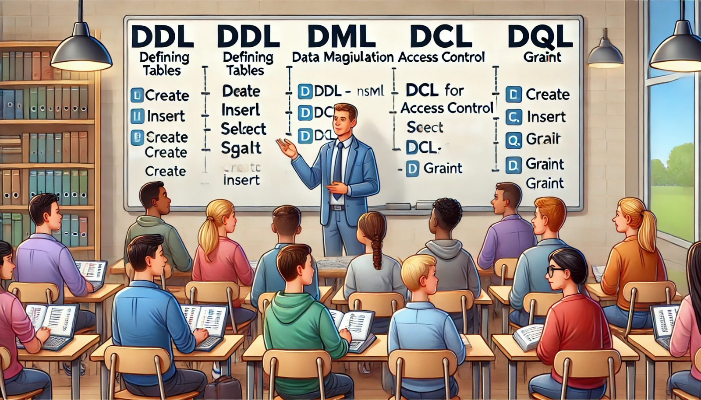

### Semana 17: Implementação dos Comandos SQL (DDL, DML, DCL, DQL)

**Bem-vindos à Semana 17!**

Nesta semana, vamos implementar os comandos **SQL** mais importantes em um banco de dados. Esses comandos são organizados em quatro categorias principais: **DDL** (Data Definition Language), **DML** (Data Manipulation Language), **DCL** (Data Control Language) e **DQL** (Data Query Language). Cada uma dessas categorias tem funções específicas para criação, manipulação, controle e consulta de dados.

---

### Objetivos da Semana

1. **Aplicar comandos DDL**: Criar e modificar a estrutura do banco de dados.
2. **Implementar comandos DML**: Inserir, atualizar e excluir dados.
3. **Utilizar comandos DCL**: Controlar as permissões e acessos ao banco de dados.
4. **Usar comandos DQL**: Consultar e filtrar dados de forma eficiente.

---

### 1. Comandos DDL (Data Definition Language)

Os comandos **DDL** são utilizados para definir e modificar a estrutura do banco de dados, incluindo a criação e alteração de tabelas e outras estruturas.

- **CREATE**: Cria uma nova tabela, índice ou outro objeto no banco de dados.
  
   **Exemplo**:
   ```sql
   CREATE TABLE Produtos (
       id_produto SERIAL PRIMARY KEY,
       nome VARCHAR(100) NOT NULL,
       preco DECIMAL(10, 2) NOT NULL,
       estoque INTEGER NOT NULL
   );
   ```

- **ALTER**: Modifica a estrutura de uma tabela existente, permitindo adicionar ou remover colunas, por exemplo.

   **Exemplo**:
   ```sql
   ALTER TABLE Produtos ADD COLUMN categoria VARCHAR(50);
   ```

- **DROP**: Exclui um objeto do banco de dados, como uma tabela ou índice.

   **Exemplo**:
   ```sql
   DROP TABLE Produtos;
   ```

Esses comandos são essenciais para a criação e modificação da estrutura do banco de dados.

---

### 2. Comandos DML (Data Manipulation Language)

Os comandos **DML** são usados para manipular os dados dentro das tabelas. Com eles, é possível inserir, atualizar e excluir registros.

- **INSERT**: Insere novos dados em uma tabela.

   **Exemplo**:
   ```sql
   INSERT INTO Produtos (nome, preco, estoque) VALUES ('Caneta', 1.50, 100);
   ```

- **UPDATE**: Atualiza os dados em uma tabela existente.

   **Exemplo**:
   ```sql
   UPDATE Produtos SET preco = 1.75 WHERE nome = 'Caneta';
   ```

- **DELETE**: Exclui registros específicos de uma tabela.

   **Exemplo**:
   ```sql
   DELETE FROM Produtos WHERE nome = 'Caneta';
   ```

Esses comandos permitem gerenciar e modificar os dados à medida que o sistema é utilizado.

---

### 3. Comandos DCL (Data Control Language)

Os comandos **DCL** controlam quem pode acessar e modificar o banco de dados, configurando permissões para diferentes usuários.

- **GRANT**: Concede permissões para um usuário.

   **Exemplo**:
   ```sql
   GRANT SELECT, INSERT ON Produtos TO usuario;
   ```

- **REVOKE**: Revoga permissões de um usuário.

   **Exemplo**:
   ```sql
   REVOKE INSERT ON Produtos FROM usuario;
   ```

Esses comandos ajudam a garantir a segurança e o controle de acesso ao banco de dados, permitindo que apenas usuários autorizados realizem certas operações.

---

### 4. Comandos DQL (Data Query Language)

O comando principal da **DQL** é o **SELECT**, usado para consultar e recuperar dados do banco. É uma das ferramentas mais poderosas para obter informações específicas do banco de dados.

- **SELECT**: Recupera dados de uma tabela, com opções de filtro e ordenação.

   **Exemplo**:
   ```sql
   SELECT nome, preco FROM Produtos WHERE estoque > 50;
   ```

Com o comando `SELECT`, é possível filtrar, ordenar e agrupar os dados para visualizar as informações desejadas de maneira rápida e prática.

---

### Prática com Exemplos

Aqui estão alguns exemplos combinando os comandos para praticar:

1. **Criar uma Tabela e Inserir Dados**:
   ```sql
   CREATE TABLE Clientes (
       id_cliente SERIAL PRIMARY KEY,
       nome VARCHAR(100),
       telefone VARCHAR(15),
       email VARCHAR(100)
   );

   INSERT INTO Clientes (nome, telefone, email) VALUES ('João Silva', '123456789', 'joao@email.com');
   ```

2. **Atualizar Dados e Consultar com Filtro**:
   ```sql
   UPDATE Clientes SET telefone = '987654321' WHERE nome = 'João Silva';
   SELECT nome, telefone FROM Clientes WHERE email LIKE '%email.com';
   ```

3. **Controlar Permissões**:
   ```sql
   GRANT SELECT ON Clientes TO usuario;
   REVOKE SELECT ON Clientes FROM usuario;
   ```

---

### Atividade da Semana (Prática com Comandos SQL)

Para praticar o que aprendemos esta semana, complete as atividades abaixo.

1. Crie uma tabela **Pedidos** com colunas `id_pedido`, `data`, `total` e `id_cliente`.
2. Insira dois pedidos na tabela **Pedidos**.
3. Atualize o total de um dos pedidos para um novo valor.
4. Execute uma consulta para selecionar todos os pedidos cujo total seja maior que um valor específico.
5. Conceda permissão de `SELECT` para um usuário fictício em **Pedidos**.

#### Parte 1: Questões de Revisão

1. Qual comando é usado para criar uma nova tabela?
   - a) INSERT
   - b) SELECT
   - c) CREATE
   - d) GRANT

2. Qual comando insere novos dados em uma tabela?
   - a) DELETE
   - b) INSERT
   - c) UPDATE
   - d) SELECT

3. Qual comando é usado para consultar dados de uma tabela?
   - a) GRANT
   - b) INSERT
   - c) SELECT
   - d) DELETE

4. Qual comando concede permissões a um usuário?
   - a) ALTER
   - b) UPDATE
   - c) CREATE
   - d) GRANT

5. Qual comando é usado para modificar dados já existentes em uma tabela?
   - a) DELETE
   - b) UPDATE
   - c) INSERT
   - d) SELECT

---

**Gabarito**:
1. c) CREATE
2. b) INSERT
3. c) SELECT
4. d) GRANT
5. b) UPDATE

---

### Conclusão

Os comandos SQL são a base para gerenciar e manipular dados em um banco de dados. Com o DDL, você define a estrutura das tabelas; com o DML, insere e modifica os dados; com o DCL, controla o acesso; e com o DQL, consulta as informações de forma eficiente. A prática desses comandos é fundamental para trabalhar com bancos de dados e preparar seu projeto para atender às necessidades dos usuários.