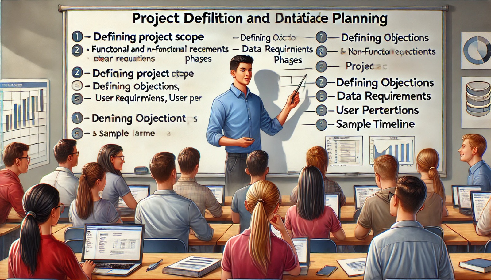

### Semana 14: Definição do Projeto e Planejamento Inicial

**Bem-vindos à Semana 14!**

Nesta semana, daremos os primeiros passos para o desenvolvimento do projeto final. Vamos definir os objetivos do projeto, mapear os requisitos e criar um planejamento detalhado. Este planejamento ajudará a orientar cada fase do projeto, garantindo que todas as etapas sejam bem executadas e organizadas.

---

### Objetivos da Semana

1. **Definir o Escopo do Projeto**: Estabelecer o que o sistema deverá fazer, quais dados deverá armazenar e como será utilizado.
2. **Identificar os Requisitos Funcionais e Não Funcionais**: Especificar as funcionalidades do sistema e as exigências de desempenho e segurança.
3. **Criar um Planejamento Inicial**: Organizar as fases de desenvolvimento, de forma que o trabalho seja realizado de maneira estruturada e eficiente.
4. **Documentar o Processo**: Anotar os detalhes do projeto, garantindo que todos os requisitos estejam claros e registrados para futuras referências.

---

### Passos para Definir o Projeto

#### 1. Definir o Escopo do Projeto

O **escopo** é a descrição do que o sistema deverá realizar. Para defini-lo, responda às perguntas abaixo:

- **Quais são as funcionalidades principais?**
   - Ex.: O sistema deve gerenciar dados de clientes, pedidos e produtos em uma loja online.
- **Quais dados precisarão ser armazenados?**
   - Ex.: Informações de clientes (nome, endereço, e-mail), pedidos (data, valor, status), produtos (nome, preço, estoque).
- **Quem serão os usuários do sistema e quais permissões terão?**
   - Ex.: Usuários administrativos, que podem acessar e modificar todos os dados; clientes, que podem visualizar e atualizar seus próprios dados.

Essas definições ajudarão a criar uma visão clara do projeto e orientarão a criação das tabelas e funcionalidades.

#### 2. Identificar os Requisitos Funcionais e Não Funcionais

**Requisitos funcionais** são as funcionalidades que o sistema deve ter. Eles incluem todas as operações que os usuários devem realizar.

- **Exemplos de Requisitos Funcionais**:
   - O sistema deve permitir que o usuário adicione novos produtos.
   - O sistema deve permitir que o cliente visualize o histórico de pedidos.

**Requisitos não funcionais** descrevem como o sistema deve operar, incluindo desempenho, segurança e escalabilidade.

- **Exemplos de Requisitos Não Funcionais**:
   - O sistema deve responder a uma consulta em até 2 segundos.
   - O sistema deve ser seguro e proteger dados confidenciais dos usuários.

Listar esses requisitos é fundamental para garantir que o sistema final atenda às expectativas dos usuários.

#### 3. Planejamento Inicial do Projeto

Com o escopo e os requisitos definidos, crie um planejamento que divida o trabalho em fases. Cada fase deve ter um objetivo claro e prazos definidos.

**Exemplo de Fases do Projeto**:
1. **Modelagem de Dados**: Criar o modelo lógico e físico do banco de dados.
2. **Implementação das Tabelas**: Definir as tabelas e seus relacionamentos no banco de dados.
3. **Configuração de Índices e Otimização**: Implementar índices e particionamento, se necessário.
4. **Configuração de Segurança**: Definir permissões de acesso para cada tipo de usuário.
5. **Plano de Backup e Recuperação**: Estabelecer um plano de backup para proteger os dados.

Esse planejamento ajuda a acompanhar o progresso do projeto e facilita a organização do trabalho em equipe.

#### 4. Documentação do Processo

Documente cada etapa do planejamento. Registre os requisitos, escopo, fases do projeto e datas importantes. A documentação ajudará a manter tudo organizado e servirá como referência para ajustes futuros.

---

### Dicas para um Planejamento Eficiente

- **Divida o Projeto em Tarefas Menores**: Fases grandes podem ser divididas em tarefas mais específicas, facilitando o acompanhamento do progresso.
- **Defina Prazos Realistas**: Planeje cada fase com prazos que sejam possíveis de cumprir, evitando pressões desnecessárias.
- **Revise e Ajuste Conforme Necessário**: O planejamento pode precisar de ajustes. Esteja aberto a revisar as etapas para atender às necessidades do projeto.

---

### Atividade da Semana (Planejamento e Escopo)

Para praticar o que aprendemos esta semana, responda às questões abaixo e complete a atividade de definição do projeto.

#### Parte 1: Questões de Revisão

1. Qual é o objetivo de definir o escopo do projeto?
   - a) Decidir as ferramentas que serão usadas.
   - b) Descrever o que o sistema deverá realizar.
   - c) Criar tabelas no banco de dados.
   - d) Definir os tipos de dados que serão usados.

2. Qual é um exemplo de requisito funcional?
   - a) O sistema deve ter consultas rápidas.
   - b) O sistema deve permitir que o usuário adicione novos produtos.
   - c) O sistema deve armazenar dados por no mínimo um ano.
   - d) O sistema deve responder rapidamente a consultas.

3. Qual é um exemplo de requisito não funcional?
   - a) O sistema deve permitir que o usuário faça login.
   - b) O sistema deve permitir que o cliente visualize o histórico de pedidos.
   - c) O sistema deve responder a consultas em até 2 segundos.
   - d) O sistema deve permitir que o usuário atualize suas informações.

4. Qual é a importância da documentação no planejamento do projeto?
   - a) Manter os requisitos e processos organizados para futuras referências.
   - b) Criar tabelas para o banco de dados.
   - c) Estabelecer a hierarquia de usuários do sistema.
   - d) Dividir o trabalho entre os membros da equipe.

5. O que deve estar incluído no planejamento inicial do projeto?
   - a) Somente a criação das tabelas.
   - b) Apenas o plano de backup e recuperação.
   - c) O escopo do projeto, as fases do projeto e as datas importantes.
   - d) A configuração de segurança do banco de dados.

---

**Gabarito**:
1. b) Descrever o que o sistema deverá realizar.
2. b) O sistema deve permitir que o usuário adicione novos produtos.
3. c) O sistema deve responder a consultas em até 2 segundos.
4. a) Manter os requisitos e processos organizados para futuras referências.
5. c) O escopo do projeto, as fases do projeto e as datas importantes.

---

### Conclusão

Nesta semana, focamos na **definição do escopo** e no **planejamento inicial** do projeto final. Com um planejamento bem estruturado, é mais fácil organizar o trabalho, definir prioridades e garantir que o projeto seja concluído com sucesso.