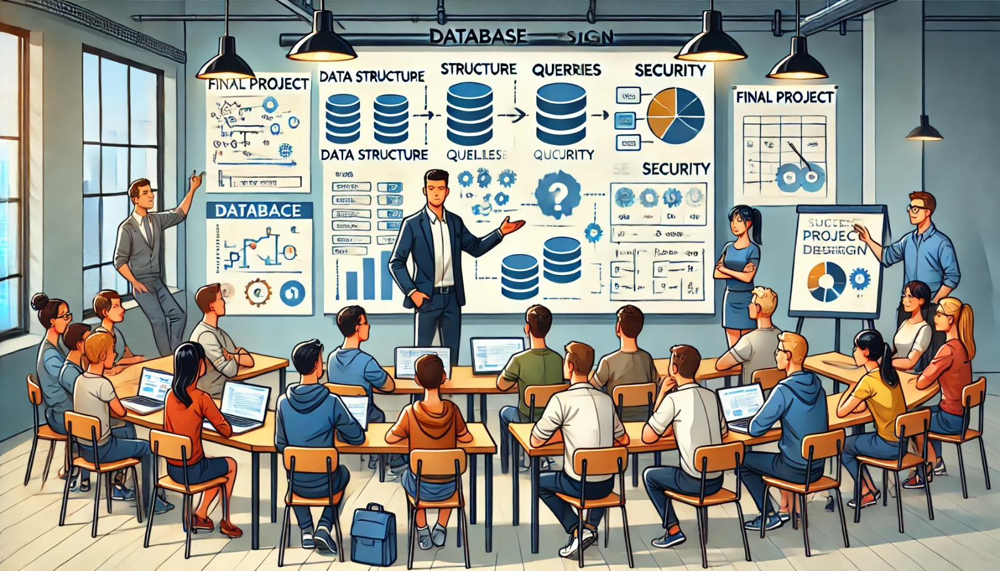

### Semana 20: Apresentação Final e Avaliação do Projeto

**Bem-vindos à Semana 20!**

Chegamos à última etapa do nosso projeto de banco de dados! Nesta semana, cada aluno ou grupo apresentará seu projeto final, mostrando as soluções implementadas, os desafios enfrentados e as lições aprendidas. Além disso, faremos uma avaliação dos projetos, considerando critérios de funcionalidade, organização e otimização.

---

### Objetivos da Semana

1. **Apresentar o Projeto Final**: Cada aluno ou grupo irá demonstrar o projeto, explicando as decisões de design, a implementação e as técnicas de tuning utilizadas.
2. **Avaliar o Projeto**: Realizar uma avaliação estruturada para garantir que os objetivos do projeto foram atendidos.
3. **Refletir sobre o Processo de Desenvolvimento**: Discutir o que foi aprendido ao longo do desenvolvimento e as melhorias que podem ser feitas em futuros projetos.

---

### 1. Estrutura da Apresentação Final

Durante a apresentação, cada aluno ou grupo deve abordar os seguintes pontos:

#### 1.1 Introdução ao Projeto

- **Objetivo do Sistema**: Explique o propósito do projeto e quais problemas ele resolve.
- **Escopo e Funcionalidades Principais**: Descreva as principais funcionalidades do sistema e os requisitos que foram atendidos.

#### 1.2 Modelagem de Dados

- **Modelo Lógico e Físico**: Mostre os diagramas ER e explique as principais entidades, relacionamentos e atributos.
- **Decisões de Design**: Comente as escolhas feitas na estrutura das tabelas, na definição das chaves e na organização dos dados.

#### 1.3 Implementação das Tabelas e Consultas

- **Estrutura das Tabelas**: Demonstre como as tabelas foram implementadas, incluindo as chaves primárias e estrangeiras.
- **Consultas e Relatórios**: Apresente exemplos de consultas SQL que o sistema utiliza para obter informações essenciais, como filtros e relatórios.

#### 1.4 Técnicas de Tuning e Otimização

- **Índices e Particionamento**: Explique onde foram aplicados índices para melhorar o desempenho e como o particionamento foi usado (se aplicável).
- **Otimização de Consultas**: Mostre como as consultas SQL foram otimizadas para acelerar o tempo de resposta e evitar sobrecarga.

#### 1.5 Segurança e Backup

- **Controle de Acesso**: Descreva como foram configuradas as permissões para garantir que apenas usuários autorizados acessem os dados.
- **Rotina de Backup e Recuperação**: Explique o plano de backup implementado, incluindo a frequência e os procedimentos de recuperação.

---

### 2. Avaliação do Projeto

Após a apresentação, o projeto será avaliado com base nos seguintes critérios:

#### Funcionalidade e Usabilidade

- **O sistema cumpre todos os requisitos estabelecidos?**
- **As funcionalidades são intuitivas e fáceis de usar?**
- **As consultas e relatórios fornecem informações úteis e claras?**

#### Organização e Modelagem de Dados

- **A modelagem de dados está bem estruturada e organizada?**
- **As tabelas e os relacionamentos estão bem definidos?**
- **O sistema evita redundâncias e mantém a integridade dos dados?**

#### Desempenho e Tuning

- **Foram aplicadas técnicas de tuning para melhorar o desempenho?**
- **Os índices e as otimizações foram implementados de forma eficaz?**
- **O sistema responde rapidamente a consultas e operações?**

#### Segurança e Backup

- **As permissões de acesso garantem a segurança dos dados?**
- **O plano de backup é adequado e garante a recuperação dos dados?**
- **As práticas de segurança estão alinhadas com as melhores práticas?**

#### Documentação e Apresentação

- **O projeto está bem documentado, com todas as etapas registradas?**
- **A apresentação é clara, organizada e cobre todos os pontos solicitados?**

Cada critério será pontuado para compor a nota final do projeto. A documentação completa e a clareza na apresentação também são pontos importantes para uma boa avaliação.

---

### 3. Reflexão Final

Após as apresentações e avaliações, vamos discutir as lições aprendidas e compartilhar feedback. Este é o momento de refletir sobre:

- **Desafios Enfrentados**: Quais foram as maiores dificuldades ao longo do projeto e como foram superadas?
- **Melhorias Futuras**: O que poderia ser feito de forma diferente em um próximo projeto?
- **Lições Aprendidas**: Que conhecimentos foram adquiridos durante o desenvolvimento e a implementação do banco de dados?

Esse processo de reflexão é importante para consolidar o aprendizado e aprimorar habilidades para futuros projetos.

---

### Atividade Final: Autoavaliação e Feedback

Após a apresentação, cada aluno deve fazer uma autoavaliação e responder às perguntas abaixo para refletir sobre o trabalho realizado:

1. Quais foram as principais lições aprendidas neste projeto?
2. Se tivesse mais tempo, o que você faria de forma diferente?
3. Quais foram os pontos fortes do seu projeto?
4. Qual foi a parte mais desafiadora e como foi superada?
5. Como você avaliaria o seu nível de conhecimento sobre bancos de dados após o projeto?

---

### Conclusão

A apresentação e a avaliação do projeto final marcam o encerramento de um ciclo de aprendizado. A partir do conhecimento adquirido e das experiências vividas, você está pronto para aplicar técnicas de modelagem, segurança, otimização e recuperação de dados em cenários reais. Parabéns pelo empenho e dedicação ao longo de cada etapa do projeto!