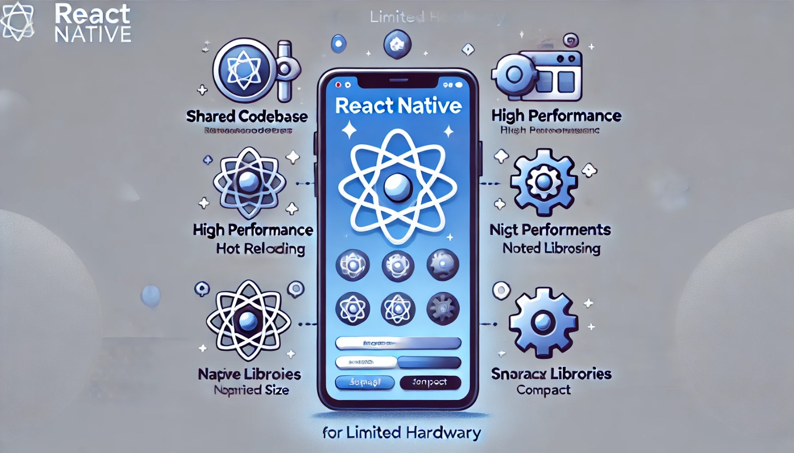

### Aula 3: Vantagens do React Native para Hardware Limitado

#### Introdução

Nesta aula, vamos explorar as vantagens de usar React Native para o desenvolvimento de aplicativos móveis, especialmente em dispositivos com hardware limitado. Entender essas vantagens pode ajudar a criar aplicativos mais eficientes e acessíveis.

#### O que é React Native?

React Native é um framework de desenvolvimento móvel criado pelo Facebook. Ele permite que você crie aplicativos móveis usando apenas JavaScript e React. Com React Native, é possível criar aplicativos para iOS e Android com uma única base de código.

#### Vantagens do React Native para Hardware Limitado

**1. Código Compartilhado entre Plataformas:**
Uma das maiores vantagens do React Native é a capacidade de compartilhar a maior parte do código entre as plataformas iOS e Android. Isso não só economiza tempo e esforço, mas também reduz a carga sobre o hardware durante o desenvolvimento, já que você não precisa executar múltiplas máquinas virtuais ou simuladores.

**2. Desempenho Eficiente:**
React Native compila os componentes para código nativo, o que significa que os aplicativos têm desempenho próximo ao dos aplicativos nativos. Isso é crucial para dispositivos com hardware limitado, onde a eficiência e a velocidade de execução são importantes.

**3. Atualizações em Tempo Real com Hot Reloading:**
A funcionalidade de hot reloading do React Native permite que os desenvolvedores vejam as mudanças no código imediatamente, sem precisar recompilar o aplicativo inteiro. Isso acelera o ciclo de desenvolvimento e reduz o uso de recursos do dispositivo.

**4. Uso de Componentes Nativos:**
React Native permite o uso de componentes nativos do sistema operacional, como botões, menus e barras de navegação. Isso garante que o aplicativo tenha uma aparência e um comportamento consistentes com outros aplicativos nativos, melhorando a experiência do usuário sem exigir muitos recursos adicionais.

**5. Bibliotecas e Componentes Otimizados:**
Há uma vasta coleção de bibliotecas e componentes prontos para uso que são otimizados para React Native. Isso significa que você pode adicionar funcionalidades complexas ao seu aplicativo sem ter que reinventar a roda, economizando tempo e recursos.

**6. Menor Tamanho de Aplicativo:**
Comparado a outras soluções de desenvolvimento híbrido, os aplicativos React Native tendem a ser menores em tamanho. Isso é especialmente importante para dispositivos com espaço de armazenamento limitado.

**7. Grande Comunidade de Suporte:**
React Native tem uma comunidade ativa e crescente. Isso significa que você pode encontrar facilmente soluções para problemas, acessar bibliotecas de terceiros e receber suporte para otimizar seu aplicativo para dispositivos com hardware limitado.

#### Conclusão

Usar React Native para desenvolver aplicativos móveis oferece muitas vantagens, especialmente quando se trabalha com dispositivos de hardware limitado. Desde o compartilhamento de código entre plataformas até a eficiência do desempenho e a vasta coleção de bibliotecas otimizadas, React Native ajuda a criar aplicativos rápidos, eficientes e com boa aparência.

Na próxima aula, vamos aprender sobre a configuração do ambiente de desenvolvimento para React Native, garantindo que você tenha todas as ferramentas necessárias para começar a criar seus próprios aplicativos móveis.

### Referências
- [React Native Documentation](https://reactnative.dev/docs/getting-started)
- [Advantages of React Native](https://www.geeksforgeeks.org/advantages-and-disadvantages-of-react-native/)
- [React Native Performance](https://blog.logrocket.com/react-native-performance-issues-and-how-to-fix-them/)

### Atividade de Fixação: Vantagens do React Native para Hardware Limitado

#### Questões de Múltipla Escolha

**1. Qual é uma das principais vantagens do React Native em termos de compartilhamento de código?**
   - A) Permite criar aplicativos apenas para iOS.
   - B) Permite criar aplicativos apenas para Android.
   - C) Permite compartilhar a maior parte do código entre iOS e Android.
   - D) Não permite o compartilhamento de código entre plataformas.

**2. Como o React Native contribui para o desempenho eficiente em dispositivos com hardware limitado?**
   - A) Compila os componentes para código nativo, garantindo alto desempenho.
   - B) Usa exclusivamente tecnologias web, como HTML e CSS.
   - C) Exige mais recursos do que aplicativos nativos.
   - D) Funciona apenas em dispositivos de última geração.

**3. O que é hot reloading e como ele beneficia os desenvolvedores usando React Native?**
   - A) Uma funcionalidade que reinicia o dispositivo automaticamente.
   - B) Permite que os desenvolvedores vejam as mudanças no código imediatamente sem recompilar o aplicativo inteiro.
   - C) Uma técnica de otimização de banco de dados.
   - D) Um método para aumentar a memória do dispositivo.

**4. Qual das seguintes afirmações sobre o uso de componentes nativos com React Native é verdadeira?**
   - A) React Native não suporta o uso de componentes nativos.
   - B) React Native permite o uso de componentes nativos, garantindo uma aparência e comportamento consistentes com aplicativos nativos.
   - C) Os componentes nativos só podem ser usados em aplicativos desenvolvidos exclusivamente para iOS.
   - D) Os componentes nativos não melhoram a experiência do usuário.

**5. Por que o tamanho menor dos aplicativos React Native é vantajoso para dispositivos com hardware limitado?**
   - A) Porque aumenta a complexidade do desenvolvimento.
   - B) Porque reduz o desempenho do aplicativo.
   - C) Porque economiza espaço de armazenamento no dispositivo.
   - D) Porque impede a atualização do aplicativo.

#### Gabarito
1. C
2. A
3. B
4. B
5. C

### Explicações

1. **Compartilhamento de Código:** React Native permite que a maior parte do código seja compartilhada entre iOS e Android, economizando tempo e esforço no desenvolvimento.
2. **Desempenho Eficiente:** React Native compila os componentes para código nativo, o que garante um desempenho alto e eficiente, mesmo em dispositivos com hardware limitado.
3. **Hot Reloading:** Hot reloading permite que os desenvolvedores vejam as mudanças no código imediatamente, sem a necessidade de recompilar o aplicativo, acelerando o ciclo de desenvolvimento.
4. **Componentes Nativos:** React Native suporta o uso de componentes nativos, proporcionando uma aparência e comportamento consistentes com outros aplicativos nativos, melhorando a experiência do usuário.
5. **Tamanho do Aplicativo:** Aplicativos menores são vantajosos para dispositivos com hardware limitado porque economizam espaço de armazenamento, tornando-os mais acessíveis e eficientes.

### Referências
- [React Native Documentation](https://reactnative.dev/docs/getting-started)
- [Advantages of React Native](https://www.geeksforgeeks.org/advantages-and-disadvantages-of-react-native/)
- [React Native Performance](https://blog.logrocket.com/react-native-performance-issues-and-how-to-fix-them/)