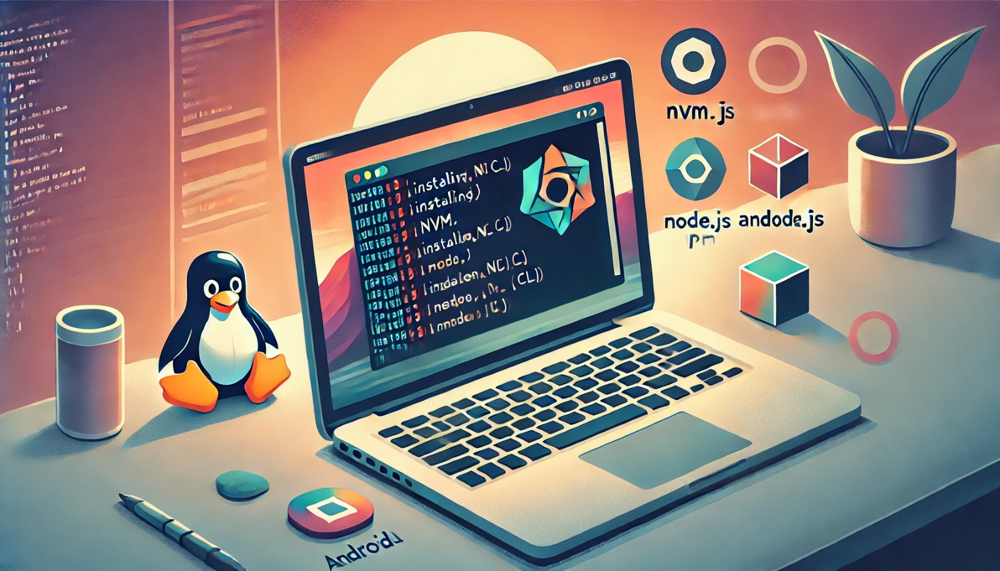

### Aula 4: Introdução à Configuração do Ambiente de Desenvolvimento

#### Introdução

Nesta aula, vamos aprender a configurar o ambiente de desenvolvimento para criar aplicativos móveis usando React Native. Vamos instalar o Node.js e o npm usando o NVM (Node Version Manager) e configurar o Expo CLI localmente em um sistema Linux, distribuição Ubuntu. Também veremos como acessar a primeira página criada em dispositivos Android e iPhone.

#### Passo 1: Instalar o NVM

NVM é uma ferramenta que permite gerenciar múltiplas versões do Node.js no mesmo sistema. Siga os passos abaixo para instalar o NVM:

1. **Baixe e instale o NVM:**
   Abra o terminal e execute o comando abaixo:
   ```bash
   curl -o- https://raw.githubusercontent.com/nvm-sh/nvm/v0.39.7/install.sh | bash
   ```

2. **Ative o NVM:**
   Reinicie o terminal ou execute o comando abaixo para ativar o NVM:
   ```bash
   source ~/.nvm/nvm.sh
   ```

#### Passo 2: Instalar o Node.js e npm

Agora que o NVM está instalado, vamos usá-lo para instalar a versão mais recente do Node.js e npm:

1. **Instale o Node.js:**
   Execute o comando abaixo para instalar a versão mais recente do Node.js:
   ```bash
   nvm install node
   ```

2. **Verifique a instalação:**
   Após a instalação, verifique se a versão correta do Node.js e npm estão instaladas:
   ```bash
   node -v  # Deve imprimir a versão do Node.js
   npm -v   # Deve imprimir a versão do npm
   ```

#### Passo 3: Configurar o Expo CLI Localmente

Devido à descontinuação do Expo CLI após a versão 16 do Node.js, precisamos instalar o Expo CLI localmente no projeto.

1. **Navegue até o diretório do seu projeto:**
   ```bash
   cd /caminho/para/seu/projeto
   ```

2. **Crie um novo projeto Expo:**
   Use o comando abaixo para criar um novo projeto Expo:
   ```bash
   npx create-expo-app nome-do-seu-projeto
   ```

3. **Navegue até o diretório do projeto:**
   ```bash
   cd nome-do-seu-projeto
   ```

4. **Inicie o servidor de desenvolvimento do Expo:**
   Use o comando abaixo para iniciar o Expo:
   ```bash
   npx expo start
   ```

#### Passo 4: Acessar a Primeira Página no Dispositivo

Agora que o servidor de desenvolvimento está em execução, vamos acessar a página criada nos dispositivos Android e iPhone.

1. **Certifique-se de que o dispositivo e o computador estejam na mesma rede Wi-Fi.**

2. **No Android:**
   - Baixe o aplicativo "Expo Go" na Google Play Store.
   - Abra o aplicativo e escaneie o código QR exibido no navegador após executar `npx expo start`.
   - O aplicativo será carregado e exibido no dispositivo Android.

3. **No iPhone:**
   - Baixe o aplicativo "Expo Go" na App Store.
   - Abra o aplicativo e escaneie o código QR exibido no navegador após executar `npx expo start`.
   - O aplicativo será carregado e exibido no dispositivo iPhone.

#### Conclusão

Seguindo esses passos, você terá configurado com sucesso seu ambiente de desenvolvimento para criar aplicativos móveis usando React Native e Expo. Além disso, aprendeu a acessar a página criada diretamente em dispositivos Android e iPhone.

Na próxima aula, vamos explorar mais detalhes sobre o desenvolvimento de interfaces para aplicativos móveis.

### Referências
- [Documentação Oficial do NVM](https://github.com/nvm-sh/nvm)
- [Documentação Oficial do Node.js](https://nodejs.org/en/)
- [Documentação Oficial do Expo](https://docs.expo.dev/)

### Exercícos de Fixação: Introdução à Configuração do Ambiente de Desenvolvimento

#### Questões de Múltipla Escolha

**1. Qual é a função do NVM (Node Version Manager) no processo de configuração do ambiente de desenvolvimento?**
   - A) Gerenciar múltiplas versões do Node.js no mesmo sistema.
   - B) Instalar pacotes de software específicos para o Ubuntu.
   - C) Facilitar a compilação de código nativo.
   - D) Executar aplicativos móveis em dispositivos Android e iOS.

**2. Qual é o comando utilizado para instalar o NVM no sistema Ubuntu?**
   - A) `sudo apt-get install nvm`
   - B) `curl -o- https://raw.githubusercontent.com/nvm-sh/nvm/v0.39.7/install.sh | bash`
   - C) `nvm install node`
   - D) `npm install -g nvm`

**3. Após instalar o NVM, qual comando é utilizado para instalar a versão mais recente do Node.js?**
   - A) `node install latest`
   - B) `nvm use latest`
   - C) `nvm install node`
   - D) `npm install node`

**4. Para verificar se a versão correta do Node.js foi instalada, qual comando deve ser utilizado?**
   - A) `npm -v`
   - B) `node -check`
   - C) `node -v`
   - D) `version node`

**5. Por que é necessário instalar o Expo CLI localmente no projeto?**
   - A) Porque o Expo CLI não suporta versões do Node.js anteriores à versão 16.
   - B) Porque o Expo CLI foi descontinuado após a versão 16 do Node.js.
   - C) Porque o Expo CLI é incompatível com sistemas Ubuntu.
   - D) Porque o Expo CLI requer permissões de administrador para ser instalado globalmente.

**6. Qual é o comando para iniciar um novo projeto Expo no diretório do seu projeto?**
   - A) `npm create-expo-app`
   - B) `expo init nome-do-seu-projeto`
   - C) `npx create-expo-app nome-do-seu-projeto`
   - D) `expo start nome-do-seu-projeto`

**7. Para acessar a primeira página criada no seu dispositivo Android, qual aplicativo você precisa baixar?**
   - A) Expo Go
   - B) Android Studio
   - C) Node.js
   - D) React Native

**8. Para que o dispositivo móvel possa acessar a aplicação criada, qual é um requisito importante?**
   - A) O dispositivo deve estar conectado à internet via dados móveis.
   - B) O dispositivo deve estar na mesma rede Wi-Fi que o computador de desenvolvimento.
   - C) O dispositivo deve ter uma versão mínima do Android 10.
   - D) O dispositivo deve estar conectado via cabo USB.

#### Gabarito
1. A
2. B
3. C
4. C
5. B
6. C
7. A
8. B

### Explicações

1. **NVM:** Gerencia múltiplas versões do Node.js no mesmo sistema.
2. **Instalação do NVM:** O comando correto para instalar o NVM.
3. **Instalação do Node.js:** Usamos `nvm install node` para instalar a versão mais recente.
4. **Verificação da Versão do Node.js:** `node -v` imprime a versão instalada do Node.js.
5. **Expo CLI Localmente:** Devido à descontinuação após a versão 16 do Node.js.
6. **Novo Projeto Expo:** `npx create-expo-app nome-do-seu-projeto` inicia um novo projeto Expo.
7. **Aplicativo Expo Go:** Necessário para visualizar o projeto no dispositivo Android.
8. **Mesma Rede Wi-Fi:** É essencial que o dispositivo e o computador estejam na mesma rede para acessar a aplicação.

### Referências
- [Documentação Oficial do NVM](https://github.com/nvm-sh/nvm)
- [Documentação Oficial do Node.js](https://nodejs.org/en/)
- [Documentação Oficial do Expo](https://docs.expo.dev/)