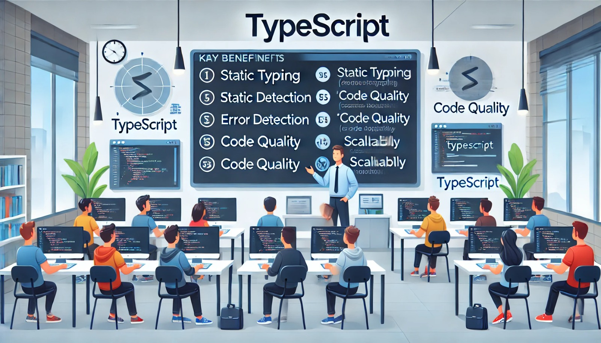

### Aula 5: Introdução ao TypeScript

**Objetivo da Aula:**
- Compreender a origem e os objetivos do TypeScript.
- Comparar TypeScript com JavaScript.
- Entender os benefícios e conceitos básicos do TypeScript.
- Reconhecer a importância do TypeScript no desenvolvimento de aplicativos móveis.

**Conteúdo Programático:**

#### Introdução ao TypeScript

**Como surgiu, para quê foi criado:**
- **Origem:** Criado pela Microsoft e lançado pela primeira vez em 2012.
- **Objetivo:** Fornecer uma linguagem com tipagem estática que compila para JavaScript, facilitando o desenvolvimento e manutenção de código escalável.

**Comparação com o JavaScript:**
- **JavaScript:** Linguagem dinâmica, sem verificação de tipos em tempo de compilação.
- **TypeScript:** Superconjunto do JavaScript que adiciona tipagem estática, permitindo detectar erros de tipo em tempo de desenvolvimento.

**Benefícios e conceitos básicos:**
- **Tipagem estática:** Reduz erros ao identificar problemas de tipo antes da execução.
- **Suporte a ES6+:** Compatível com as funcionalidades mais recentes do JavaScript.
- **IDE-Friendly:** Oferece melhor suporte para autocompletar e navegação de código em editores modernos.
- **Conceitos:** Tipos primitivos, interfaces, classes, módulos, e funções tipadas.

**Por quê é necessário saber TypeScript para desenolver aplicativos móveis?**
- **Manutenção e Escalabilidade:** Facilita a manutenção de grandes bases de código, comum em aplicativos móveis.
- **Integração com React Native:** Melhor suporte a ferramentas e bibliotecas utilizadas no desenvolvimento móvel.
- **Qualidade do Código:** Aumenta a confiabilidade e a qualidade do código, reduzindo bugs e erros em produção.

**Conclusão:**
- TypeScript aprimora a experiência de desenvolvimento e a qualidade dos aplicativos móveis.
- Aprofundar o conhecimento em TypeScript é crucial para desenvolver soluções robustas e eficientes em ambientes complexos.

**Exercícios de Fixação:**

1. **Questões de Múltipla Escolha:**

   **1. Qual é o objetivo principal do TypeScript?**
   a) Substituir o JavaScript 
   b) Adicionar tipagem estática ao JavaScript 
   c) Melhorar a performance do código 
   d) Criar uma nova linguagem de programação 

   **2. Quem criou o TypeScript?**
   a) Google 
   b) Microsoft 
   c) Facebook 
   d) Amazon 

   **3. Qual das opções a seguir é um benefício do TypeScript?**
   a) Tipagem estática 
   b) Suporte limitado a ES6+ 
   c) Não compatível com JavaScript 
   d) Performance reduzida 

   **4. Por que é importante saber TypeScript para desenvolver aplicativos móveis?**
   a) Porque é mais rápido que JavaScript 
   b) Facilita a manutenção e escalabilidade do código 
   c) Não é necessário para desenvolvimento móvel 
   d) Porque é a única linguagem suportada pelo React Native 

   **5. Qual dos seguintes conceitos NÃO é parte do TypeScript?**
   a) Interfaces 
   b) Tipos primitivos 
   c) Classes 
   d) Selectores de CSS 

***Fontes:***
- https://www.typescriptlang.org/docs/handbook/intro.html
- https://devblogs.microsoft.com/typescript/introducing-typescript/
- https://developer.mozilla.org/en-US/docs/Web/JavaScript/Reference/Statements/TypeScript
- https://reactnative.dev/docs/typescript

Esse plano de aula oferece uma visão clara e prática do TypeScript, preparando os alunos para avançar no desenvolvimento móvel com React Native e Expo.

### Gabarito dos Exercícios de Fixação

**1. Qual é o objetivo principal do TypeScript?**
   b) Adicionar tipagem estática ao JavaScript

**2. Quem criou o TypeScript?**
   b) Microsoft

**3. Qual das opções a seguir é um benefício do TypeScript?**
   a) Tipagem estática

**4. Por que é importante saber TypeScript para desenvolver aplicativos móveis?**
   b) Facilita a manutenção e escalabilidade do código

**5. Qual dos seguintes conceitos NÃO é parte do TypeScript?**
   d) Selectores de CSS

