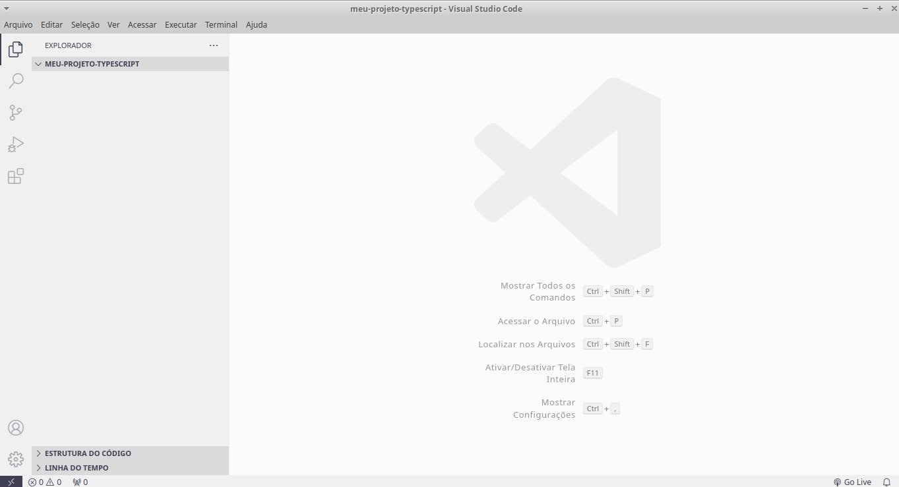
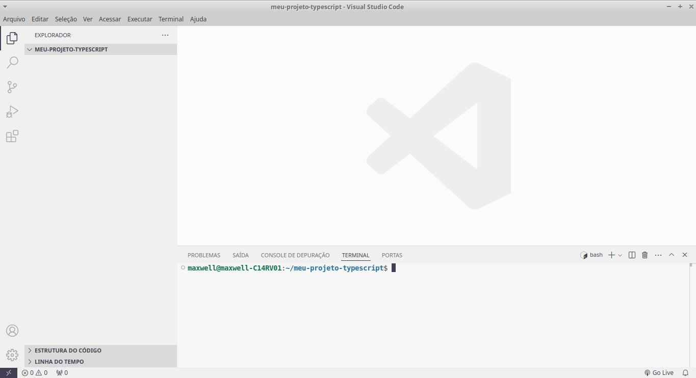
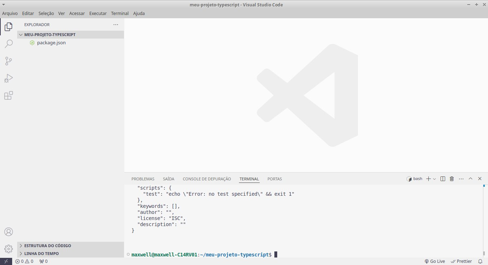
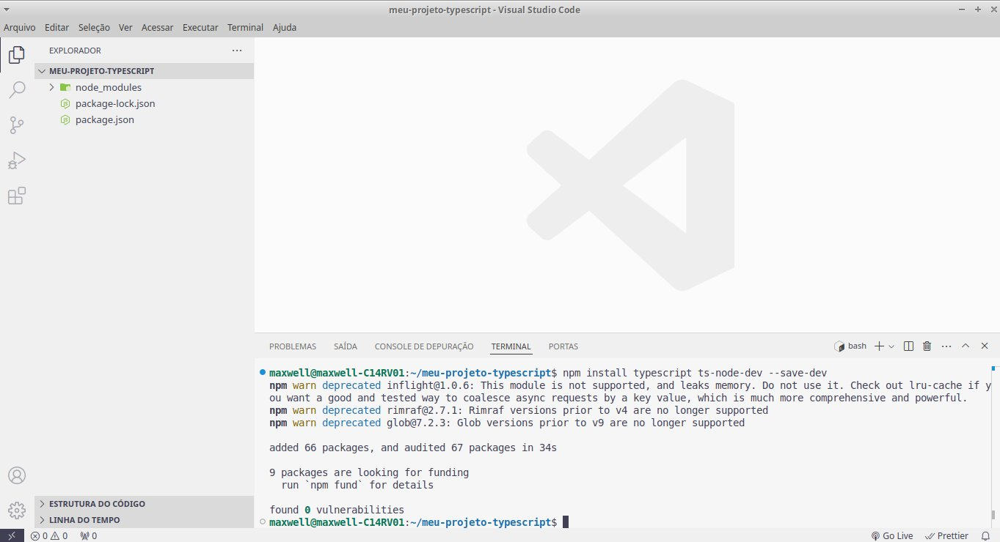
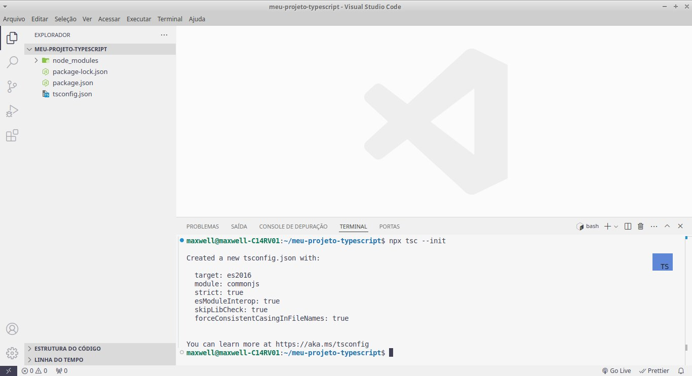
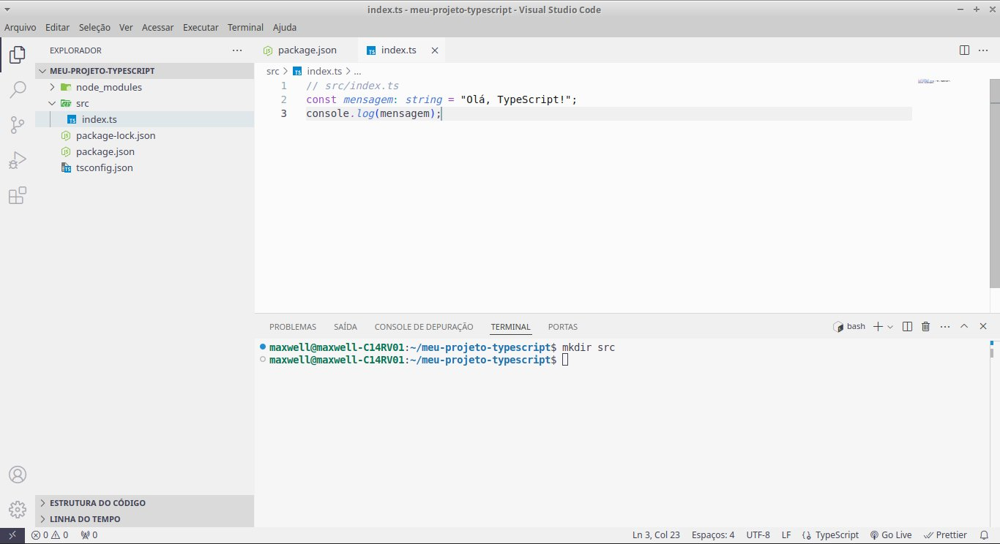
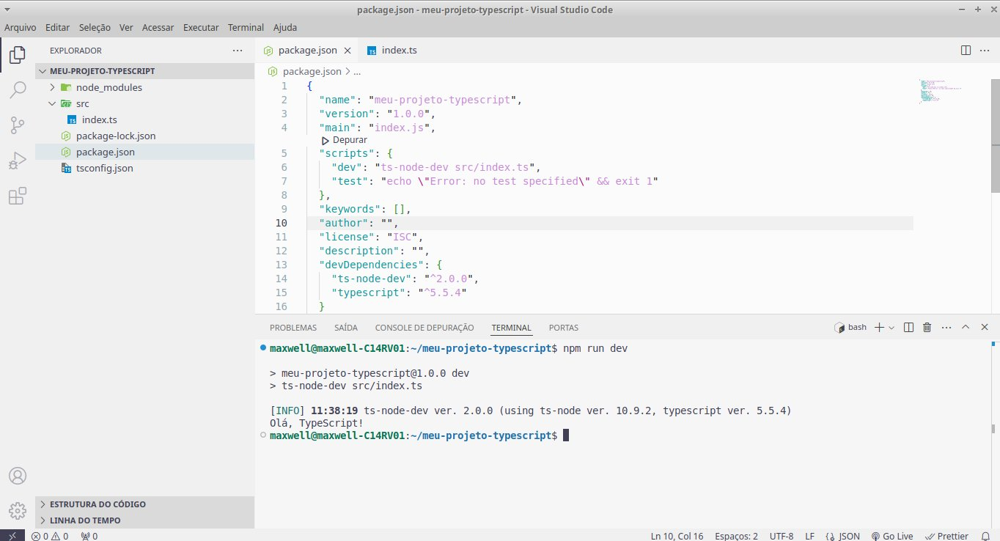

### Aula 6: Configuração do TypeScript no Projeto (Atualizada)

**Objetivo da Aula:**
- Configurar um ambiente de desenvolvimento TypeScript.
- Integrar TypeScript a um projeto existente ou criar um novo projeto com TypeScript.

**Conteúdo Programático:**

#### Configuração do TypeScript no Projeto

**1. Pré-requisitos:**
- **Node.js e npm:** Certifique-se de que Node.js e npm (Node Package Manager) estão instalados no seu sistema.
  - https://nodejs.org/pt/download/package-manager

**2. Instalando o TypeScript:**
- Abra o terminal e execute o comando:
  ```bash
  npm install -g typescript
  ```

**3. Inicializando um Projeto TypeScript:**
- Crie uma nova pasta para o projeto e navegue até ela no terminal:
  ```bash
  mkdir meu-projeto-typescript
  cd meu-projeto-typescript
  ```
- Abra o seu projeto com o VScode:
  ```bash
  code .
  ```
  
- Pressione ctrl + j para abrir o terminal no vscode:
  
- Inicialize o projeto com npm:
  ```bash
  npm init -y
  ```
  
- Instale o TypeScript e o ts-node-dev localmente no projeto:
  ```bash
  npm install typescript ts-node-dev --save-dev
  ```
  

**4. Configurando o tsconfig.json:**
- Gere o arquivo de configuração do TypeScript:
  ```bash
  npx tsc --init
  ```
  
**5. Estrutura do Projeto:**
- Crie a pasta `src` para armazenar os arquivos TypeScript.
  ```bash
  mkdir src
  ```
- Dentro da pasta `src`, crie um arquivo `index.ts`:
  ```typescript
  // src/index.ts
  const mensagem: string = "Olá, TypeScript!";
  console.log(mensagem);
  ```
  
**6. Adicionando Scripts ao package.json:**
- Atualize o `package.json` adicionando um script de desenvolvimento ("dev": "ts-node-dev src/index.ts",) dentro de "scripts":{ } :
  ```json
  {
    "scripts": {
      "dev": "ts-node-dev src/index.ts",
      "test": "echo \"Error: no test specified\" && exit 1"
    }
  }
  ```

**7. Executando o Código TypeScript:**
- Para compilar e assistir o código TypeScript, execute:
  ```bash
  npm run dev
  ```

**Conclusão:**
- Configurar o TypeScript no projeto é um passo essencial para aproveitar seus benefícios, como tipagem estática e detecção de erros em tempo de desenvolvimento.

**Exercícios de Fixação:**

1. **Qual comando é usado para instalar o TypeScript globalmente?**
   a) `npm install typescript`<br>
   b) `npm install -g typescript`<br>
   c) `npm install --save typescript`<br>
   d) `npm install typescript --save-dev`<br>

2. **Qual comando inicializa um arquivo de configuração TypeScript?**
   a) `tsc --init`<br>
   b) `tsconfig --init`<br>
   c) `typescript --init`<br>
   d) `init --tsconfig`<br>

3. **Qual é a função do arquivo tsconfig.json?**
   a) Configurar as dependências do projeto<br>
   b) Especificar as configurações de compilação do TypeScript<br>
   c) Definir os módulos do Node.js<br>
   d) Configurar o ambiente de desenvolvimento<br>

4. **Qual pasta deve conter os arquivos TypeScript no exemplo dado?**
   a) `dist`<br>
   b) `build`<br>
   c) `src`<br>
   d) `lib`<br>

5. **Qual comando compila e executa os arquivos TypeScript para JavaScript?**
   a) `tsc -w`<br>
   b) `tsbuild -w`<br>
   c) `typescript -w`<br>
   d) `npm run dev`<br>

### Gabarito dos Exercícios de Fixação

**1. Qual comando é usado para instalar o TypeScript globalmente?**
   b) `npm install -g typescript`

**2. Qual comando inicializa um arquivo de configuração TypeScript?**
   a) `tsc --init`

**3. Qual é a função do arquivo tsconfig.json?**
   b) Especificar as configurações de compilação do TypeScript

**4. Qual pasta deve conter os arquivos TypeScript no exemplo dado?**
   c) `src`

**5. Qual comando compila e executa os arquivos TypeScript para JavaScript?**
   d) `npm run dev`