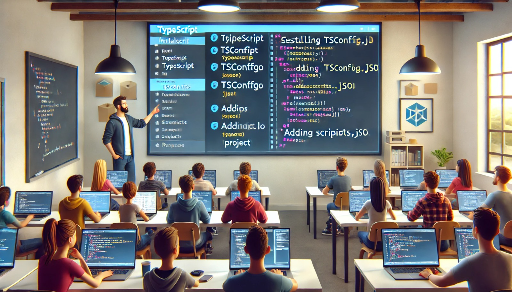

### Aula 6: Princípios de Design Responsivo

#### Introdução

Nesta aula, vamos aprender sobre design responsivo. O design responsivo garante que um site ou aplicativo se adapte bem a diferentes tamanhos de tela, como smartphones, tablets e computadores.

#### O que é Design Responsivo?

Design responsivo é uma abordagem para criar sites e aplicativos que funcionam bem em todos os dispositivos, independentemente do tamanho da tela. Isso significa que o conteúdo deve ser fácil de ler e navegar, seja em um pequeno smartphone ou em um grande monitor de computador.

#### Princípios Básicos do Design Responsivo

1. **Layouts Flexíveis:**
   - Use layouts que se ajustem automaticamente ao tamanho da tela. Isso pode ser feito usando unidades de medida flexíveis, como porcentagens, em vez de pixels fixos.

2. **Imagens e Mídias Flexíveis:**
   - As imagens e outros elementos de mídia devem redimensionar corretamente conforme o tamanho da tela. Use CSS para definir a largura das imagens em porcentagens para que elas se ajustem ao seu contêiner.

3. **Media Queries:**
   - As media queries permitem aplicar estilos CSS diferentes com base nas características do dispositivo, como largura da tela, altura e orientação. Isso permite ajustar o design para diferentes tamanhos de tela.

   ```css
   @media (max-width: 600px) {
     .container {
       flex-direction: column;
     }
   }
   ```

4. **Tipografia Adaptativa:**
   - Use unidades relativas para fontes, como `em` ou `rem`, para garantir que o texto seja legível em diferentes tamanhos de tela.

5. **Navegação Adaptativa:**
   - Ajuste a navegação para funcionar bem em diferentes dispositivos. Em telas menores, considere usar menus hambúrguer para economizar espaço.

6. **Testar em Diversos Dispositivos:**
   - Sempre teste seu design em diferentes dispositivos e tamanhos de tela para garantir que tudo funcione bem.

#### Ferramentas e Técnicas

1. **Frameworks de CSS:**
   - Frameworks como Bootstrap e Foundation fornecem classes CSS pré-definidas que facilitam a criação de layouts responsivos.

2. **Flexbox:**
   - Flexbox é um modelo de layout que facilita a criação de layouts flexíveis e responsivos.

   ```css
   .container {
     display: flex;
     flex-wrap: wrap;
   }
   ```

3. **Grid Layout:**
   - O Grid Layout é outro sistema de layout CSS que permite criar designs complexos e responsivos.

   ```css
   .grid-container {
     display: grid;
     grid-template-columns: repeat(auto-fill, minmax(200px, 1fr));
   }
   ```

#### Conclusão

Design responsivo é essencial para criar sites e aplicativos que ofereçam uma boa experiência de usuário em qualquer dispositivo. Usando layouts flexíveis, media queries e outras técnicas, você pode garantir que seu conteúdo seja acessível e fácil de usar, independentemente do tamanho da tela.

Na próxima aula, vamos aplicar esses princípios criando uma interface responsiva para um aplicativo móvel.

### Referências
- [Guia de Design Responsivo](https://developer.mozilla.org/en-US/docs/Learn/CSS/CSS_layout/Responsive_Design)
- [Documentação do Bootstrap](https://getbootstrap.com/)
- [Documentação do Flexbox](https://css-tricks.com/snippets/css/a-guide-to-flexbox/)
- [Documentação do CSS Grid Layout](https://css-tricks.com/snippets/css/complete-guide-grid/)