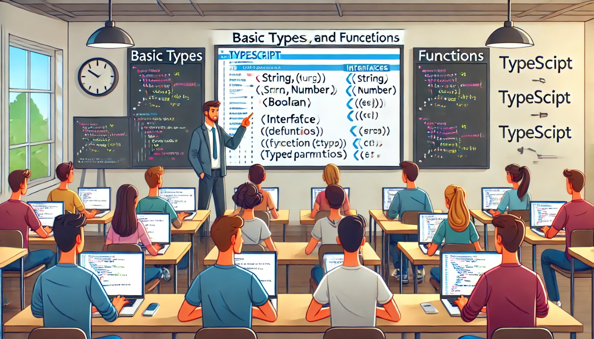

### Aulas 7-8: Tipos Básicos, Interfaces e Funções em TypeScript

**Objetivo da Aula:**
- Compreender e utilizar tipos básicos em TypeScript.
- Definir e implementar interfaces.
- Criar e utilizar funções tipadas.

**Conteúdo Programático:**

#### Tipos Básicos em TypeScript

**1. Introdução aos Tipos Básicos:**
- **String:** Sequências de caracteres.
  ```typescript
  let nome: string = "João";
  ```
- **Number:** Valores numéricos.
  ```typescript
  let idade: number = 30;
  ```
- **Boolean:** Verdadeiro ou falso.
  ```typescript
  let ativo: boolean = true;
  ```
- **Array:** Coleção de valores de mesmo tipo.
  ```typescript
  let numeros: number[] = [1, 2, 3];
  ```

**2. Tipos de Tupla:**
- Estrutura que permite armazenar múltiplos valores de diferentes tipos.
  ```typescript
  let pessoa: [string, number] = ["João", 30];
  ```

**3. Enum:**
- Conjunto de constantes nomeadas.
  ```typescript
  enum Cor { Vermelho, Verde, Azul }
  let corFavorita: Cor = Cor.Verde;
  ```

**4. Any:**
- Tipo que permite qualquer valor, utilizado em casos de incerteza.
  ```typescript
  let valor: any = 5;
  valor = "Texto";
  ```

**5. Void:**
- Representa ausência de valor, comum em funções que não retornam nada.
  ```typescript
  function saudar(): void {
    console.log("Olá");
  }
  ```

**6. Null e Undefined:**
- Tipos básicos para valores nulos e indefinidos.
  ```typescript
  let indefinido: undefined = undefined;
  let nulo: null = null;
  ```

#### Interfaces em TypeScript

**1. Definição de Interfaces:**
- Contratos para objetos, definindo a estrutura que eles devem seguir.
  ```typescript
  interface Pessoa {
    nome: string;
    idade: number;
  }
  let usuario: Pessoa = { nome: "João", idade: 30 };
  ```

**2. Propriedades Opcionais:**
- Propriedades que não são obrigatórias.
  ```typescript
  interface Carro {
    modelo: string;
    ano?: number;
  }
  let meuCarro: Carro = { modelo: "Fusca" };
  ```

**3. Interfaces de Função:**
- Definição de tipos para funções.
  ```typescript
  interface Calculo {
    (a: number, b: number): number;
  }
  let somar: Calculo = (x, y) => x + y;
  ```

#### Funções em TypeScript

**1. Tipagem de Funções:**
- Definição de tipos de parâmetros e retorno.
  ```typescript
  function somar(a: number, b: number): number {
    return a + b;
  }
  ```

**2. Parâmetros Opcionais:**
- Parâmetros que podem ou não ser fornecidos.
  ```typescript
  function saudar(nome: string, saudacao?: string): void {
    console.log(`${saudacao || "Olá"}, ${nome}`);
  }
  ```

**3. Parâmetros Padrão:**
- Valores padrão para parâmetros.
  ```typescript
  function multiplicar(a: number, b: number = 1): number {
    return a * b;
  }
  ```

**4. Tipos de Retorno:**
- Definição de tipos específicos de retorno.
  ```typescript
  function obterUsuario(id: number): Pessoa | null {
    // lógica para obter usuário
    return null;
  }
  ```

**Conclusão:**
- Entender e utilizar tipos básicos, interfaces e funções em TypeScript é fundamental para escrever código robusto e escalável.

### Exercícios de Fixação

1. **Qual é o tipo básico usado para representar valores verdadeiros ou falsos?**
   a) `string`  
   b) `boolean`  
   c) `number`  
   d) `array`  

2. **Como se define uma interface para um objeto Pessoa com propriedades nome e idade?**
   a) 
   ```typescript
   interface Pessoa {
     nome: string;
     idade: number;
   }
   ```
   b) 
   ```typescript
   interface Pessoa {
     nome: number;
     idade: string;
   }
   ```
   c) 
   ```typescript
   interface Pessoa {
     nome: boolean;
     idade: boolean;
   }
   ```
   d) 
   ```typescript
   interface Pessoa {
     nome: array;
     idade: array;
   }
   ```

3. **Como se cria uma função que aceita um parâmetro opcional?**
   a) 
   ```typescript
   function saudar(nome: string, saudacao: string): void {
     console.log(`${saudacao}, ${nome}`);
   }
   ```
   b) 
   ```typescript
   function saudar(nome: string, saudacao?: string): void {
     console.log(`${saudacao || "Olá"}, ${nome}`);
   }
   ```
   c) 
   ```typescript
   function saudar(nome: string, saudacao: number): void {
     console.log(`${saudacao}, ${nome}`);
   }
   ```
   d) 
   ```typescript
   function saudar(nome: number, saudacao?: number): void {
     console.log(`${saudacao || "Olá"}, ${nome}`);
   }
   ```

4. **Qual comando é usado para definir um valor padrão para um parâmetro de função?**
   a) 
   ```typescript
   function multiplicar(a: number, b: number = 1): number {
     return a * b;
   }
   ```
   b) 
   ```typescript
   function multiplicar(a: number, b: number = 0): number {
     return a * b;
   }
   ```
   c) 
   ```typescript
   function multiplicar(a: number, b: number = 2): number {
     return a * b;
   }
   ```
   d) 
   ```typescript
   function multiplicar(a: number, b: number = 3): number {
     return a * b;
   }
   ```

5. **Qual é a sintaxe correta para definir uma tupla com um string e um número?**
   a) 
   ```typescript
   let pessoa: [string, number] = [30, "João"];
   ```
   b) 
   ```typescript
   let pessoa: [number, string] = ["João", 30];
   ```
   c) 
   ```typescript
   let pessoa: [string, number] = ["João", 30];
   ```
   d) 
   ```typescript
   let pessoa: [number, string] = [30, "João"];
   ```