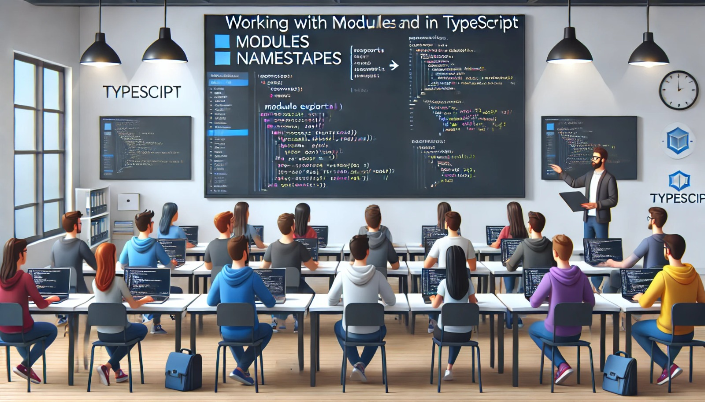

### Aulas 11-12: Trabalhando com Módulos e Namespaces em TypeScript

**Objetivo da Aula:**
- Compreender a utilização de módulos em TypeScript.
- Aprender a organizar o código utilizando namespaces.
- Praticar a importação e exportação de funcionalidades em diferentes arquivos.

**Conteúdo Programático:**

#### Módulos em TypeScript

**1. O que são Módulos?**
- **Módulos** são uma forma de organizar e dividir o código em diferentes arquivos, permitindo que você importe e utilize funcionalidades em outros arquivos. Isso facilita a manutenção e reutilização do código.

**2. Exportando Funcionalidades:**
- **Exportação** é como você torna parte do seu código acessível em outros arquivos. Você pode exportar variáveis, funções, classes, interfaces, entre outros.
  ```typescript
  // arquivo math.ts
  export function somar(a: number, b: number): number {
    return a + b;
  }
  ```
- **Exportação Padrão:** Permite exportar uma única funcionalidade como principal do arquivo.
  ```typescript
  // arquivo saudacao.ts
  export default function saudar(nome: string): string {
    return `Olá, ${nome}`;
  }
  ```

**3. Importando Funcionalidades:**
- **Importação** é como você traz funcionalidades de outro módulo para o seu arquivo.
  ```typescript
  // arquivo main.ts
  import { somar } from './math';
  console.log(somar(5, 3));
  ```
- **Importação Padrão:** Quando você usa exportação padrão.
  ```typescript
  // arquivo main.ts
  import saudar from './saudacao';
  console.log(saudar('João'));
  ```

#### Namespaces em TypeScript

**1. O que são Namespaces?**
- **Namespaces** são uma forma de organizar o código dentro de um único arquivo ou de vários arquivos, agrupando código relacionado sob um mesmo nome. Isso ajuda a evitar conflitos de nomes e mantém o código mais organizado.
  ```typescript
  namespace Animais {
    export class Cachorro {
      latir(): void {
        console.log("Au Au!");
      }
    }

    export class Gato {
      miar(): void {
        console.log("Miau!");
      }
    }
  }

  let cachorro = new Animais.Cachorro();
  cachorro.latir();
  ```

**2. Usando Namespaces em Vários Arquivos:**
- Você pode espalhar o conteúdo de um namespace por vários arquivos, desde que utilize a mesma declaração de namespace em todos.
  ```typescript
  // arquivo animais.ts
  namespace Animais {
    export class Elefante {
      trombar(): void {
        console.log("Trombar!");
      }
    }
  }

  // arquivo main.ts
  /// <reference path="animais.ts" />
  let elefante = new Animais.Elefante();
  elefante.trombar();
  ```

**Conclusão:**
- Usar módulos e namespaces é essencial para organizar grandes bases de código, permitindo reutilização e manutenção mais fácil. Módulos são ideais para separar código em diferentes arquivos, enquanto namespaces ajudam a evitar conflitos de nomes em projetos maiores.

### Exercícios de Fixação

1. **Como você exporta uma função chamada `multiplicar` de um arquivo chamado `math.ts`?**
   a) 
   ```typescript
   export function multiplicar(a: number, b: number): number {
     return a * b;
   }
   ```
   b) 
   ```typescript
   function multiplicar(a: number, b: number): number {
     return a * b;
   }
   ```
   c) 
   ```typescript
   export default multiplicar(a: number, b: number): number {
     return a * b;
   }
   ```
   d) 
   ```typescript
   export multiplicar function(a: number, b: number): number {
     return a * b;
   }
   ```

2. **Qual é a maneira correta de importar uma função padrão chamada `calcular` de um arquivo `calc.ts`?**
   a) 
   ```typescript
   import { calcular } from './calc';
   ```
   b) 
   ```typescript
   import calcular from './calc';
   ```
   c) 
   ```typescript
   import './calc';
   ```
   d) 
   ```typescript
   import * as calcular from './calc';
   ```

3. **Qual das opções a seguir NÃO é um benefício do uso de módulos?**
   a) Organização do código  
   b) Reutilização de código  
   c) Isolamento de código  
   d) Redução do tamanho dos arquivos  

4. **O que acontece quando você usa namespaces em TypeScript?**
   a) Organiza e agrupa código relacionado sob um mesmo nome  
   b) Torna o código mais difícil de entender  
   c) Desativa a tipagem estática  
   d) Reduz a necessidade de comentários no código  

5. **Qual das opções a seguir é a melhor prática ao usar namespaces em um projeto grande?**
   a) Colocar todo o código em um único namespace  
   b) Dividir o código em múltiplos namespaces relacionados  
   c) Evitar o uso de namespaces  
   d) Usar namespaces apenas para funções  

### Atividade Prática

**Objetivo:** Aplicar o uso de módulos e namespaces para organizar o código de um pequeno projeto em TypeScript.

**Tarefa:**

1. **Criar Módulos:**
   - Crie um arquivo `math.ts` que contenha funções para `somar`, `subtrair`, `multiplicar`, e `dividir`. Exporte cada uma dessas funções.

2. **Usar Módulos:**
   - Crie um arquivo `main.ts` e importe as funções do módulo `math.ts`.
   - Use as funções importadas para realizar operações matemáticas e exibir os resultados no console.

3. **Utilizar Namespaces:**
   - Crie um arquivo `animais.ts` e defina um namespace `Animais` contendo classes `Cachorro` e `Gato`, cada uma com métodos para emitir sons (`latir` e `miar`).
   - No arquivo `main.ts`, utilize o namespace `Animais` para criar instâncias de `Cachorro` e `Gato`, e chame seus métodos.

4. **Rodar o Projeto:**
   - Compile o código TypeScript e execute-o para verificar se tudo está funcionando corretamente.

**Entrega:** Envie o código em um repositório GitHub ou como arquivos compactados, junto com uma captura de tela dos resultados exibidos no console.