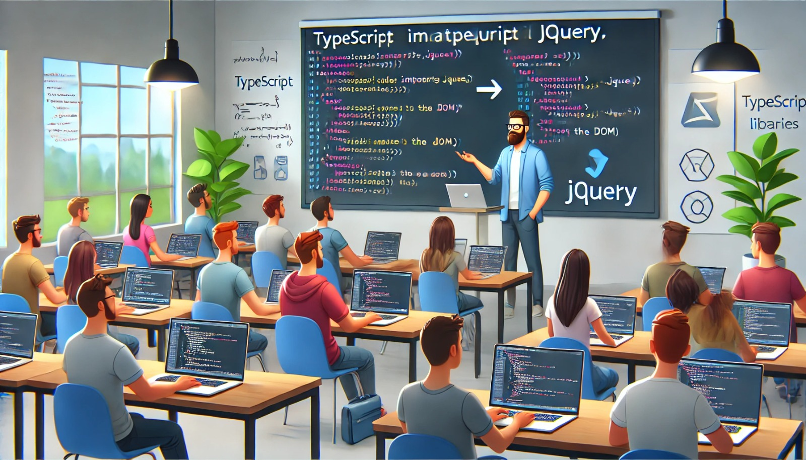

### Aulas 13-14: Integração do TypeScript com Bibliotecas JavaScript

**Objetivo da Aula:**
- Aprender a integrar TypeScript com bibliotecas JavaScript.
- Entender como utilizar definições de tipos (Type Definitions) para bibliotecas que não foram escritas originalmente em TypeScript.

**Conteúdo Programático:**

#### Integrando TypeScript com Bibliotecas JavaScript

**1. O Desafio da Integração:**
- Muitas bibliotecas populares no ecossistema JavaScript, como `jQuery`, foram escritas originalmente em JavaScript puro, sem o suporte nativo ao TypeScript.
- Isso pode ser um problema ao usar TypeScript, pois ele espera que todo o código tenha tipos definidos. Sem os tipos, você perde os benefícios de segurança do TypeScript, como a detecção de erros em tempo de compilação.

**2. Usando jQuery em TypeScript:**
- Mesmo que uma biblioteca tenha sido escrita em JavaScript, você ainda pode usá-la em TypeScript. Contudo, você precisa informar ao TypeScript sobre os tipos que a biblioteca utiliza.

**3. Definições de Tipos (`.d.ts`):**
- **Definições de tipos** são arquivos que contêm as declarações de tipos de uma biblioteca JavaScript. Eles geralmente têm a extensão `.d.ts` e dizem ao TypeScript o que esperar da biblioteca.
- Muitas bibliotecas populares já vêm com arquivos `.d.ts`, mas quando não vêm, você pode adicioná-las usando o DefinitelyTyped, um repositório de definições de tipos da comunidade.

**4. Instalando Definições de Tipos:**
- A maioria das definições de tipos está disponível via npm e pode ser instalada facilmente. Por exemplo, para usar `jQuery` com TypeScript, você faria:
  ```bash
  npm install jquery
  npm install @types/jquery --save-dev
  ```

**5. Exemplo de Uso com `jQuery`:**
- Com a definição de tipos instalada, você pode usar `jQuery` em seu código TypeScript com total suporte a tipos.
  ```typescript
  import $ from 'jquery';

  $(document).ready(function() {
    $('#titulo').text('Olá, TypeScript com jQuery!');
  });
  ```

**6. Criando Suas Próprias Definições de Tipos:**
- Se você estiver usando uma biblioteca sem suporte de tipo, você pode criar suas próprias definições. Isso é feito criando um arquivo `.d.ts` e descrevendo as assinaturas das funções que você pretende usar.
  ```typescript
  // exemplo.d.ts
  declare module 'exemplo' {
    export function minhaFuncao(param: string): number;
  }
  ```

**Conclusão:**
- Integrar TypeScript com bibliotecas JavaScript é uma habilidade crucial que permite aproveitar o vasto ecossistema de JavaScript sem perder a segurança de tipos. Instalar definições de tipos é o primeiro passo, e em casos onde elas não existem, você pode criar as suas próprias.

**Exercícios de Fixação:**

1. **O que são definições de tipos (`.d.ts`)?**
   a) Arquivos JavaScript com suporte a TypeScript  
   b) Arquivos que informam ao TypeScript sobre os tipos de uma biblioteca JavaScript  
   c) Arquivos que convertem JavaScript em TypeScript  
   d) Nenhuma das anteriores  

2. **Como você instala definições de tipos para a biblioteca `jQuery`?**
   a) `npm install @types/jquery --save`  
   b) `npm install jquery-types`  
   c) `npm install @types/jquery --save-dev`  
   d) `npm install jquery --save-dev`  

3. **O que fazer se uma biblioteca JavaScript não tiver uma definição de tipo disponível?**
   a) Não pode ser usada em TypeScript  
   b) Criar uma definição de tipo personalizada  
   c) Usar o JavaScript diretamente no TypeScript sem segurança de tipos  
   d) Reescrever a biblioteca em TypeScript  

4. **Por que é importante integrar bibliotecas JavaScript com TypeScript?**
   a) Para aumentar o tamanho dos arquivos  
   b) Para aproveitar a segurança de tipos em todo o código  
   c) Para melhorar a performance do JavaScript  
   d) Para reduzir a quantidade de código necessário  

5. **Qual é a função do DefinitelyTyped?**
   a) Repositório de bibliotecas JavaScript  
   b) Repositório de definições de tipos para bibliotecas JavaScript  
   c) Ferramenta para compilar TypeScript  
   d) Framework de desenvolvimento em TypeScript  

Essas aulas ajudarão os alunos a entender como combinar TypeScript com bibliotecas JavaScript, permitindo que eles aproveitem ao máximo as ferramentas existentes no ecossistema JavaScript enquanto mantêm os benefícios da tipagem estática.