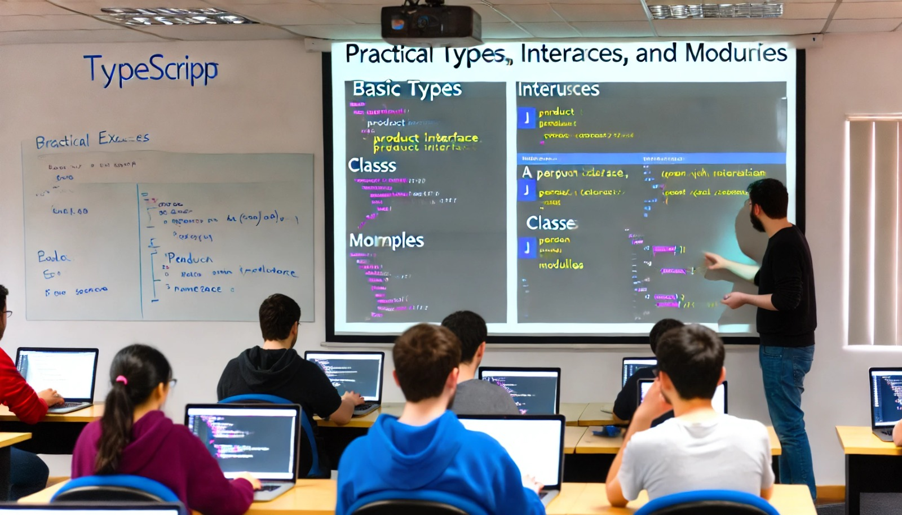

### Aulas 15-16: Exercícios Práticos com TypeScript

**Objetivo da Aula:**
- Colocar em prática os conceitos de TypeScript, como tipos básicos, interfaces, classes e módulos.

---

### **Exercício 1: Tipos Básicos e Interfaces**
1. **Objetivo:** Criar uma função que recebe um objeto `Produto` com os seguintes tipos:
   - `nome: string`
   - `preco: number`
   - `categoria: string`

2. **Instruções:**
   - Crie uma interface `Produto` com as propriedades acima.
   - Implemente uma função `criarProduto` que receba um objeto conforme a interface e retorne uma string formatada:
   ```typescript
   interface Produto {
     nome: string;
     preco: number;
     categoria: string;
   }

   function criarProduto(produto: Produto): string {
     return `Produto: ${produto.nome}, Preço: R$${produto.preco}, Categoria: ${produto.categoria}`;
   }

   const produto1: Produto = {
     nome: "Smartphone",
     preco: 1500,
     categoria: "Eletrônicos"
   };

   console.log(criarProduto(produto1));
   ```

---

### **Exercício 2: Classes e Herança**
1. **Objetivo:** Criar uma classe `Pessoa` e uma subclasse `Funcionario` para praticar herança.

2. **Instruções:**
   - Crie uma classe `Pessoa` com `nome` e `idade`.
   - Crie uma subclasse `Funcionario` que herda de `Pessoa` e adiciona `cargo`.
   - Adicione um método `descrever` que exiba as informações de `Funcionario`.

   ```typescript
   class Pessoa {
     nome: string;
     idade: number;

     constructor(nome: string, idade: number) {
       this.nome = nome;
       this.idade = idade;
     }
   }

   class Funcionario extends Pessoa {
     cargo: string;

     constructor(nome: string, idade: number, cargo: string) {
       super(nome, idade);
       this.cargo = cargo;
     }

     descrever(): string {
       return `${this.nome}, ${this.idade} anos, Cargo: ${this.cargo}`;
     }
   }

   const funcionario1 = new Funcionario("Maria", 30, "Desenvolvedora");
   console.log(funcionario1.descrever());
   ```

---

### **Exercício 3: Módulos e Namespaces**
1. **Objetivo:** Dividir o código em diferentes arquivos usando módulos e namespaces.

2. **Instruções:**
   - Crie um arquivo `pessoa.ts` que exporte a classe `Pessoa`.
   - Crie um arquivo `funcionario.ts` que exporte a classe `Funcionario`, que deve herdar de `Pessoa`.
   - No arquivo `main.ts`, importe ambas as classes e utilize-as.

   ```typescript
   // pessoa.ts
   export class Pessoa {
     constructor(public nome: string, public idade: number) {}
   }

   // funcionario.ts
   import { Pessoa } from './pessoa';

   export class Funcionario extends Pessoa {
     constructor(nome: string, idade: number, public cargo: string) {
       super(nome, idade);
     }

     descrever(): string {
       return `${this.nome}, ${this.idade} anos, Cargo: ${this.cargo}`;
     }
   }

   // main.ts
   import { Funcionario } from './funcionario';

   const funcionario1 = new Funcionario("Pedro", 45, "Gerente");
   console.log(funcionario1.descrever());
   ```

---

### Conclusão:
Esses exercícios cobrem desde conceitos básicos de tipos e interfaces até o uso de módulos e namespaces. Eles ajudarão os alunos a consolidar seu entendimento de TypeScript, aplicando o que aprenderam nas aulas anteriores em diferentes cenários.