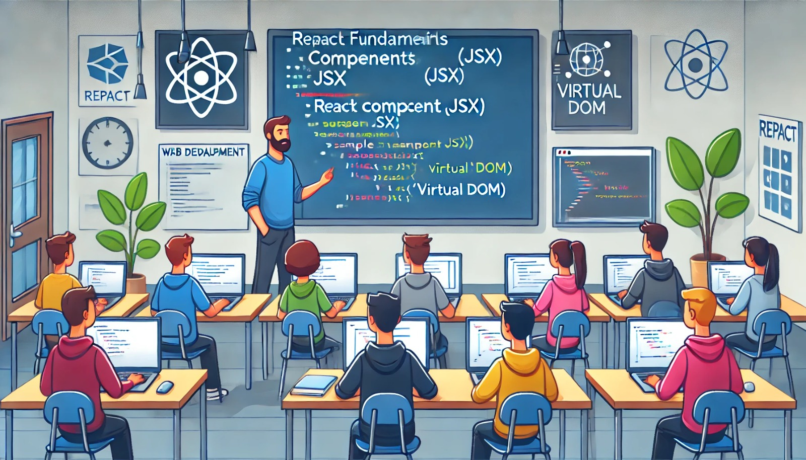

### Aula 17: Visão Geral do React - Componentes, JSX e Virtual DOM

**Objetivo da Aula:**
Introduzir os conceitos fundamentais do React, incluindo componentes, JSX, e o Virtual DOM, fornecendo uma base sólida para o desenvolvimento com esta biblioteca.

#### **1. Componentes:**
- **Definição:** Os componentes são as unidades básicas do React, como blocos de construção para interfaces de usuário. Eles podem ser classes ou funções que retornam elementos React para serem exibidos na interface.
- **Exemplo Simples:**
  ```jsx
  function BemVindo(props) {
    return <h1>Olá, {props.nome}!</h1>;
  }
  ```

#### **2. JSX:**
- **Definição:** JSX é uma sintaxe que se parece com HTML e é usada para descrever a aparência da interface do usuário dentro do código JavaScript.
- **Benefícios:** Permite escrever estruturas de componente de forma declarativa e clara.
- **Exemplo:**
  ```jsx
  const elemento = <BemVindo nome="João" />;
  ```

#### **3. Virtual DOM:**
- **Definição:** O Virtual DOM é uma representação leve do DOM real. É uma técnica usada pelo React para otimizar as atualizações na interface do usuário, melhorando o desempenho.
- **Funcionamento:** O React cria uma cópia do DOM em memória. Quando um componente é atualizado, o React calcula a diferença entre o Virtual DOM e o DOM real e faz apenas as atualizações necessárias.

### Conclusão:
Esses conceitos formam a base do desenvolvimento com React, permitindo a criação de interfaces ricas e interativas de forma eficiente. Compreender esses princípios é essencial para qualquer desenvolvedor que deseja trabalhar com essa poderosa biblioteca de construção de interfaces.

### Atividade: Exercícios de Fixação sobre React

**Objetivo:** Avaliar o entendimento sobre os conceitos de Componentes, JSX e Virtual DOM em React.

**Instruções:** Responda às seguintes questões de múltipla escolha:

1. **O que é um componente em React?**
   - a) Uma função ou classe que retorna HTML para construir a interface do usuário.
   - b) Um pacote de código JavaScript para animações.
   - c) Uma biblioteca para gerenciar estados.
   - d) Uma ferramenta de desenvolvimento para testar aplicações.

2. **O que JSX permite que um desenvolvedor faça?**
   - a) Escreva expressões regulares dentro do código JavaScript.
   - b) Use sintaxe semelhante ao HTML dentro de arquivos JavaScript.
   - c) Acesse bancos de dados diretamente do cliente.
   - d) Envie dados para servidores sem usar AJAX.

3. **Qual é o propósito do Virtual DOM em React?**
   - a) Para permitir o uso de JSX.
   - b) Para aumentar a segurança do código.
   - c) Para otimizar as atualizações na interface do usuário, fazendo eficientes alterações no DOM.
   - d) Para armazenar dados de componentes entre diferentes sessões do usuário.

4. **Como o React usa o Virtual DOM para melhorar o desempenho?**
   - a) Recarregando a página inteira quando o estado muda.
   - b) Comparando a versão nova com a antiga do DOM e atualizando apenas as partes que mudaram.
   - c) Armazenando todos os componentes na memória local.
   - d) Usando WebSockets para atualizar o DOM em tempo real.

**Entrega:** Após responder, confira as respostas corretas para verificar seu entendimento dos conceitos introduzidos. Esses conceitos são fundamentais para o desenvolvimento eficiente de aplicações com React.