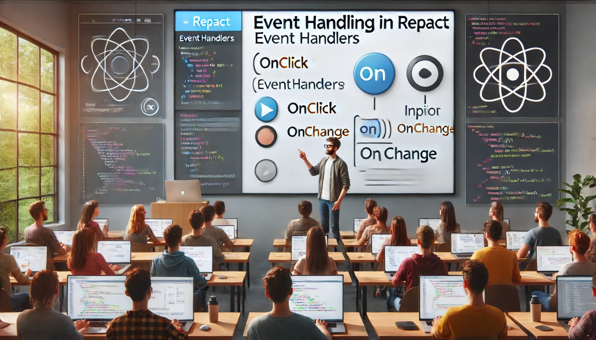

### Aula 25-26: Manipulação de Eventos em React

**Objetivo da Aula:**  
Entender como lidar com eventos em React para tornar a interface interativa.

---

### **1. O que são Eventos?**

Eventos são ações do usuário ou do sistema que acontecem em um navegador, como cliques, pressionar teclas, enviar formulários, entre outros. No React, você pode capturar esses eventos e responder a eles com funções, permitindo que a interface reaja às ações do usuário.

---

### **2. Manipulação de Eventos em React**

A manipulação de eventos no React é semelhante ao JavaScript tradicional, mas existem algumas diferenças importantes:

- Os nomes dos eventos são escritos em **camelCase** (ex: `onClick`).
- Em vez de atribuir diretamente a uma string de código, você passa uma função que será executada quando o evento ocorrer.

---

### **3. Exemplo de Evento de Clique**

Vamos ver um exemplo simples de como capturar um evento de clique usando o `onClick`:

```jsx
function Botao() {
  function handleClick() {
    alert('Botão clicado!');
  }

  return (
    <button onClick={handleClick}>Clique aqui</button>
  );
}
```

Neste exemplo:
- O evento `onClick` está associado ao botão.
- Quando o botão é clicado, a função `handleClick` é executada, exibindo um alerta na tela.

---

### **4. Eventos Mais Comuns no React**

Aqui estão alguns dos eventos mais usados no React:

- **onClick**: Disparado quando um elemento é clicado.
- **onChange**: Usado em elementos de formulário, como `<input>`, para capturar mudanças de valor.
  ```jsx
  function CampoTexto() {
    function handleChange(event) {
      console.log(event.target.value);
    }

    return <input type="text" onChange={handleChange} />;
  }
  ```
- **onSubmit**: Usado para capturar o envio de um formulário.
  ```jsx
  function Formulario() {
    function handleSubmit(event) {
      event.preventDefault(); // Impede o comportamento padrão de recarregar a página
      console.log('Formulário enviado');
    }

    return (
      <form onSubmit={handleSubmit}>
        <button type="submit">Enviar</button>
      </form>
    );
  }
  ```
- **onKeyDown** e **onKeyUp**: Capturam eventos de pressionar e soltar teclas.
  ```jsx
  function Teclado() {
    function handleKeyDown(event) {
      console.log(`Tecla pressionada: ${event.key}`);
    }

    return <input type="text" onKeyDown={handleKeyDown} />;
  }
  ```

---

### **5. Funções de Evento em Componentes Funcionais**

Nos exemplos anteriores, associamos funções diretamente aos eventos. Isso é possível em componentes funcionais. Em componentes de classe, usamos o `this` para referenciar funções, mas em componentes funcionais, passamos diretamente a função.

---

### **6. Prevenção do Comportamento Padrão**

Alguns eventos têm um comportamento padrão que pode ser indesejado, como o envio de um formulário que recarrega a página. Para evitar isso, usamos o `event.preventDefault()`.

**Exemplo:**
```jsx
function Formulario() {
  function handleSubmit(event) {
    event.preventDefault(); // Impede o recarregamento da página
    console.log('Formulário processado');
  }

  return (
    <form onSubmit={handleSubmit}>
      <button type="submit">Enviar</button>
    </form>
  );
}
```

---

### **7. Passando Parâmetros para Funções de Evento**

Se você precisar passar parâmetros adicionais para a função de evento, pode usar uma função anônima.

**Exemplo:**
```jsx
function Saudacao() {
  function handleClick(nome) {
    alert(`Olá, ${nome}`);
  }

  return <button onClick={() => handleClick('João')}>Clique</button>;
}
```

---

### Conclusão:

A manipulação de eventos em React permite capturar interações do usuário, tornando a interface dinâmica e interativa. Usando eventos como `onClick`, `onChange` e `onSubmit`, você pode responder às ações do usuário de forma simples e eficiente.