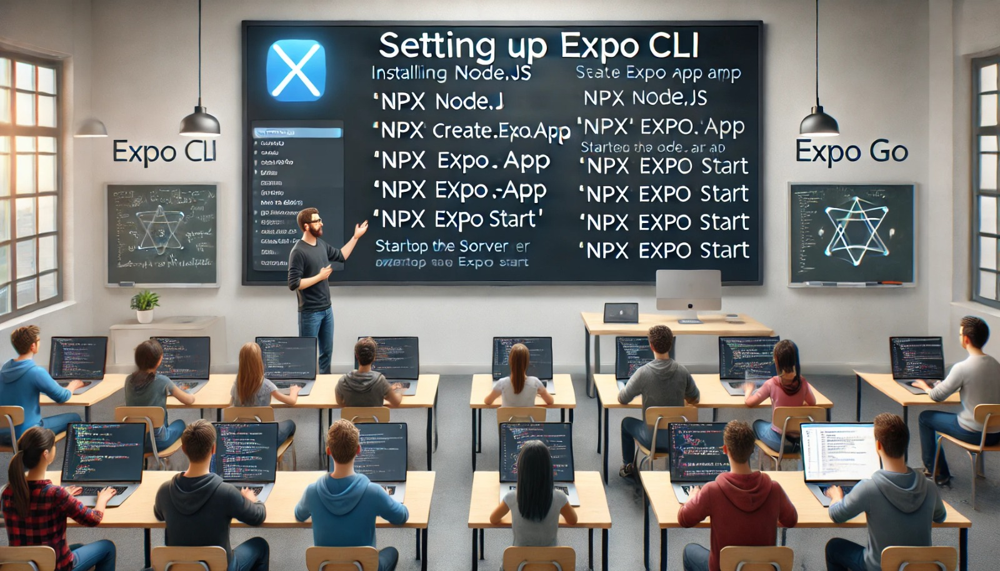

### Aula 32: Configuração do Ambiente Expo CLI

**Objetivo da Aula:**  
Aprender a configurar o ambiente de desenvolvimento para criar aplicativos móveis usando Expo CLI e React Native.

---

### **1. O que é o Expo CLI?**

O **Expo CLI** é uma ferramenta de linha de comando que facilita o desenvolvimento de aplicativos móveis com React Native. Ele fornece um ambiente completo para criar, testar e empacotar aplicativos móveis para iOS e Android, sem a necessidade de configurar ambientes complexos nativos para essas plataformas.

- O Expo é ideal para desenvolvedores que querem começar rapidamente, sem precisar lidar com a configuração manual de SDKs nativos.

---

### **2. Requisitos de Instalação**

Para configurar o ambiente de desenvolvimento com Expo CLI, você precisará dos seguintes componentes:

- **Node.js (versão LTS):** O Expo CLI é baseado em Node.js, portanto, é necessário instalar o Node.js na sua máquina. Você pode baixá-lo [aqui](https://nodejs.org/).
- **Expo Go:** Um aplicativo disponível para Android e iOS que permite testar os aplicativos diretamente no dispositivo durante o desenvolvimento.

---

### **3. Passos para Configurar o Ambiente Expo CLI**

#### **Passo 1: Instalar Node.js**
Certifique-se de que o Node.js está instalado corretamente na sua máquina. Você pode verificar isso executando o seguinte comando no terminal:
```bash
node -v
```
Se o comando retornar a versão do Node.js, está tudo certo.

#### **Passo 2: Criar um Novo Projeto Expo**
Agora que o Node.js está instalado, você pode criar um novo projeto Expo com o seguinte comando:
```bash
npx create-expo-app meu-app
```
Esse comando cria um novo projeto com um template básico de React Native. O Expo CLI cuidará de todas as dependências e configurações iniciais.

#### **Passo 3: Iniciar o Servidor de Desenvolvimento**
Após criar o projeto, navegue até a pasta do projeto e inicie o servidor:
```bash
cd meu-app
npx expo start
```
O comando abrirá uma interface de desenvolvimento no navegador com um QR code. Você pode escanear o QR code usando o aplicativo **Expo Go** no seu dispositivo móvel para ver o aplicativo rodando em tempo real.

#### **Passo 4: Testando no Emulador ou Dispositivo Físico**
Você pode testar o aplicativo diretamente no dispositivo físico ou em emuladores:
- **Android:** Pressione `A` no terminal para abrir no Android Emulator.
- **iOS:** Pressione `I` para abrir no iOS Simulator (disponível apenas em macOS).

#### **Passo 5: Personalizações Avançadas**
O Expo CLI também permite personalizar a configuração do ambiente, como escolher portas diferentes para rodar o servidor:
```bash
npx expo start --port 8082
```
Esse comando inicia o servidor de desenvolvimento em uma porta específica.

---

### **4. Benefícios do Expo CLI**

- **Rápido para começar:** O Expo simplifica a configuração inicial, permitindo que você comece a desenvolver imediatamente.
- **Multiplataforma:** Permite criar aplicativos tanto para Android quanto iOS com um único código.
- **Ferramentas prontas:** Inclui bibliotecas para acessar funcionalidades nativas do dispositivo, como câmera, localização e notificações.

---

### Conclusão:
A configuração do Expo CLI é simples e eficiente, permitindo que você desenvolva aplicativos móveis com React Native rapidamente. Com o Expo Go, é fácil testar o aplicativo em tempo real no seu dispositivo ou em um emulador.

---

### **Exercícios de Fixação**

1. **Qual ferramenta é necessária para configurar o ambiente de desenvolvimento com Expo?**
   - a) Visual Studio Code.
   - b) Node.js.
   - c) Android Studio.
   - d) GitHub.

2. **Qual comando é usado para criar um novo projeto Expo?**
   - a) `npm init expo`
   - b) `npx create-expo-app meu-app`
   - c) `expo new-app`
   - d) `npx react-native init`

3. **Qual aplicativo permite que você teste o código Expo diretamente no dispositivo móvel?**
   - a) Android Studio.
   - b) Expo Go.
   - c) Visual Studio Code.
   - d) Expo Builder.

4. **O que acontece ao executar o comando `npx expo start`?**
   - a) Um novo projeto é criado.
   - b) O código é compilado para produção.
   - c) O servidor de desenvolvimento é iniciado.
   - d) O aplicativo é enviado para a App Store.

5. **Qual a principal função do Expo Go?**
   - a) Criar novos projetos Expo.
   - b) Hospedar aplicativos Expo na nuvem.
   - c) Testar aplicativos Expo diretamente no dispositivo.
   - d) Compilar código JavaScript para nativo.

---

**Respostas:**
1. **b)** Node.js.
2. **b)** `npx create-expo-app meu-app`.
3. **b)** Expo Go.
4. **c)** O servidor de desenvolvimento é iniciado.
5. **c)** Testar aplicativos Expo diretamente no dispositivo.