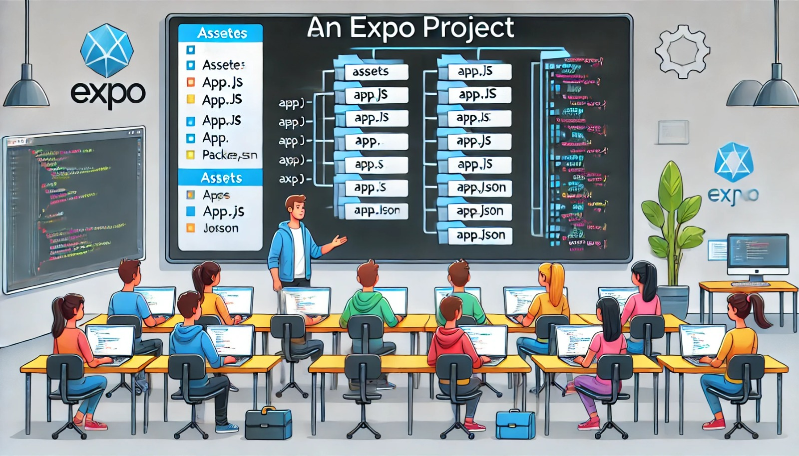

### Aula 33-34: Estrutura de um Projeto Expo

**Objetivo da Aula:**  
Entender a estrutura de um projeto Expo, seus arquivos principais, pastas e como esses elementos se conectam no desenvolvimento de aplicativos móveis.

---

### **1. O que é o Expo?**

O **Expo** é uma plataforma que simplifica o desenvolvimento de aplicativos móveis com React Native, permitindo que você comece a desenvolver rapidamente sem a necessidade de configurar manualmente ambientes para Android ou iOS. Quando você cria um projeto com o Expo CLI, uma estrutura básica é gerada automaticamente, contendo todos os arquivos e pastas essenciais para o desenvolvimento.

---

### **2. Estrutura Básica de um Projeto Expo**

Ao criar um projeto com o comando `npx create-expo-app`, a seguinte estrutura de diretórios e arquivos será gerada:

```bash
meu-app/
├── assets/
├── node_modules/
├── .gitignore
├── App.js
├── app.json
├── babel.config.js
├── package.json
```

### **3. Descrição dos Principais Arquivos e Pastas**

#### **1. assets/**  
Esta pasta contém os ativos do aplicativo, como imagens, ícones e fontes. O Expo facilita o carregamento e o uso desses arquivos no aplicativo.

#### **2. node_modules/**  
Contém todas as dependências instaladas no projeto, como as bibliotecas React Native e Expo. Sempre que você instala pacotes com `npm` ou `yarn`, eles ficam armazenados aqui.

#### **3. .gitignore**  
Este arquivo define quais arquivos ou pastas não devem ser rastreados pelo Git, como a pasta `node_modules` ou outros arquivos temporários.

#### **4. App.js**  
Este é o arquivo principal do seu projeto, onde o código da interface do aplicativo é escrito. O `App.js` é o ponto de entrada padrão, e todo o código React Native começa a partir daqui.

**Exemplo simples de `App.js`:**
```jsx
import React from 'react';
import { Text, View } from 'react-native';

function App() {
  return (
    <View>
      <Text>Bem-vindo ao meu app Expo!</Text>
    </View>
  );
}

export default App;
```

#### **5. app.json**  
Este arquivo contém a configuração do projeto, como o nome do aplicativo, ícone, splash screen e permissões necessárias. Ele define como o aplicativo será exibido e comportado no Expo Go e durante o processo de build.

#### **6. babel.config.js**  
Configura o Babel, que é o compilador JavaScript usado para transformar código moderno em uma versão compatível com diferentes plataformas. Este arquivo raramente precisa de mudanças no início do projeto.

#### **7. package.json**  
Este arquivo armazena as informações sobre o projeto, como nome, versão e dependências instaladas. Além disso, contém scripts que você pode executar com `npm`, como `npm start`, `npm run build`, entre outros.

---

### **4. Como Funciona um Projeto Expo**

- **Arquivo App.js:** Este é o ponto de entrada do aplicativo. Toda a interface e lógica são desenvolvidas a partir deste arquivo.
- **Pasta assets:** Aqui ficam as imagens, fontes e outros ativos utilizados no aplicativo.
- **app.json:** Configurações visuais e de permissões, como ícone e splash screen, são definidas neste arquivo.
- **Scripts de desenvolvimento:** O arquivo `package.json` armazena scripts úteis para rodar o projeto, como iniciar o servidor de desenvolvimento com `npm start`.

A estrutura padrão é projetada para ser simples e funcional, permitindo que você se concentre no código do aplicativo, enquanto o Expo CLI cuida da configuração do ambiente de desenvolvimento.

---

### Conclusão:

A estrutura de um projeto Expo é organizada de maneira simples, com arquivos e pastas importantes já configurados. Com o **App.js** como ponto de partida e a pasta **assets/** para organizar seus recursos, você pode começar a desenvolver aplicativos móveis rapidamente. O Expo CLI e essa estrutura facilitam o desenvolvimento, gerenciamento e teste do aplicativo durante todo o processo de criação.

---

### **Exercícios de Fixação**

1. **Qual arquivo contém o ponto de entrada do aplicativo Expo?**
   - a) `index.js`
   - b) `App.js`
   - c) `package.json`
   - d) `babel.config.js`

2. **Qual é a função do arquivo `app.json` em um projeto Expo?**
   - a) Compilar o código para Android e iOS.
   - b) Gerenciar as dependências do projeto.
   - c) Armazenar a configuração do aplicativo, como nome e ícone.
   - d) Definir as rotas do aplicativo.

3. **Qual pasta em um projeto Expo contém as bibliotecas e dependências instaladas?**
   - a) `node_modules`
   - b) `assets`
   - c) `components`
   - d) `src`

4. **O que o arquivo `babel.config.js` faz em um projeto Expo?**
   - a) Define as rotas do aplicativo.
   - b) Configura o Babel, que transforma o código JavaScript para versões compatíveis.
   - c) Define o layout da tela inicial.
   - d) Gerencia a instalação de pacotes no projeto.

5. **Onde você armazena imagens e fontes no projeto Expo?**
   - a) Na pasta `node_modules`.
   - b) Na pasta `assets`.
   - c) No arquivo `App.js`.
   - d) No arquivo `app.json`.

---

**Respostas:**
1. **b)** `App.js`
2. **c)** Armazenar a configuração do aplicativo, como nome e ícone.
3. **a)** `node_modules`
4. **b)** Configura o Babel, que transforma o código JavaScript para versões compatíveis.
5. **b)** Na pasta `assets`.