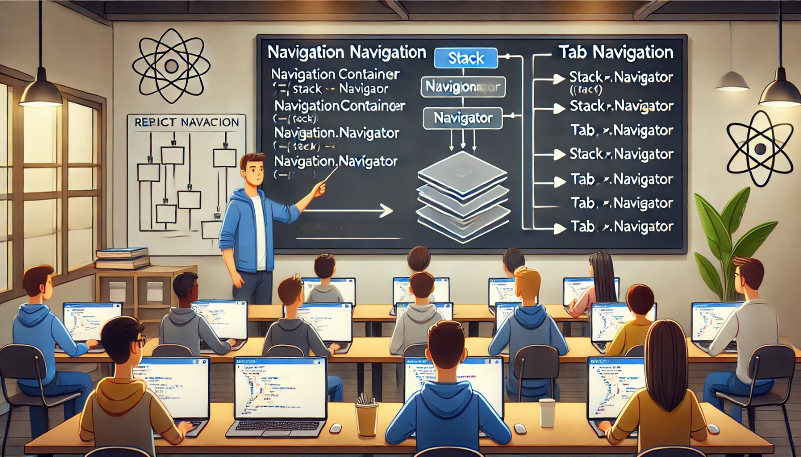

### Aula 39-40: Navegação com React Navigation

**Objetivo da Aula:**  
Compreender como implementar navegação entre telas em aplicativos React Native usando o React Navigation, criando interfaces dinâmicas e de fácil navegação.

---

### **1. O que é o React Navigation?**

O **React Navigation** é uma biblioteca popular para gerenciar a navegação em aplicativos React Native. Ela fornece uma maneira fácil e flexível de adicionar navegação entre telas, seja por meio de menus, navegação em pilhas, guias (tabs), entre outros. O React Navigation facilita o controle de rotas e o acesso à navegação global do aplicativo.

---

### **2. Instalação do React Navigation**

Para começar, você precisa instalar as dependências do React Navigation. No terminal, execute o seguinte comando:

```bash
npm install @react-navigation/native
```

Depois, adicione as dependências para a navegação baseada em pilhas:

```bash
npm install @react-navigation/stack
```

Também é necessário instalar algumas dependências adicionais para o React Navigation funcionar corretamente:

```bash
npm install react-native-screens react-native-safe-area-context
```

Após instalar essas dependências, é recomendável reiniciar o projeto para garantir que tudo funcione corretamente.

---

### **3. Navegação em Pilhas (Stack Navigation)**

A navegação em pilhas é um tipo de navegação onde cada nova tela é empilhada em cima da anterior, formando uma pilha de telas. Quando você navega para uma nova tela, ela aparece sobre a anterior, e você pode voltar para a tela anterior com um botão de "voltar".

**Exemplo de Navegação em Pilhas:**

1. Importe as bibliotecas necessárias:
   ```jsx
   import { NavigationContainer } from '@react-navigation/native';
   import { createStackNavigator } from '@react-navigation/stack';
   ```

2. Crie um "Stack Navigator" e as telas:
   ```jsx
   const Stack = createStackNavigator();

   function TelaInicial({ navigation }) {
     return (
       <View>
         <Text>Tela Inicial</Text>
         <Button
           title="Ir para Detalhes"
           onPress={() => navigation.navigate('Detalhes')}
         />
       </View>
     );
   }

   function TelaDetalhes() {
     return (
       <View>
         <Text>Tela de Detalhes</Text>
       </View>
     );
   }
   ```

3. Configure as rotas dentro de um contêiner:
   ```jsx
   export default function App() {
     return (
       <NavigationContainer>
         <Stack.Navigator>
           <Stack.Screen name="Inicial" component={TelaInicial} />
           <Stack.Screen name="Detalhes" component={TelaDetalhes} />
         </Stack.Navigator>
       </NavigationContainer>
     );
   }
   ```

---

### **4. Navegação em Guias (Tab Navigation)**

A navegação por guias (tabs) cria uma interface com abas na parte inferior da tela, permitindo alternar rapidamente entre diferentes seções do aplicativo.

1. Instale o módulo de navegação por guias:
   ```bash
   npm install @react-navigation/bottom-tabs
   ```

2. Implemente a navegação em guias:
   ```jsx
   import { createBottomTabNavigator } from '@react-navigation/bottom-tabs';

   const Tab = createBottomTabNavigator();

   function TelaHome() {
     return <Text>Página Home</Text>;
   }

   function TelaConfig() {
     return <Text>Página Configurações</Text>;
   }

   export default function App() {
     return (
       <NavigationContainer>
         <Tab.Navigator>
           <Tab.Screen name="Home" component={TelaHome} />
           <Tab.Screen name="Configurações" component={TelaConfig} />
         </Tab.Navigator>
       </NavigationContainer>
     );
   }
   ```

---

### **5. Personalização de Navegação**

Você pode personalizar a aparência das telas de navegação usando as propriedades `options`. Essas propriedades permitem definir títulos, ícones e outras configurações visuais.

**Exemplo:**
```jsx
<Stack.Screen 
  name="Inicial" 
  component={TelaInicial} 
  options={{ title: 'Bem-vindo' }} 
/>
```

---

### Conclusão

O React Navigation oferece uma maneira poderosa e flexível de gerenciar a navegação em aplicativos React Native, suportando navegação em pilhas, guias, menus e muito mais. Com ele, é possível criar interfaces completas e organizadas, proporcionando uma experiência fluida para os usuários.

---

### **Exercícios de Fixação**

1. **Qual é a principal função do React Navigation em aplicativos React Native?**
   - a) Renderizar a interface do usuário.
   - b) Gerenciar a navegação entre telas.
   - c) Armazenar dados de estado.
   - d) Criar componentes de estilo.

2. **Qual comando instala a biblioteca base do React Navigation?**
   - a) `npm install @react-navigation/stack`
   - b) `npm install @react-navigation/native`
   - c) `npm install react-navigation`
   - d) `npm install react-native-navigation`

3. **O que caracteriza a navegação em pilhas (Stack Navigation)?**
   - a) Permite alternar entre abas na parte inferior da tela.
   - b) Cria uma sequência de telas empilhadas uma sobre a outra.
   - c) Exibe todas as telas ao mesmo tempo.
   - d) Oculta todas as telas ao sair.

4. **Qual módulo é necessário para implementar a navegação em guias (Tab Navigation)?**
   - a) `@react-navigation/tabs`
   - b) `@react-navigation/bottom-tabs`
   - c) `@react-navigation/top-tabs`
   - d) `@react-navigation/native`

5. **Como você especifica as configurações de cada tela na navegação por pilhas?**
   - a) Usando `screenConfig`.
   - b) Através da propriedade `options` em cada `Stack.Screen`.
   - c) Com o método `navigateOptions`.
   - d) Na função `App()`.

---

**Respostas:**
1. **b)** Gerenciar a navegação entre telas.
2. **b)** `npm install @react-navigation/native`
3. **b)** Cria uma sequência de telas empilhadas uma sobre a outra.
4. **b)** `@react-navigation/bottom-tabs`
5. **b)** Através da propriedade `options` em cada `Stack.Screen`.