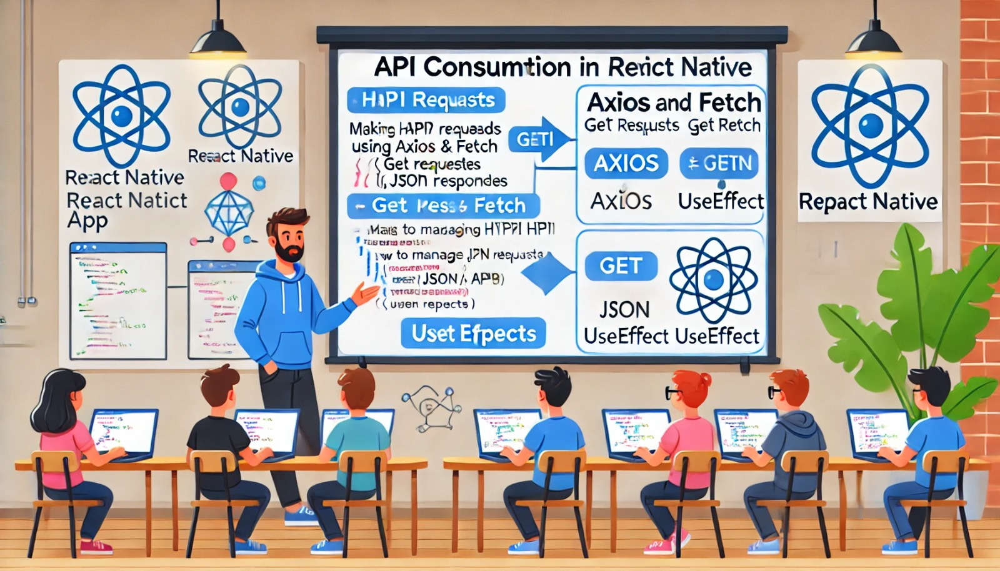

### Aula 41-42: Consumo de APIs com Axios e Fetch

**Objetivo da Aula:**  
Entender como realizar requisições HTTP para consumir dados de APIs em aplicativos React Native usando Axios e Fetch.

---

### **1. O que é uma API e por que utilizá-la?**

Uma **API (Application Programming Interface)** permite que aplicativos se comuniquem entre si. Em aplicativos móveis, APIs são usadas para buscar dados de servidores, enviar dados do usuário para armazenamento, autenticar usuários e muito mais. Isso facilita o desenvolvimento, pois permite a integração de dados externos no aplicativo.

---

### **2. O que são Axios e Fetch?**

Tanto **Axios** quanto **Fetch** são bibliotecas que permitem fazer requisições HTTP para consumir APIs. 

- **Fetch:** Uma API nativa do JavaScript para fazer requisições. Não requer instalação, mas pode exigir configurações adicionais para lidar com erros ou formatos de dados complexos.
- **Axios:** Uma biblioteca popular para fazer requisições HTTP, conhecida por sua facilidade de uso, com suporte nativo para interceptação de erros, suporte a JSON e um código mais limpo em comparação com Fetch.

---

### **3. Configurando Axios**

Para começar a usar o Axios em seu projeto, primeiro instale-o:

```bash
npm install axios
```

Depois de instalado, você pode importar Axios e usá-lo para fazer uma requisição GET simples.

**Exemplo de requisição com Axios:**

```jsx
import React, { useEffect, useState } from 'react';
import axios from 'axios';
import { Text, View } from 'react-native';

function App() {
  const [dados, setDados] = useState([]);

  useEffect(() => {
    axios.get('https://api.example.com/data')
      .then(response => {
        setDados(response.data);
      })
      .catch(error => {
        console.error('Erro ao buscar dados:', error);
      });
  }, []);

  return (
    <View>
      {dados.map(item => (
        <Text key={item.id}>{item.nome}</Text>
      ))}
    </View>
  );
}

export default App;
```

Neste exemplo:
- `axios.get(url)` faz uma requisição GET para a URL fornecida.
- `.then(response => {...})` lida com a resposta, acessando os dados em `response.data`.
- `.catch(error => {...})` lida com erros caso a requisição falhe.

---

### **4. Usando Fetch para Requisições HTTP**

O **Fetch** é uma alternativa nativa que permite fazer requisições HTTP, como GET e POST, para consumir APIs.

**Exemplo de requisição com Fetch:**

```jsx
import React, { useEffect, useState } from 'react';
import { Text, View } from 'react-native';

function App() {
  const [dados, setDados] = useState([]);

  useEffect(() => {
    fetch('https://api.example.com/data')
      .then(response => response.json())
      .then(data => setDados(data))
      .catch(error => console.error('Erro ao buscar dados:', error));
  }, []);

  return (
    <View>
      {dados.map(item => (
        <Text key={item.id}>{item.nome}</Text>
      ))}
    </View>
  );
}

export default App;
```

Neste exemplo:
- `fetch(url)` realiza a requisição para a URL.
- `.then(response => response.json())` converte a resposta para JSON.
- `.then(data => {...})` lida com os dados JSON convertidos.

---

### **5. Diferenças entre Axios e Fetch**

- **Suporte JSON**: Axios converte automaticamente as respostas JSON, enquanto Fetch requer `response.json()`.
- **Tratamento de Erros**: Axios lida melhor com erros. Em Fetch, é necessário verificar o status manualmente.
- **Cancelamento de Requisições**: Axios suporta cancelamento de requisições com o `CancelToken`, mas no Fetch essa funcionalidade é limitada.

### Conclusão:

Tanto o Axios quanto o Fetch são ferramentas eficazes para consumir APIs em React Native. O Axios é mais simples e possui tratamento de erros robusto, enquanto o Fetch é uma opção nativa que pode ser usada em qualquer projeto JavaScript.

---

### **Exercícios de Fixação**

1. **Qual é a principal função de uma API em aplicativos móveis?**
   - a) Exibir o layout do aplicativo.
   - b) Permitir a comunicação entre diferentes aplicativos e servidores.
   - c) Armazenar dados localmente no dispositivo.
   - d) Renderizar componentes gráficos.

2. **Qual das opções a seguir é uma biblioteca nativa para fazer requisições HTTP em JavaScript?**
   - a) Axios
   - b) Fetch
   - c) Express
   - d) Node.js

3. **Qual comando é usado para instalar o Axios?**
   - a) `npm install fetch`
   - b) `npm install axios`
   - c) `npm install http`
   - d) `npm install api`

4. **Como o Axios lida com dados JSON por padrão?**
   - a) Requer conversão manual para JSON.
   - b) Converte automaticamente as respostas JSON.
   - c) Converte apenas dados XML para JSON.
   - d) Não lida com JSON.

5. **Como capturar erros em uma requisição Fetch?**
   - a) Usando `fetch.catch()`.
   - b) Usando `axios.catch()`.
   - c) Com o `.catch()` após a requisição.
   - d) Fetch não suporta captura de erros.

---

**Respostas:**
1. **b)** Permitir a comunicação entre diferentes aplicativos e servidores.
2. **b)** Fetch
3. **b)** `npm install axios`
4. **b)** Converte automaticamente as respostas JSON.
5. **c)** Com o `.catch()` após a requisição.