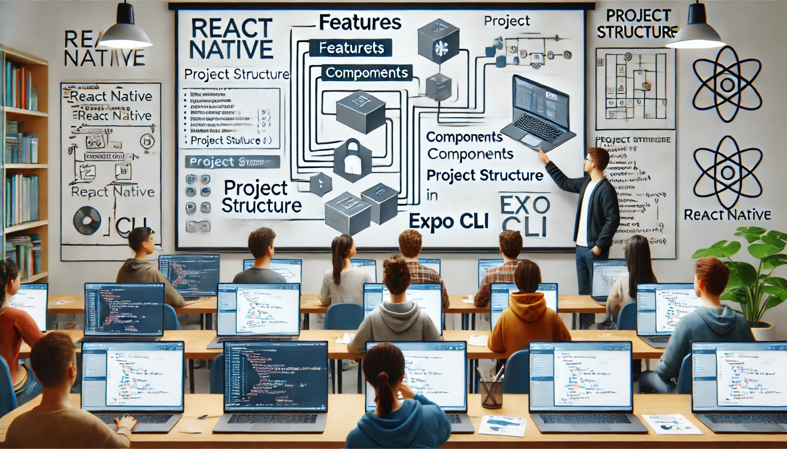

### Aula 47-50: Planejamento e Início do Projeto Prático

**Objetivo da Aula:**  
Aprender a planejar e estruturar um projeto prático em React Native, abordando desde a definição de objetivos até a criação do esqueleto do projeto. Os alunos terão uma visão geral de como organizar o desenvolvimento, definindo funcionalidades, layout, componentes e integrando recursos previamente estudados.

---

### **1. Definição do Projeto Prático**

O primeiro passo é escolher um projeto prático que permita aplicar os conceitos aprendidos. Algumas ideias comuns para projetos incluem:

- **Aplicativo de Lista de Tarefas:** Permite adicionar, remover e marcar tarefas como concluídas.
- **Aplicativo de Notas:** Salva e exibe notas ou lembretes.
- **Aplicativo de Localização e Mapa:** Usa o GPS para localizar o usuário e mostrar locais próximos.
- **Aplicativo de Fotos e Galeria:** Permite tirar fotos com a câmera e salvá-las em uma galeria.

Para esta aula, vamos considerar um projeto de **Aplicativo de Lista de Tarefas** que utilizará:

- **Armazenamento de Dados:** Usando AsyncStorage para salvar as tarefas.
- **Navegação:** Para organizar a navegação entre a lista de tarefas e a tela de detalhes.
- **Câmera (opcional):** Permite associar imagens às tarefas.

---

### **2. Estruturação e Planejamento do Projeto**

#### **Passo 1: Definir Funcionalidades**

Liste as principais funcionalidades que o aplicativo deve ter. Para um aplicativo de lista de tarefas, as funcionalidades podem incluir:

- Adicionar uma nova tarefa.
- Remover uma tarefa existente.
- Marcar uma tarefa como concluída.
- Visualizar detalhes de uma tarefa.
- Salvar dados localmente usando AsyncStorage.

#### **Passo 2: Estruturar o Layout**

Desenhe uma estrutura básica de como cada tela do aplicativo será organizada:

- **Tela Inicial:** Mostra todas as tarefas.
- **Tela de Adicionar Tarefa:** Formulário para criar uma nova tarefa.
- **Tela de Detalhes da Tarefa:** Exibe informações detalhadas sobre a tarefa selecionada.

#### **Passo 3: Escolher os Componentes Necessários**

Defina quais componentes do React Native e quais bibliotecas externas serão necessários para o projeto. Alguns componentes essenciais incluem:

- **View** e **Text**: Para estruturar o layout.
- **TextInput**: Para inserir o título e a descrição da tarefa.
- **Button**: Para adicionar e remover tarefas.
- **FlatList**: Para exibir a lista de tarefas.

#### **Passo 4: Organizar a Navegação**

Use o React Navigation para estruturar a navegação entre as telas. Isso ajuda a organizar as diferentes telas e permite uma transição suave entre elas.

---

### **3. Configuração Inicial do Projeto**

Agora que o projeto está planejado, configure o projeto no Expo CLI:

1. **Criar o Projeto:** No terminal, execute:
   ```bash
   npx create-expo-app lista-de-tarefas
   ```

2. **Instalar Dependências Necessárias:**
   ```bash
   npm install @react-navigation/native
   npm install @react-navigation/stack
   npm install @react-native-async-storage/async-storage
   ```

3. **Configurar o Esqueleto do Projeto:**
   - Crie as pastas `screens` e `components` para organizar as telas e componentes.
   - Adicione uma pasta `assets` para armazenar ícones ou imagens, se necessário.

---

### **4. Início do Desenvolvimento**

1. **Criar o Componente de Lista de Tarefas**  
   Crie um componente que exiba todas as tarefas utilizando o `FlatList`. Configure o AsyncStorage para salvar e recuperar tarefas.

2. **Criar o Componente de Adicionar Tarefa**  
   Desenvolva o formulário para adicionar novas tarefas, capturando os dados com `TextInput` e salvando as informações no AsyncStorage.

3. **Implementar Navegação**  
   Adicione navegação para que o usuário possa alternar entre as telas de lista, adicionar tarefa e detalhes.

---

### **5. Dicas de Organização**

- **Versionamento de Código:** Use Git para versionar o projeto, salvando cada etapa do desenvolvimento.
- **Componentização:** Divida o projeto em componentes reutilizáveis, facilitando a manutenção e a leitura do código.
- **Testes:** Verifique regularmente se cada nova funcionalidade está funcionando corretamente, corrigindo bugs antes de avançar.

---

### Conclusão

O planejamento cuidadoso de um projeto é essencial para que o desenvolvimento ocorra de maneira organizada e eficiente. Definir as funcionalidades, o layout, os componentes e as configurações iniciais ajuda a garantir que o projeto siga uma estrutura clara, facilitando a implementação e o ajuste de novas funcionalidades.

---

### **Exercícios de Fixação**

1. **Qual é o primeiro passo ao iniciar um projeto prático?**
   - a) Implementar a interface.
   - b) Planejar as funcionalidades e o layout.
   - c) Instalar todas as bibliotecas.
   - d) Configurar a navegação.

2. **Qual biblioteca é recomendada para armazenamento local de dados?**
   - a) `react-native-storage`
   - b) `redux-persist`
   - c) `AsyncStorage`
   - d) `expo-storage`

3. **Para exibir uma lista de tarefas, qual componente é mais adequado?**
   - a) `ScrollView`
   - b) `View`
   - c) `FlatList`
   - d) `Image`

4. **Qual pasta é recomendada para armazenar telas e componentes personalizados no projeto?**
   - a) `screens`
   - b) `storage`
   - c) `src`
   - d) `app`

5. **Por que o planejamento é importante em um projeto de desenvolvimento de aplicativos?**
   - a) Para instalar as bibliotecas corretamente.
   - b) Para garantir uma estrutura organizada e funcionalidades bem definidas.
   - c) Para evitar o uso de AsyncStorage.
   - d) Para permitir que o projeto seja desenvolvido sem usar navegação.

---

**Respostas:**
1. **b)** Planejar as funcionalidades e o layout.
2. **c)** AsyncStorage
3. **c)** FlatList
4. **a)** screens
5. **b)** Para garantir uma estrutura organizada e funcionalidades bem definidas.