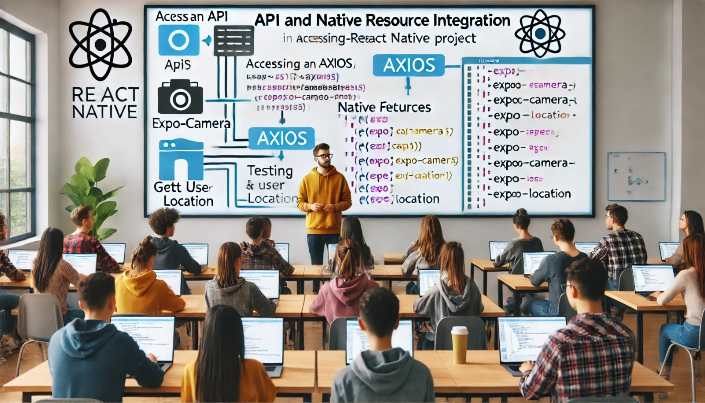

### Aula 55-58: Integração de APIs e Recursos Nativos no Projeto

**Objetivo da Aula:**  
Aprender a integrar APIs e recursos nativos (como câmera e localização) em um projeto React Native, aplicando os conceitos aprendidos para adicionar funcionalidades avançadas ao aplicativo prático.

---

### **1. Integração de APIs no Projeto**

A integração de APIs permite que o aplicativo acesse dados externos ou funcionalidades de outros sistemas. Neste projeto, usaremos uma API para adicionar uma funcionalidade extra: uma lista de citações ou dicas que o usuário pode acessar diariamente.

#### **Passo 1: Escolher e Configurar uma API**

Escolha uma API simples e gratuita que forneça dados em formato JSON. No exemplo, usaremos uma API de citações (Quotes API), que fornece uma citação aleatória.

#### **Passo 2: Fazer a Requisição com Axios**

Para consumir a API, usaremos o Axios para realizar a requisição HTTP. Instale o Axios caso ainda não esteja no projeto:

```bash
npm install axios
```

#### **Passo 3: Exibir os Dados da API**

Integre os dados da API na interface do aplicativo, exibindo uma nova citação sempre que o usuário acessar a tela de dicas.

**Exemplo de código para integrar uma API com Axios:**
```jsx
import React, { useEffect, useState } from 'react';
import axios from 'axios';
import { View, Text, Button } from 'react-native';

function CitarTarefa() {
  const [citacao, setCitacao] = useState('');

  useEffect(() => {
    buscarCitacao();
  }, []);

  const buscarCitacao = async () => {
    try {
      const response = await axios.get('https://api.quotable.io/random');
      setCitacao(response.data.content);
    } catch (error) {
      console.error('Erro ao buscar citação:', error);
    }
  };

  return (
    <View>
      <Text>{citacao}</Text>
      <Button title="Nova Citação" onPress={buscarCitacao} />
    </View>
  );
}

export default CitarTarefa;
```

---

### **2. Integração de Recursos Nativos**

#### **Integração com a Câmera**

Com o recurso de câmera, os usuários poderão capturar uma imagem para associar a uma tarefa.

1. **Instalar o Módulo de Câmera:**
   - Execute o comando abaixo se você estiver usando o Expo CLI:
   ```bash
   expo install expo-camera
   ```

2. **Solicitar Permissão e Capturar Imagem:**
   - Antes de usar a câmera, é necessário pedir permissão ao usuário.
   
**Exemplo de uso da câmera com Expo Camera:**
```jsx
import React, { useState, useEffect } from 'react';
import { View, Button } from 'react-native';
import { Camera } from 'expo-camera';

function CapturaTarefa() {
  const [temPermissao, setTemPermissao] = useState(null);
  const [cameraRef, setCameraRef] = useState(null);

  useEffect(() => {
    (async () => {
      const { status } = await Camera.requestPermissionsAsync();
      setTemPermissao(status === 'granted');
    })();
  }, []);

  const capturarImagem = async () => {
    if (cameraRef) {
      const foto = await cameraRef.takePictureAsync();
      console.log(foto.uri); // Exemplo: armazenar o caminho da imagem para uso na tarefa
    }
  };

  return (
    <View style={{ flex: 1 }}>
      {temPermissao ? (
        <Camera style={{ flex: 1 }} ref={ref => setCameraRef(ref)} />
      ) : (
        <Text>Solicitando permissão de câmera</Text>
      )}
      <Button title="Capturar Imagem" onPress={capturarImagem} />
    </View>
  );
}

export default CapturaTarefa;
```

---

#### **Integração com Localização**

A função de localização permite que o aplicativo acesse a posição atual do usuário.

1. **Instalar o Módulo de Localização:**
   - Se estiver usando Expo, instale o módulo de localização:
   ```bash
   expo install expo-location
   ```

2. **Solicitar Permissão e Obter Localização:**
   - Peça permissão para acessar a localização e use a API para capturar a posição atual.

**Exemplo de uso da localização com Expo Location:**
```jsx
import React, { useState, useEffect } from 'react';
import * as Location from 'expo-location';
import { View, Text, Button } from 'react-native';

function LocalizacaoTarefa() {
  const [localizacao, setLocalizacao] = useState(null);

  useEffect(() => {
    (async () => {
      let { status } = await Location.requestPermissionsAsync();
      if (status !== 'granted') {
        setLocalizacao('Permissão de localização negada');
        return;
      }
      let local = await Location.getCurrentPositionAsync({});
      setLocalizacao(local.coords);
    })();
  }, []);

  return (
    <View>
      {localizacao ? (
        <Text>Localização: {localizacao.latitude}, {localizacao.longitude}</Text>
      ) : (
        <Text>Obtendo localização...</Text>
      )}
    </View>
  );
}

export default LocalizacaoTarefa;
```

---

### Conclusão

A integração de APIs e recursos nativos enriquece a experiência do usuário, adicionando funcionalidades que tornam o aplicativo mais interativo e útil. Esses recursos podem ser personalizados para atender às necessidades específicas do projeto.

---

### **Exercícios de Fixação**

1. **Qual biblioteca é recomendada para fazer requisições HTTP em um projeto React Native?**
   - a) Fetch
   - b) XMLHttpRequest
   - c) Axios
   - d) APIService

2. **Qual módulo é necessário para acessar a câmera em um projeto Expo?**
   - a) `expo-image`
   - b) `expo-photo`
   - c) `expo-camera`
   - d) `expo-gallery`

3. **Antes de acessar a câmera ou localização, o que é necessário fazer?**
   - a) Ativar o recurso automaticamente.
   - b) Solicitar permissão ao usuário.
   - c) Configurar uma chave de API para o recurso.
   - d) Reiniciar o aplicativo.

4. **Qual método do Axios é usado para fazer uma requisição GET a uma API?**
   - a) `axios.post`
   - b) `axios.get`
   - c) `axios.retrieve`
   - d) `axios.fetch`

5. **Qual biblioteca permite obter a posição geográfica do usuário em um projeto Expo?**
   - a) `expo-location`
   - b) `expo-geo`
   - c) `expo-position`
   - d) `expo-gps`

---

**Respostas:**
1. **c)** Axios
2. **c)** `expo-camera`
3. **b)** Solicitar permissão ao usuário
4. **b)** `axios.get`
5. **a)** `expo-location`