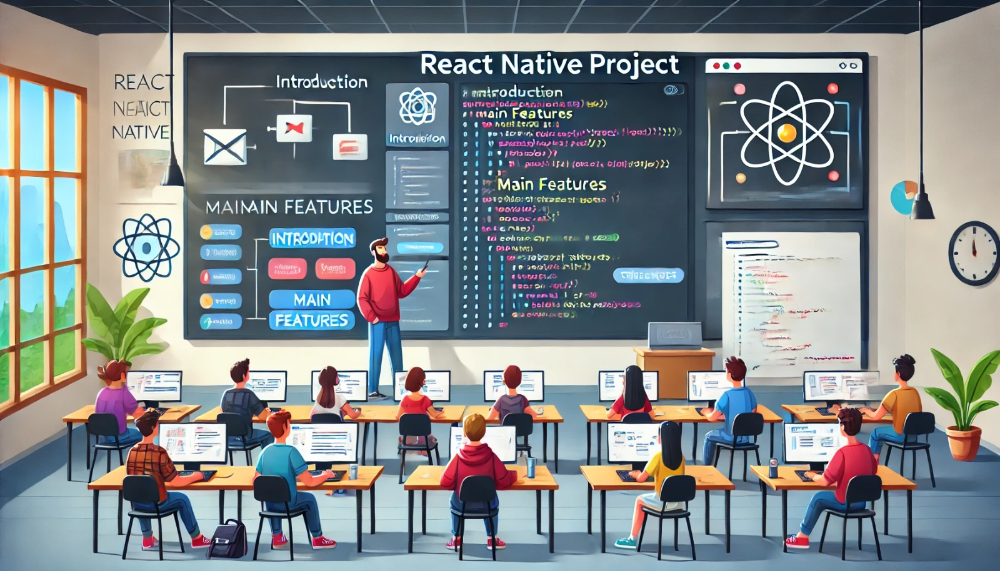

### Aula 63-66: Finalização e Apresentação do Projeto

**Objetivo da Aula:**  
Finalizar o desenvolvimento do projeto prático em React Native, aplicando ajustes finais e preparando-o para apresentação. Ao final, os alunos realizarão uma apresentação do projeto, explicando as funcionalidades, estrutura e os conceitos aplicados.

---

### **1. Revisão e Ajustes Finais**

Na fase de finalização, é essencial revisar o projeto para garantir que todos os requisitos estejam atendidos e que o aplicativo funcione corretamente.

#### **Passo 1: Revisão de Funcionalidades**

Verifique se todas as funcionalidades principais estão implementadas e funcionando conforme esperado. Isso inclui:

- **Adicionar e excluir itens na lista**
- **Persistência de dados** (usando AsyncStorage ou outra forma de armazenamento local)
- **Integração com APIs externas** (exibição de dados externos, como citações)
- **Acesso a recursos nativos** (como câmera e localização, se aplicável)

#### **Passo 2: Testes Finais de Navegação**

A navegação entre telas deve ser testada para garantir uma transição suave entre as seções do aplicativo. Verifique:

- Transições corretas entre telas
- Navegação funcional e intuitiva
- Mensagens e feedback para o usuário ao realizar ações, como salvar ou excluir dados

#### **Passo 3: Teste de Experiência do Usuário (UX)**

Avalie o design e a usabilidade do aplicativo, considerando a experiência do usuário. Tente simplificar onde possível, e verifique:

- Layout limpo e organizado
- Facilidade de uso e compreensão da interface
- Consistência nas cores, ícones e tipografia

### **2. Preparação para Apresentação**

A apresentação é uma oportunidade para os alunos compartilharem o que aprenderam e demonstrarem suas habilidades. Aqui estão os passos para preparar uma apresentação clara e objetiva:

#### **Passo 1: Organizar a Estrutura da Apresentação**

Defina a sequência da apresentação, incluindo os seguintes pontos:

1. **Introdução ao Projeto**  
   - Explique a proposta do aplicativo (exemplo: um aplicativo de lista de tarefas) e sua finalidade.

2. **Funcionalidades Principais**  
   - Mostre as funcionalidades implementadas, como adicionar e remover itens, e qualquer funcionalidade adicional (API, recursos nativos).

3. **Tecnologias Utilizadas**  
   - Destaque as principais bibliotecas e ferramentas utilizadas, como React Native, Axios, AsyncStorage e React Navigation.

4. **Desafios e Aprendizados**  
   - Explique os principais desafios enfrentados durante o desenvolvimento e como foram superados, além dos aprendizados adquiridos.

5. **Demonstração**  
   - Execute uma demonstração ao vivo do aplicativo, mostrando as funcionalidades e o fluxo do usuário.

#### **Passo 2: Preparar a Demonstração ao Vivo**

Prepare um roteiro para a demonstração, explicando cada passo enquanto navega pelo aplicativo. Verifique:

- O aplicativo está funcionando corretamente.
- A conexão com a API e recursos nativos está ativa.
- Todos os componentes visuais estão sendo exibidos adequadamente.

---

### **3. Prática e Feedback**

Pratique a apresentação antes da exibição final, garantindo que o conteúdo esteja claro e que cada parte do projeto seja bem explicada. Durante a apresentação:

- **Mantenha o foco no objetivo do projeto:** Concentre-se em explicar as principais funcionalidades e decisões de design.
- **Solicite Feedback:** Ao final, peça sugestões e comentários para aprimoramento futuro.

### **4. Encerramento do Projeto**

Depois da apresentação, encerre o projeto realizando uma última revisão e salvando as versões finais do código. Lembre-se de documentar o projeto, incluindo:

- **Instruções de Instalação:** Passos para clonar e rodar o aplicativo.
- **Descrição das Funcionalidades:** Resumo das principais funcionalidades.
- **Bibliotecas Utilizadas:** Lista das bibliotecas e ferramentas adicionais.

---

### Conclusão

Finalizar um projeto de desenvolvimento envolve revisão, ajustes e uma apresentação bem estruturada. Esta etapa não só solidifica os conhecimentos adquiridos, mas também permite que os alunos pratiquem habilidades de comunicação e compartilhem suas criações.

---

### **Exercícios de Fixação**

1. **Qual é o primeiro passo ao finalizar um projeto?**
   - a) Excluir todos os arquivos desnecessários
   - b) Revisar as funcionalidades e verificar se tudo funciona conforme esperado
   - c) Adicionar novas funcionalidades
   - d) Atualizar o AsyncStorage

2. **Qual aspecto da interface deve ser testado durante a finalização do projeto?**
   - a) Apenas o layout principal
   - b) Apenas as cores
   - c) A experiência do usuário (UX) e a facilidade de navegação
   - d) Apenas as transições de tela

3. **O que é importante incluir na apresentação do projeto?**
   - a) Apenas uma breve descrição
   - b) Demonstração das funcionalidades e uma explicação do aprendizado
   - c) Explicação detalhada de cada linha de código
   - d) Apenas uma demonstração ao vivo

4. **Quais são elementos fundamentais para uma boa experiência do usuário?**
   - a) Layout complexo e várias cores
   - b) Simplicidade, consistência e usabilidade
   - c) Muitos ícones e botões coloridos
   - d) Apenas tipografia e fontes grandes

5. **O que deve ser feito após a apresentação do projeto?**
   - a) Começar um novo projeto
   - b) Apagar os arquivos temporários
   - c) Documentar o projeto com instruções e um resumo das funcionalidades
   - d) Testar o projeto novamente

---

**Respostas:**
1. **b)** Revisar as funcionalidades e verificar se tudo funciona conforme esperado
2. **c)** A experiência do usuário (UX) e a facilidade de navegação
3. **b)** Demonstração das funcionalidades e uma explicação do aprendizado
4. **b)** Simplicidade, consistência e usabilidade
5. **c)** Documentar o projeto com instruções e um resumo das funcionalidades