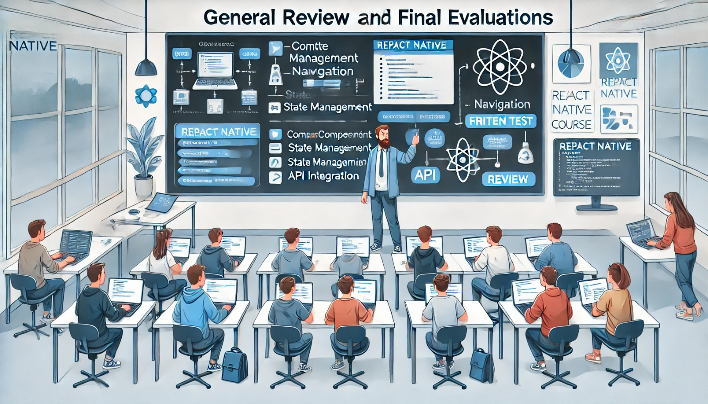

### Aula 75-80: Revisão Geral e Avaliações Finais

**Objetivo da Aula:**  
Realizar uma revisão abrangente dos principais conceitos e práticas desenvolvidos ao longo do curso e realizar avaliações finais para medir o conhecimento e as habilidades adquiridas pelos alunos em React Native.

---

### **1. Revisão Geral dos Conteúdos**

Nesta aula final, faremos uma recapitulação dos conceitos-chave, destacando os pontos mais importantes abordados em cada módulo. Essa revisão ajudará os alunos a consolidar o aprendizado e a se prepararem para as avaliações finais.

#### **Principais Tópicos Revisados**

- **Configuração do Ambiente e Fundamentos do TypeScript**
  - Como configurar um ambiente de desenvolvimento com React Native e Expo.
  - Introdução ao TypeScript e por que ele é útil no desenvolvimento de aplicativos móveis.

- **Componentes e Layout no React Native**
  - Criação e organização de componentes básicos e avançados.
  - Utilização do Flexbox para layout e estilização com StyleSheet.

- **Estado, Props e Ciclo de Vida dos Componentes**
  - Gerenciamento de estado com `useState`, `useEffect` e `useReducer`.
  - Manipulação de propriedades (`props`) e o ciclo de vida dos componentes.

- **Navegação e Integração de APIs**
  - Configuração de navegação usando React Navigation.
  - Consumo de APIs com Axios e Fetch para obter dados externos.

- **Persistência de Dados com AsyncStorage e Recursos Nativos**
  - Uso do AsyncStorage para persistência de dados.
  - Integração com recursos nativos, como câmera e localização.

- **Testes e Otimização**
  - Testes de unidade e de interface com Jest e React Native Testing Library.
  - Otimização de desempenho com hooks como `useCallback` e `React.memo`.

- **Publicação do Aplicativo nas Lojas**
  - Preparação e submissão de aplicativos na Google Play Store e Apple App Store.

---

### **2. Revisão Prática e Atividades**

Para reforçar o aprendizado, os alunos realizarão uma atividade prática em grupo. Eles devem identificar e implementar melhorias em seus projetos, seguindo as diretrizes discutidas durante o curso.

#### **Atividade de Revisão**

1. **Correção de Bugs e Otimização**
   - Revisem o código do projeto e identifiquem áreas que podem ser otimizadas.
   - Verifiquem o uso eficiente de hooks e identifiquem componentes que podem ser otimizados com `React.memo` ou `useCallback`.

2. **Testes de Funcionalidade**
   - Realizem testes para cada funcionalidade principal do aplicativo, garantindo que todos os fluxos de usuário funcionem corretamente.

3. **Ajustes de UI e UX**
   - Avaliem a interface e façam ajustes para melhorar a experiência do usuário.
   - Garanta que o layout seja responsivo e adequado para diferentes tamanhos de tela.

---

### **3. Avaliação Final**

A avaliação final será composta por uma prova escrita e uma apresentação final do projeto. A prova escrita avaliará o entendimento teórico dos conceitos, enquanto a apresentação do projeto permitirá que os alunos demonstrem suas habilidades práticas e expliquem o raciocínio por trás das decisões de design e implementação.

#### **Prova Escrita (Exemplos de Questões)**

- Questões de múltipla escolha abordando tópicos como componentes, navegação, hooks e consumo de APIs.
- Perguntas sobre boas práticas e organização de código.

**Exemplo de Pergunta:**
- **Qual hook é utilizado para evitar renderizações desnecessárias de funções em React Native?**
  - a) `useEffect`
  - b) `useMemo`
  - c) `useCallback`
  - d) `useState`

#### **Apresentação Final do Projeto**

Cada grupo de alunos fará uma apresentação final de seu projeto, demonstrando:

1. **Funcionalidades Principais:** Uma explicação das funcionalidades implementadas e uma breve demonstração.
2. **Principais Desafios:** Compartilhamento dos desafios enfrentados e como foram superados.
3. **Melhorias Implementadas:** Destaque para otimizações ou ajustes feitos nas últimas aulas.
4. **Aprendizados:** Reflexão sobre o que aprenderam e como podem aplicar essas habilidades no futuro.

---

### Conclusão

A revisão geral e as avaliações finais permitem que os alunos consolidem o aprendizado, identifiquem pontos de melhoria e apresentem o que desenvolveram. Ao concluir esta etapa, os alunos estarão prontos para aplicar suas habilidades em projetos reais e seguir em frente no desenvolvimento de aplicativos móveis com React Native.

---

### **Exercícios de Fixação**

1. **Qual é o principal uso do AsyncStorage em um projeto React Native?**
   - a) Renderizar componentes
   - b) Persistir dados localmente no dispositivo
   - c) Gerenciar navegação entre telas
   - d) Executar testes de unidade

2. **Qual biblioteca é usada para criar navegação entre telas em React Native?**
   - a) `react-native-navigation`
   - b) `react-router`
   - c) `React Navigation`
   - d) `react-dom`

3. **Qual hook permite controlar o ciclo de vida de um componente no React?**
   - a) `useState`
   - b) `useMemo`
   - c) `useEffect`
   - d) `useRef`

4. **O que é necessário para publicar um aplicativo na Google Play Store?**
   - a) Apenas uma conta do GitHub
   - b) Um arquivo `.aab` e uma conta no Google Play Console
   - c) Um arquivo `.ipa`
   - d) Um arquivo `.apk`

5. **Qual dos seguintes é um benefício da revisão de código?**
   - a) Reduz o tamanho do código
   - b) Facilita o uso de AsyncStorage
   - c) Melhora a qualidade do código e identifica erros
   - d) Aumenta a velocidade de execução do código

---

**Respostas:**
1. **b)** Persistir dados localmente no dispositivo
2. **c)** React Navigation
3. **c)** `useEffect`
4. **b)** Um arquivo `.aab` e uma conta no Google Play Console
5. **c)** Melhora a qualidade do código e identifica erros