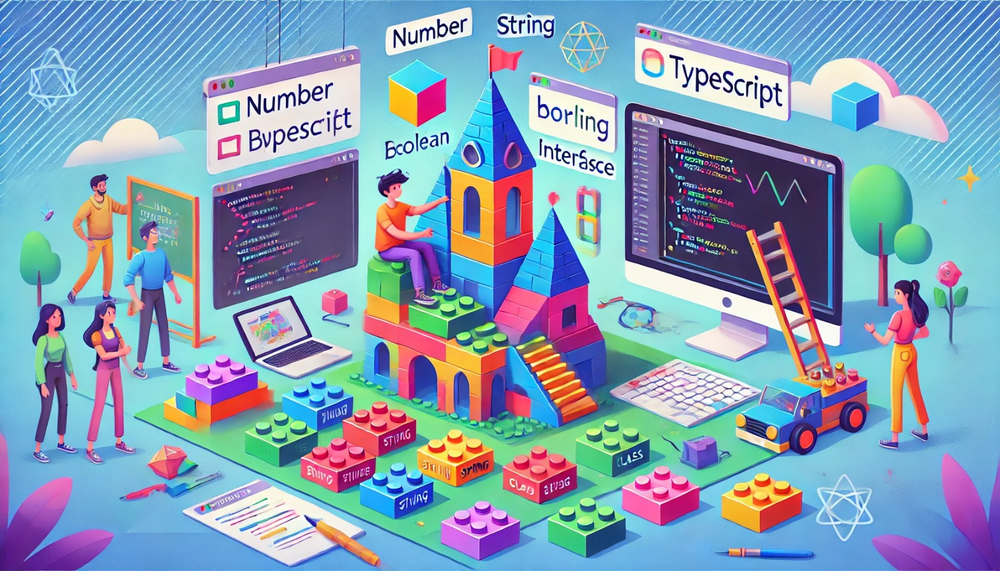

### **Introdução ao TypeScript: Benefícios e Conceitos Básicos**

Imagine que você está construindo um castelo de LEGO. Para garantir que tudo se encaixe perfeitamente, você precisa de peças que correspondam exatamente ao que você planejou. O **TypeScript** é como um manual de instruções para esse castelo, ajudando a garantir que todas as peças se encaixem corretamente no seu código.

**JavaScript** é uma linguagem muito popular, mas ela pode ser um pouco confusa às vezes, porque não exige que você diga exatamente que tipo de peça (ou valor) está usando. O **TypeScript** vem para resolver isso, adicionando "tipos" ao JavaScript. Isso significa que você pode dizer exatamente que tipo de dado você espera (como números, textos, listas, etc.), e o TypeScript vai garantir que tudo esteja correto antes de você construir (ou compilar) seu código.

**Benefícios do TypeScript:**
1. **Detecção de Erros:** O TypeScript ajuda a encontrar erros antes mesmo de executar o código.
2. **Auto-completar e Sugestões:** Ferramentas de desenvolvimento como o Visual Studio Code oferecem sugestões inteligentes enquanto você digita, graças ao TypeScript.
3. **Mais Organização:** Com TypeScript, você pode organizar melhor o seu código, tornando-o mais fácil de entender e manter.

**Conceitos Básicos:**
- **Tipos:** São como etiquetas que você coloca em variáveis para dizer que tipo de dado elas podem armazenar (ex: `number`, `string`, `boolean`).
- **Interfaces:** Definem a estrutura que um objeto deve seguir. É como um contrato que garante que os objetos tenham certas propriedades.
- **Funções:** Em TypeScript, você pode especificar quais tipos de dados as funções aceitam como argumentos e qual tipo de dado elas retornam.

### **Configuração do TypeScript no Projeto**

Vamos configurar nosso castelo de LEGO! Siga as etapas abaixo para preparar o ambiente onde vamos construir nosso código em TypeScript.

1. **Instale o TypeScript globalmente:**  
   ```bash
   npm install -g typescript
   ```
   Isso permite que você use o TypeScript em qualquer lugar do seu computador.

2. **Crie uma pasta para o projeto:**
   ```bash
   mkdir revisao
   cd revisao
   ```

3. **Abra o Visual Studio Code dentro da pasta:**
   ```bash
   code .
   ```

4. **Abra o terminal integrado (Ctrl + J) e inicie o projeto Node.js:**
   ```bash
   npm init -y
   ```
   Isso cria um arquivo `package.json` com as configurações básicas do projeto.

5. **Instale as dependências de desenvolvimento:**
   ```bash
   npm install typescript ts-node-dev --save-dev
   ```
   - **TypeScript:** a ferramenta principal que vamos usar.
   - **ts-node-dev:** um utilitário que facilita a execução e desenvolvimento com TypeScript.

6. **Inicie a configuração do TypeScript:**
   ```bash
   npx tsc --init
   ```
   Isso cria o arquivo `tsconfig.json`, que é o manual de instruções para o TypeScript.

7. **Crie a pasta e o arquivo principal do projeto:**
   ```bash
   mkdir src
   cd src
   touch index.ts
   ```
   O arquivo `index.ts` será o ponto de partida do nosso código.

8. **Adicione o script de desenvolvimento no `package.json`:**
   Abra o arquivo `package.json` e adicione o seguinte script:
   ```json
   "scripts": {
     "dev": "ts-node-dev src/index.ts"
   }
   ```
   Agora, você pode rodar o projeto com o comando `npm run dev`.

### **Tipos Básicos, Interfaces e Funções em TypeScript**

Agora que nosso castelo está configurado, vamos começar a montar as peças!

#### **Tipos Básicos**

Vamos começar com as peças mais simples: os tipos básicos.

- **`number`:** Números, como 42 ou 3.14.
- **`string`:** Textos, como "Olá, mundo!".
- **`boolean`:** Verdadeiro ou falso, como `true` ou `false`.

Exemplo:
```typescript
let idade: number = 25;
let nome: string = "Ana";
let estaChovendo: boolean = false;
```

#### **Interfaces**

As interfaces são como um plano para nossos objetos, garantindo que eles tenham as propriedades certas.

Exemplo:
```typescript
interface Pessoa {
  nome: string;
  idade: number;
}

let pessoa1: Pessoa = {
  nome: "Carlos",
  idade: 30
};
```

#### **Funções**

Em TypeScript, você pode especificar quais tipos de dados uma função aceita e retorna.

Exemplo:
```typescript
function soma(a: number, b: number): number {
  return a + b;
}

let resultado = soma(5, 3); // resultado será 8
```

### **Classes e Interfaces Avançadas em TypeScript**

Agora, vamos construir estruturas mais complexas, como torres no nosso castelo.

#### **Classes**

Classes são como modelos para criar objetos. Elas podem ter propriedades e métodos.

Exemplo:
```typescript
class Animal {
  nome: string;

  constructor(nome: string) {
    this.nome = nome;
  }

  fazerSom(): void {
    console.log(`${this.nome} está fazendo som!`);
  }
}

let cachorro = new Animal("Rex");
cachorro.fazerSom(); // Rex está fazendo som!
```

#### **Interfaces Avançadas**

Podemos combinar interfaces para criar estruturas mais complexas.

Exemplo:
```typescript
interface Veiculo {
  marca: string;
  ano: number;
}

interface Carro extends Veiculo {
  modelo: string;
}

let meuCarro: Carro = {
  marca: "Toyota",
  ano: 2020,
  modelo: "Corolla"
};
```

### **Exercícios de Fixação**

Agora é sua vez de montar algumas peças!

#### **Tipos Básicos:**
1. Crie uma variável `altura` que seja um número e atribua o valor 1.75.
2. Crie uma variável `cidade` que seja uma string e atribua o nome de uma cidade.
3. Crie uma variável `temCarro` que seja um boolean e atribua o valor `false`.

#### **Interfaces e Funções:**
1. Crie uma interface chamada `Livro` com as propriedades `titulo` (string) e `autor` (string).
2. Crie um objeto do tipo `Livro` e preencha com informações de um livro de sua escolha.
3. Crie uma função `exibirLivro` que aceite um parâmetro do tipo `Livro` e exiba o título e autor no console.

#### **Classes e Interfaces Avançadas:**
1. Crie uma classe `Pessoa` com as propriedades `nome` e `idade` e um método `apresentar` que exiba uma mensagem com o nome e idade da pessoa.
2. Crie uma interface `Endereco` com as propriedades `rua`, `numero`, e `cidade`.
3. Altere a classe `Pessoa` para aceitar um `Endereco` como propriedade adicional e modifique o método `apresentar` para incluir o endereço na mensagem.

Divirta-se explorando e construindo com TypeScript!