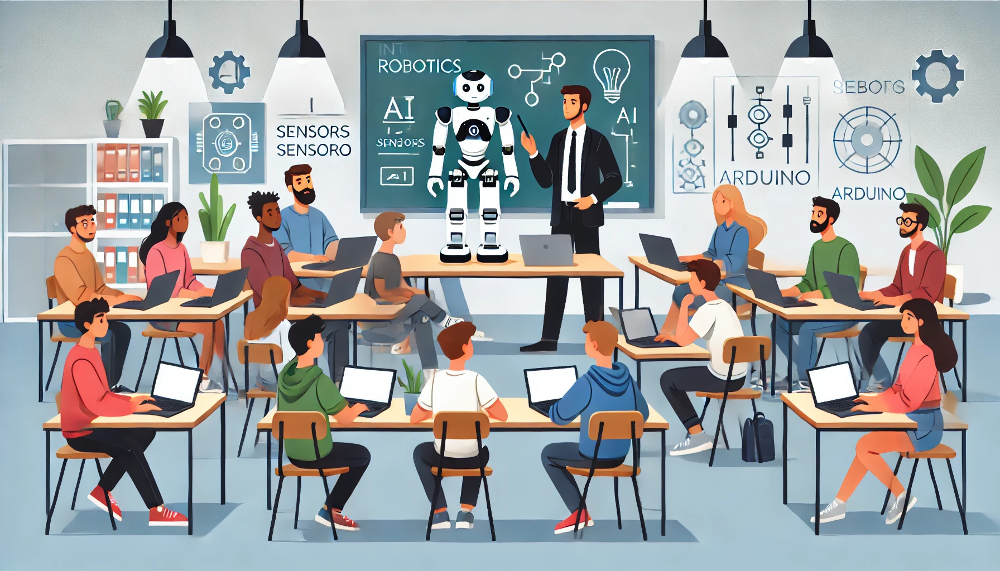

### Aula 1: Introdução ao Curso e Visão Geral da Robótica

Bem-vindos ao emocionante mundo da robótica! Hoje, iniciaremos nossa jornada de descobertas, aprendendo sobre como a robótica transforma nosso mundo e as incríveis oportunidades que ela oferece.

**O que é Robótica?**

A robótica é uma área da tecnologia que envolve o design, a construção, a operação e a aplicação de robôs. Os robôs são sistemas que podem ser programados para realizar uma variedade de tarefas, algumas das quais podem ser complexas ou perigosas para os humanos. Eles são usados em muitos setores, incluindo manufatura, saúde, serviços e até na exploração espacial.

**Por que estudar Robótica?**

Estudar robótica é fascinante pois combina elementos de engenharia, ciência da computação e tecnologia. É uma área que promove a inovação e a criatividade, oferecendo soluções para problemas reais. Além disso, à medida que a tecnologia avança, a demanda por habilidades em robótica só tende a crescer.

**O que você aprenderá neste curso?**

Neste curso, você terá a oportunidade de:
- Entender os princípios básicos de eletricidade e eletrônica, essenciais para qualquer projeto robótico.
- Aprender a programar utilizando o Arduino, uma plataforma de prototipagem eletrônica amplamente utilizada em robótica.
- Explorar diferentes tipos de sensores e atuadores e como eles permitem que os robôs interajam com o ambiente ao seu redor.
- Desenvolver projetos práticos utilizando o Tinkercad, uma ferramenta online que permite simular circuitos eletrônicos e protótipos de robôs.

**Como o curso será conduzido?**

Cada aula combinará teoria e prática. Apresentaremos os conceitos em uma linguagem clara e acessível, seguidos de atividades práticas onde você poderá aplicar o que aprendeu. Encorajamos a experimentação e a curiosidade, fundamentais para o aprendizado eficaz em robótica.

**Próximos Passos**

Prepare-se para embarcar em uma viagem de descoberta e inovação. Cada classe é projetada para construir suas habilidades passo a passo, garantindo que você se sinta confiante e preparado para enfrentar desafios mais complexos à medida que avançamos.

Ao final deste curso, você não apenas entenderá os fundamentos da robótica, mas também terá desenvolvido habilidades práticas que poderão ser aplicadas em projetos reais. Estamos empolgados para guiá-lo nesta jornada de aprendizado e inovação. Vamos começar!

### Atividade de Fixação: Introdução ao Curso e Visão Geral da Robótica

**Questão 1:** O que é robótica?
- A) A ciência de cozinhar usando robôs.
- B) A área da tecnologia que envolve a criação de filmes sobre robôs.
- C) A área da tecnologia que envolve o design, a construção, a operação e a aplicação de robôs.
- D) Um ramo da literatura que explora histórias de ficção científica.

**Questão 2:** Qual dos seguintes setores NÃO é comumente associado ao uso de robôs?
- A) Manufatura
- B) Saúde
- C) Exploração espacial
- D) Entretenimento musical

**Questão 3:** O que os estudantes aprenderão sobre programação neste curso?
- A) Como programar em todas as linguagens de programação.
- B) Como utilizar o C++ para programação em Arduino.
- C) Como programar jogos de vídeo.
- D) Como escrever scripts para filmes.

**Questão 4:** Qual ferramenta será usada para simulações de circuitos eletrônicos e protótipos de robôs?
- A) Photoshop
- B) Microsoft Excel
- C) Tinkercad
- D) AutoCAD

**Questão 5:** Qual é a principal aplicação da robótica na indústria?
- A) Reduzir o tempo de entretenimento.
- B) Substituir humanos em tarefas perigosas ou repetitivas.
- C) Criar arte moderna.
- D) Ensinar história.