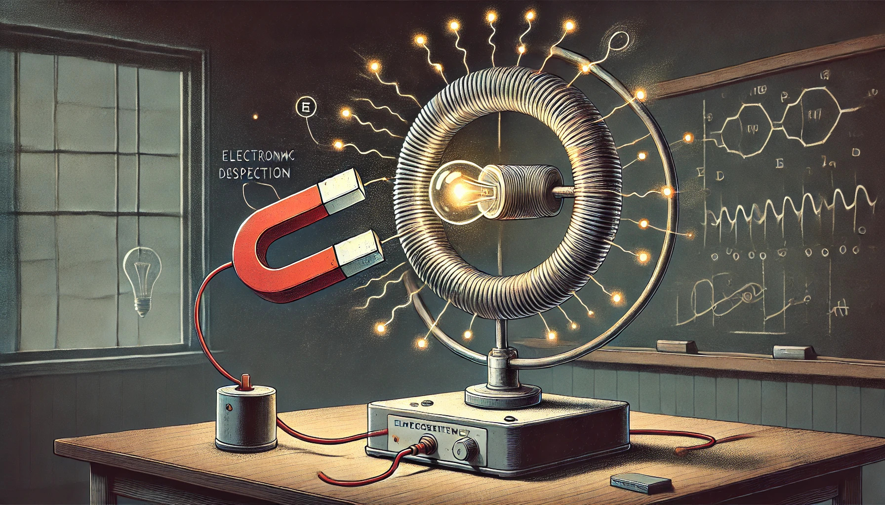

### Aula 2: O que é Eletricidade? Conceitos de Carga Elétrica e Campos Elétricos

Bem-vindos novamente! Na aula de hoje, além de revisar o que é eletricidade, exploraremos como a energia elétrica é gerada e de que elementos ela é composta.

**O que é Eletricidade?**

A eletricidade é uma forma de energia resultante do movimento de elétrons, que são partículas subatômicas com carga elétrica negativa. Ela é fundamental para a vida moderna, alimentando tudo, desde lâmpadas até computadores.

**Como a Energia Elétrica é Gerada?**

A energia elétrica pode ser gerada de várias formas, sendo as mais comuns através de usinas hidrelétricas, termelétricas, eólicas e solares. No entanto, o princípio básico por trás da geração de eletricidade é o mesmo: transformar algum tipo de energia (como cinética, térmica ou solar) em energia elétrica.

- **Usinas Hidrelétricas:** Utilizam a energia da água em movimento para girar turbinas que, por sua vez, ativam um gerador.
- **Usinas Termelétricas:** Queimam combustíveis fósseis para produzir calor, que é usado para gerar vapor que gira as turbinas.
- **Energia Eólica:** Utiliza o vento para mover turbinas diretamente.
- **Energia Solar:** Converte a luz do sol em eletricidade usando células fotovoltaicas.

**Como Funciona um Gerador?**

Um gerador é um dispositivo que converte energia mecânica em energia elétrica. Ele funciona baseado no princípio da indução eletromagnética, descoberto por Michael Faraday. Quando um condutor se move através de um campo magnético, elétrons são deslocados, criando uma corrente elétrica.

**De que Elemento a Eletricidade é Composta?**

A eletricidade é composta por elétrons, que são os portadores de carga em materiais condutores. Quando uma diferença de potencial elétrico (voltagem) é aplicada a um condutor, os elétrons livres no material se movem, formando o que conhecemos como corrente elétrica.

**Conclusão**

Entender como a eletricidade é gerada e como ela funciona nos ajuda a perceber a importância dos conceitos elétricos em robótica. Ao dominar esses princípios, você será capaz de construir circuitos mais eficientes e inovadores para seus projetos robóticos.

Prepare-se para a próxima aula, onde mergulharemos mais fundo em circuitos elétricos e começaremos a aplicar estes conceitos em nossos primeiros projetos de robótica. Até lá, continuem explorando e questionando o mundo fascinante da eletricidade!