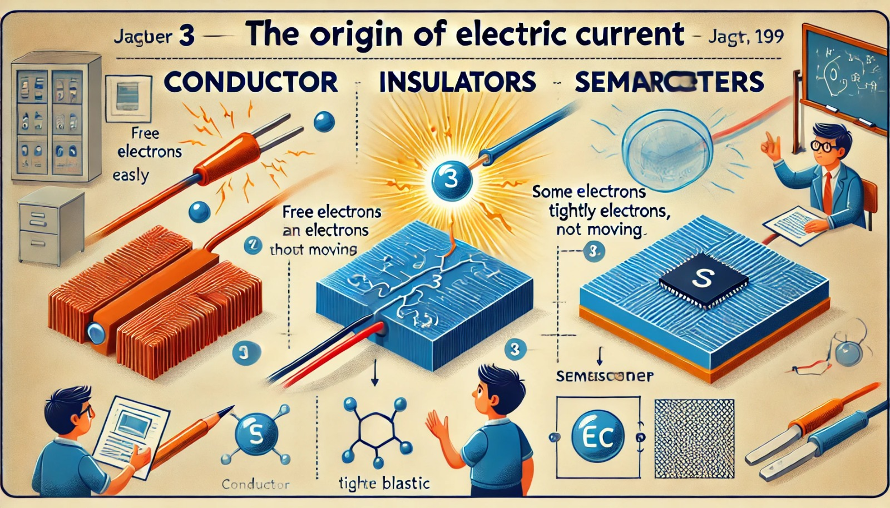

### Aula 3: Origem da Corrente Elétrica: Condutores, Isolantes e Semicondutores

Bem-vindos à nossa terceira aula! Hoje, vamos explorar como a corrente elétrica é gerada e entender os diferentes tipos de materiais que influenciam o fluxo de eletricidade: condutores, isolantes e semicondutores.

#### O que é Corrente Elétrica?

Corrente elétrica é o fluxo de elétrons através de um material condutor. Ela ocorre quando há uma diferença de potencial elétrico (voltagem) entre dois pontos. Essa diferença de potencial faz com que os elétrons se movam de um ponto de maior potencial negativo para um ponto de menor potencial negativo, criando assim a corrente elétrica.

#### Diferença de Potencial Elétrico

Para entender a corrente elétrica, precisamos entender a diferença de potencial elétrico, ou voltagem. Pense na voltagem como a pressão da água em um cano. Quanto maior a pressão, mais forte a água flui. Da mesma forma, quanto maior a voltagem, mais forte os elétrons são "empurrados" através de um condutor.

#### Condutores

**Condutores** são materiais que permitem o fácil movimento de elétrons. Eles possuem muitos elétrons livres que podem se mover facilmente de um átomo para outro. Exemplos de bons condutores incluem metais como cobre, alumínio e prata. Esses materiais são frequentemente usados em fios e cabos elétricos porque permitem que a corrente flua com pouca resistência.

#### Isolantes

**Isolantes** são materiais que não permitem o movimento fácil de elétrons. Eles têm poucos elétrons livres, o que impede a corrente elétrica de fluir através deles. Exemplos comuns de isolantes incluem plástico, borracha, vidro e cerâmica. Isolantes são usados para revestir fios elétricos e proteger as pessoas de choques elétricos, além de evitar curtos-circuitos.

#### Semicondutores

**Semicondutores** têm propriedades que ficam entre as dos condutores e isolantes. Eles podem conduzir eletricidade sob certas condições, mas não tão bem quanto os condutores. O silício é o semicondutor mais amplamente utilizado, especialmente em componentes eletrônicos como diodos, transistores e circuitos integrados. Semicondutores são essenciais na fabricação de dispositivos eletrônicos como computadores e smartphones.

#### Conclusão

Compreender os tipos de materiais e como eles afetam o fluxo de corrente elétrica é fundamental para a robótica e a eletrônica. Saber quando usar condutores, isolantes ou semicondutores nos ajuda a projetar e construir circuitos eficientes e seguros. Na próxima aula, exploraremos como montar circuitos básicos e aplicar esses conceitos na prática.

### Atividade de Fixação: Origem da Corrente Elétrica: Condutores, Isolantes e Semicondutores

**Questão 1:** O que é corrente elétrica?
- A) O movimento de prótons através de um material.
- B) O movimento de nêutrons através de um material.
- C) O movimento de elétrons através de um material.
- D) O movimento de átomos através de um material.

**Questão 2:** Qual dos seguintes materiais é um bom condutor de eletricidade?
- A) Plástico
- B) Vidro
- C) Cobre
- D) Borracha

**Questão 3:** Qual é a principal característica dos isolantes?
- A) Eles têm muitos elétrons livres que se movem facilmente.
- B) Eles permitem o fácil movimento de prótons.
- C) Eles têm poucos elétrons livres, dificultando o movimento de elétrons.
- D) Eles conduzem eletricidade melhor que os condutores.

**Questão 4:** Qual dos seguintes é um exemplo de semicondutor amplamente utilizado?
- A) Cobre
- B) Plástico
- C) Borracha
- D) Silício

**Questão 5:** O que acontece com os elétrons em um material semicondutor?
- A) Eles se movem livremente como em um condutor.
- B) Eles não se movem de forma alguma.
- C) Eles se movem sob certas condições, como a aplicação de uma tensão.
- D) Eles se movem apenas na presença de um campo magnético.

**Questão 6:** Qual é a função de um isolante em um cabo elétrico?
- A) Aumentar a corrente elétrica no cabo.
- B) Proteger o cabo de danos físicos.
- C) Evitar que a corrente elétrica escape do cabo.
- D) Reduzir a voltagem no cabo.

**Questão 7:** Qual a diferença entre condutores e isolantes em termos de elétrons livres?
- A) Condutores têm poucos elétrons livres, enquanto isolantes têm muitos.
- B) Condutores têm muitos elétrons livres, enquanto isolantes têm poucos.
- C) Ambos têm a mesma quantidade de elétrons livres.
- D) Condutores não têm elétrons livres, enquanto isolantes têm todos os elétrons livres.

**Questão 8:** Qual é a principal aplicação dos semicondutores na eletrônica?
- A) Conduzir eletricidade com eficiência em todas as condições.
- B) Armazenar energia em grandes quantidades.
- C) Controlar o fluxo de corrente em dispositivos eletrônicos.
- D) Bloquear completamente o fluxo de corrente elétrica.
