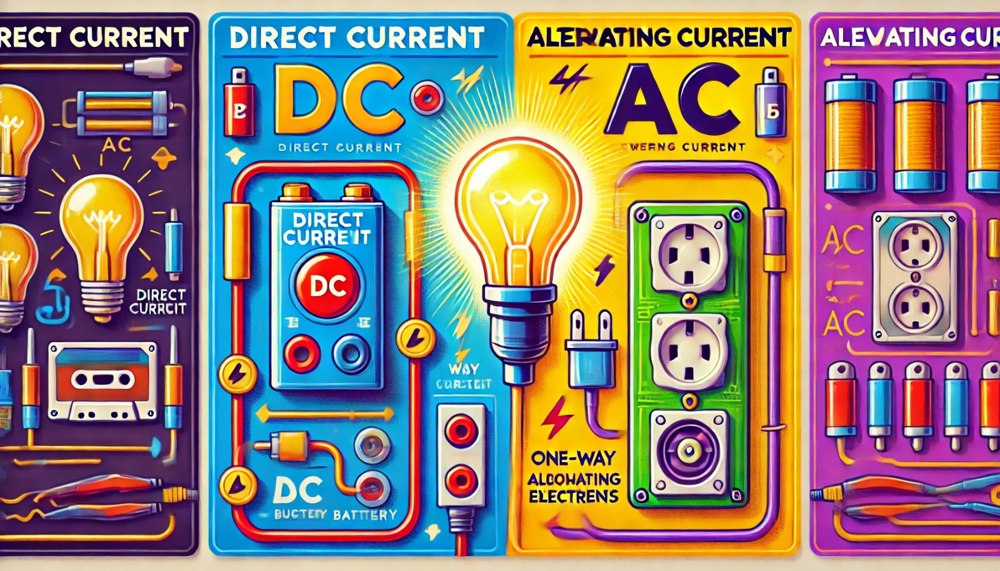

### Aula 4: Tipos de Corrente: Corrente Contínua (CC) e Corrente Alternada (CA)

Bem-vindos à nossa quarta aula! Hoje vamos aprender sobre os dois principais tipos de corrente elétrica: Corrente Contínua (CC) e Corrente Alternada (CA). Vamos explorar o que são, como funcionam e onde são usadas.

#### O que é Corrente Contínua (CC)?

A corrente contínua (CC) é o fluxo constante de elétrons em uma única direção. Imagine uma estrada onde os carros só podem viajar em uma direção. Na CC, os elétrons fluem do terminal negativo para o terminal positivo de uma fonte de energia, como uma bateria. 

- **Fonte Comum:** Pilhas e baterias.
- **Uso:** Dispositivos eletrônicos como lanternas, telefones celulares, laptops, e carros elétricos.
- **Exemplo:** Quando você coloca uma bateria em um controle remoto, a corrente elétrica que alimenta o controle é corrente contínua.

#### O que é Corrente Alternada (CA)?

A corrente alternada (CA) é o fluxo de elétrons que muda de direção periodicamente. Imagine uma estrada onde os carros podem mudar de direção repetidamente. Na CA, os elétrons mudam de direção várias vezes por segundo.

- **Fonte Comum:** Tomadas de parede em residências e empresas.
- **Uso:** Alimentar aparelhos domésticos como geladeiras, televisores, computadores e lâmpadas.
- **Exemplo:** A eletricidade que sai das tomadas de parede em sua casa é corrente alternada.

#### Principais Diferenças entre CC e CA

1. **Direção do Fluxo:**
   - **CC:** Os elétrons fluem em uma única direção.
   - **CA:** Os elétrons mudam de direção periodicamente.

2. **Fonte de Energia:**
   - **CC:** Baterias, células solares.
   - **CA:** Geradores em usinas de energia.

3. **Uso Comum:**
   - **CC:** Eletrônicos portáteis.
   - **CA:** Aparelhos domésticos e iluminação.

#### Como a Corrente Alternada é Gerada?

A corrente alternada é gerada em usinas de energia usando grandes geradores que convertem energia mecânica (como a de uma turbina a vapor) em energia elétrica. Esses geradores produzem eletricidade que alterna sua direção, criando a CA.

### Exercícios Teóricos

**Questão 1:** O que é corrente contínua (CC)?
- A) Um tipo de corrente elétrica que muda de direção periodicamente.
- B) Um tipo de corrente elétrica que flui em uma única direção.
- C) Um tipo de corrente elétrica que não se move.
- D) Um tipo de corrente elétrica que só é usada em lâmpadas.

**Questão 2:** Onde a corrente contínua (CC) é comumente usada?
- A) Em tomadas de parede.
- B) Em aparelhos domésticos.
- C) Em dispositivos eletrônicos portáteis.
- D) Em linhas de transmissão de alta tensão.

**Questão 3:** O que é corrente alternada (CA)?
- A) Um tipo de corrente elétrica que flui em uma única direção.
- B) Um tipo de corrente elétrica que muda de direção periodicamente.
- C) Um tipo de corrente elétrica que não flui.
- D) Um tipo de corrente elétrica que só é usada em baterias.

**Questão 4:** Onde a corrente alternada (CA) é comumente usada?
- A) Em dispositivos eletrônicos portáteis.
- B) Em lâmpadas e eletrodomésticos.
- C) Em baterias de carros elétricos.
- D) Em painéis solares.

**Questão 5:** Qual é a principal diferença entre corrente contínua (CC) e corrente alternada (CA)?
- A) CC flui em uma única direção, enquanto CA muda de direção periodicamente.
- B) CC muda de direção periodicamente, enquanto CA flui em uma única direção.
- C) CC é usada apenas em residências, enquanto CA é usada em dispositivos portáteis.
- D) CC é mais perigosa que CA.

### Conclusão

Compreender os tipos de corrente elétrica é fundamental para entender como diferentes dispositivos funcionam e são alimentados. A corrente contínua é usada principalmente em dispositivos portáteis, enquanto a corrente alternada é amplamente utilizada para alimentar aparelhos domésticos e iluminação. Com este conhecimento, você estará mais preparado para avançar no estudo da eletrônica e da robótica.