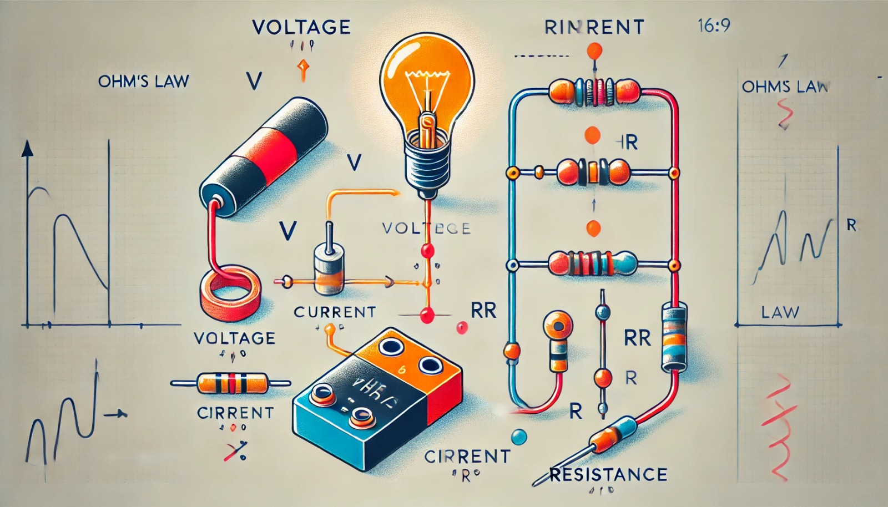

### Aula 5: A Lei de Ohm - Relacionamento entre Tensão, Corrente e Resistência

Bem-vindos à nossa quinta aula! Hoje, vamos aprender sobre a Lei de Ohm, uma das leis mais importantes da eletricidade, e como ela descreve a relação entre tensão, corrente e resistência em um circuito elétrico.

#### Conceitos Básicos

Antes de entender a Lei de Ohm, precisamos revisar três conceitos básicos:

- **Tensão (V):** Também conhecida como voltagem, é a força que "empurra" os elétrons através de um condutor. É medida em volts (V).
- **Corrente (I):** É o fluxo de elétrons que se move através de um condutor. É medida em amperes (A).
- **Resistência (R):** É a oposição ao fluxo de corrente oferecida pelo material do condutor. É medida em ohms (Ω).

#### A Lei de Ohm

A Lei de Ohm estabelece que a tensão (V) em um circuito é igual à corrente (I) que flui através do circuito multiplicada pela resistência (R) do circuito. A fórmula matemática da Lei de Ohm é:

#### Entendendo a Lei de Ohm

Vamos ver como esses conceitos se relacionam com exemplos práticos.

1. **Encontrar a Tensão (V):**
   - Se você conhece a corrente (I) e a resistência (R), pode encontrar a tensão usando a fórmula .
   - Exemplo: Se uma corrente de 2 amperes flui através de um resistor de 5 ohms, a tensão será:
     

2. **Encontrar a Corrente (I):**
   - Se você conhece a tensão (V) e a resistência (R), pode encontrar a corrente rearranjando a fórmula para .
   - Exemplo: Se uma tensão de 10 volts é aplicada a um resistor de 5 ohms, a corrente será:
     

3. **Encontrar a Resistência (R):**
   - Se você conhece a tensão (V) e a corrente (I), pode encontrar a resistência rearranjando a fórmula para .
   - Exemplo: Se uma tensão de 10 volts causa uma corrente de 2 amperes, a resistência será:
     

#### Visualizando a Lei de Ohm

Para facilitar a compreensão, imagine um sistema de encanamento:
- **Tensão (V):** É como a pressão da água que empurra a água através do cano.
- **Corrente (I):** É como o fluxo de água que passa pelo cano.
- **Resistência (R):** É como a largura do cano; um cano mais estreito (maior resistência) dificulta o fluxo de água.

#### Exemplos Práticos

- **Lâmpadas:** Quando você conecta uma lâmpada a uma bateria, a tensão da bateria empurra os elétrons através do filamento da lâmpada, fazendo com que ela brilhe. A resistência do filamento determina a quantidade de corrente que fluirá.
- **Aparelhos Eletrônicos:** Todos os aparelhos eletrônicos usam a Lei de Ohm para funcionar corretamente, ajustando a tensão, corrente e resistência conforme necessário para operar de maneira segura e eficiente.

### Exercícios de Fixação

**Questão 1:** Qual é a fórmula da Lei de Ohm?

**Questão 2:** Se uma corrente de 3 amperes flui através de um resistor de 4 ohms, qual é a tensão?
- A) 7 volts
- B) 12 volts
- C) 1.33 volts
- D) 0.75 volts

**Questão 3:** Se uma tensão de 15 volts é aplicada a um resistor de 5 ohms, qual é a corrente?
- A) 3 amperes
- B) 75 amperes
- C) 0.3 amperes
- D) 20 amperes

**Questão 4:** Se uma tensão de 9 volts causa uma corrente de 3 amperes, qual é a resistência?
- A) 27 ohms
- B) 0.33 ohms
- C) 3 ohms
- D) 1 ohm

**Questão 5:** Qual dos seguintes exemplos ilustra melhor a resistência em um circuito?
- A) A pressão da água em um encanamento.
- B) A largura do cano em um encanamento.
- C) O volume de água que passa pelo cano.
- D) A quantidade de água armazenada em um tanque.

### Conclusão

A Lei de Ohm é uma ferramenta poderosa e simples que nos ajuda a entender e controlar circuitos elétricos. Ao dominar esta lei, você pode projetar, construir e solucionar problemas em uma variedade de dispositivos eletrônicos.
