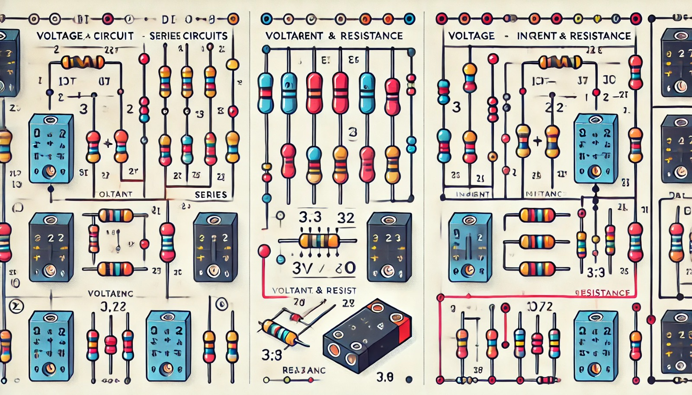
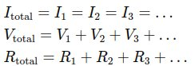
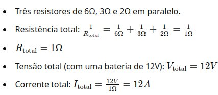
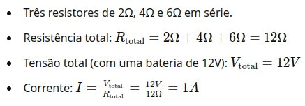

### Aula 6: Circuitos em Série e Paralelo. Cálculo de Parâmetros em Circuitos Combinados

Bem-vindos à nossa sexta aula! Hoje vamos aprender sobre circuitos em série e paralelo, dois tipos fundamentais de circuitos elétricos. Vamos explorar como eles funcionam, suas diferenças e como calcular parâmetros importantes nesses circuitos.

#### O que são Circuitos em Série?

Em um circuito em série, todos os componentes estão conectados um após o outro, formando um único caminho para o fluxo da corrente elétrica. Se um dos componentes falhar, o circuito inteiro será interrompido.

**Características dos Circuitos em Série:**
- **Corrente (I):** A corrente é a mesma em todos os componentes do circuito.
- **Tensão (V):** A tensão total é a soma das tensões em cada componente.
- **Resistência (R):** A resistência total é a soma das resistências individuais.

**Fórmulas para Circuitos em Série:**

#### O que são Circuitos em Paralelo?

Em um circuito em paralelo, todos os componentes estão conectados em diferentes ramos, formando múltiplos caminhos para o fluxo da corrente elétrica. Se um dos componentes falhar, os outros podem continuar funcionando.

**Características dos Circuitos em Paralelo:**
- **Tensão (V):** A tensão é a mesma em todos os componentes do circuito.
- **Corrente (I):** A corrente total é a soma das correntes em cada ramo.
- **Resistência (R):** A resistência total é menor do que a menor resistência individual e pode ser calculada usando a fórmula específica.

**Fórmulas para Circuitos em Paralelo:**

#### Como Calcular Parâmetros em Circuitos Combinados?

Circuitos combinados são aqueles que possuem partes em série e partes em paralelo. Para calcular os parâmetros nesses circuitos, siga estes passos:

1. **Identifique as partes em série e paralelo:** Separe o circuito em seções de série e paralelo.
2. **Calcule a resistência equivalente para as partes em paralelo:** Use a fórmula de resistência em paralelo.
3. **Simplifique o circuito:** Substitua as partes paralelas pela resistência equivalente para transformar o circuito em série.
4. **Calcule a resistência total:** Some as resistências das partes em série.
5. **Calcule a corrente total:** Use a Lei de Ohm (V = I x R) para encontrar a corrente total.
6. **Distribua a corrente e a tensão:** Redistribua a corrente e a tensão para as partes individuais do circuito.

#### Exemplos Práticos

**Exemplo 1: Circuito em Série**

**Exemplo 2: Circuito em Paralelo**

### Exercícios de Fixação

**Questão 1:** Qual é a resistência total de três resistores de 10Ω, 20Ω e 30Ω conectados em série?
- A) 60Ω
- B) 10Ω
- C) 6Ω
- D) 30Ω

**Questão 2:** Qual é a resistência total de três resistores de 12Ω, 6Ω e 4Ω conectados em paralelo?
- A) 22Ω
- B) 2Ω
- C) 1.71Ω
- D) 3Ω

**Questão 3:** Em um circuito em série com uma bateria de 9V e três resistores de 2Ω, 2Ω e 2Ω, qual é a corrente total?
- A) 1A
- B) 3A
- C) 9A
- D) 1.5A

**Questão 4:** Em um circuito paralelo com uma tensão de 12V e três resistores de 12Ω, qual é a corrente total?
- A) 1A
- B) 3A
- C) 0.33A
- D) 4A

**Questão 5:** Qual é a principal característica de um circuito em série?
- A) A corrente é dividida em cada componente.
- B) A tensão é a mesma em todos os componentes.
- C) A corrente é a mesma em todos os componentes.
- D) A resistência total é menor que a menor resistência individual.

### Conclusão

Compreender como funcionam os circuitos em série e paralelo é fundamental para qualquer estudo de eletrônica. Saber calcular os parâmetros nesses circuitos permitirá que você projete e analise circuitos de forma eficiente e segura. Na próxima aula, exploraremos mais conceitos avançados de eletrônica. Até lá!