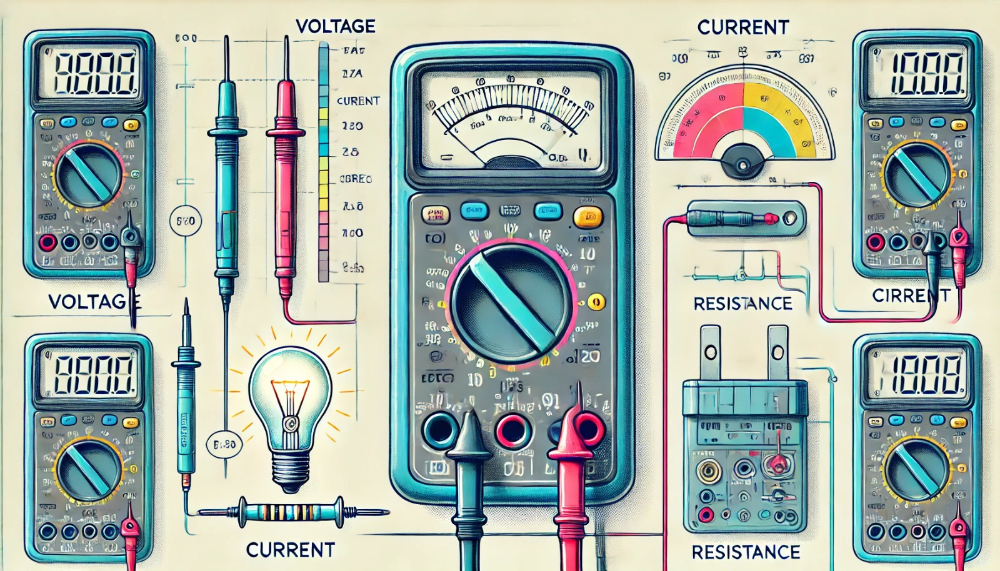

### Aula 7: Uso do Multímetro para Medição de Parâmetros Elétricos

Bem-vindos à nossa sétima aula! Hoje, vamos aprender como usar um multímetro, uma ferramenta essencial para medir diferentes parâmetros elétricos, como tensão, corrente e resistência. O multímetro é um dispositivo versátil e amplamente utilizado em eletrônica para testar e diagnosticar circuitos elétricos.

#### O que é um Multímetro?

Um multímetro é um instrumento de medição que combina várias funções em um único dispositivo. Ele pode medir:
- **Tensão (Voltagem)**
- **Corrente**
- **Resistência**
- **Continuidade** (verificação se há um caminho elétrico entre dois pontos)

Existem dois tipos principais de multímetros:
- **Multímetro Digital:** Mostra os valores medidos em uma tela digital.
- **Multímetro Analógico:** Usa um ponteiro para indicar os valores em uma escala.

#### Partes do Multímetro

Um multímetro típico tem as seguintes partes:
- **Selector de Funções:** Um dial que permite selecionar o que você quer medir (tensão, corrente, resistência, etc.).
- **Probes (Pontas de Prova):** Cabos que você usa para conectar o multímetro ao circuito. Geralmente, um é vermelho (positivo) e o outro é preto (negativo).
- **Tela de Exibição:** Onde você vê os resultados das medições.

#### Como Usar o Multímetro

Vamos aprender a usar o multímetro para medir três parâmetros principais: tensão, corrente e resistência.

**1. Medição de Tensão (Voltagem):**
- **Passo 1:** Gire o selector de funções para a configuração de voltagem (V). Escolha CC (corrente contínua) ou CA (corrente alternada) dependendo do tipo de voltagem que você deseja medir.
- **Passo 2:** Conecte o probe preto ao conector "COM" (comum) e o probe vermelho ao conector "VΩ".
- **Passo 3:** Toque o probe preto em um ponto do circuito e o probe vermelho no outro. O multímetro mostrará a voltagem entre esses dois pontos.

**2. Medição de Corrente:**
- **Passo 1:** Gire o selector de funções para a configuração de corrente (A). Novamente, escolha CC ou CA conforme necessário.
- **Passo 2:** Conecte o probe preto ao conector "COM" e o probe vermelho ao conector "A" ou "mA", dependendo da corrente esperada.
- **Passo 3:** Interrompa o circuito em algum ponto e conecte os probes do multímetro em série com o circuito. O multímetro mostrará a corrente que flui através do circuito.

**3. Medição de Resistência:**
- **Passo 1:** Gire o selector de funções para a configuração de resistência (Ω).
- **Passo 2:** Conecte o probe preto ao conector "COM" e o probe vermelho ao conector "VΩ".
- **Passo 3:** Toque os probes nas duas extremidades do componente cuja resistência você deseja medir (o componente deve estar desconectado do circuito). O multímetro mostrará o valor da resistência.

#### Dicas de Segurança

- **Nunca meça a resistência em um circuito energizado:** Isso pode danificar o multímetro e ser perigoso.
- **Selecione a faixa adequada:** Comece com a faixa mais alta e vá diminuindo conforme necessário para evitar sobrecargas.
- **Verifique as conexões:** Certifique-se de que os probes estão conectados corretamente para evitar medições incorretas.

#### Exercícios Práticos

1. **Medição de Tensão em uma Bateria:** Use o multímetro para medir a voltagem de uma pilha AA.
2. **Medição de Corrente em um Circuito Simples:** Monte um circuito com uma lâmpada e use o multímetro para medir a corrente que passa por ela.
3. **Medição de Resistência em um Resistor:** Desconecte um resistor do circuito e use o multímetro para medir sua resistência.

### Conclusão

O multímetro é uma ferramenta indispensável para qualquer pessoa que trabalha com eletrônica. Aprender a usá-lo corretamente permitirá que você diagnostique e solucione problemas em circuitos com precisão e segurança. Na próxima aula, vamos aplicar essas habilidades em projetos práticos. Até lá!