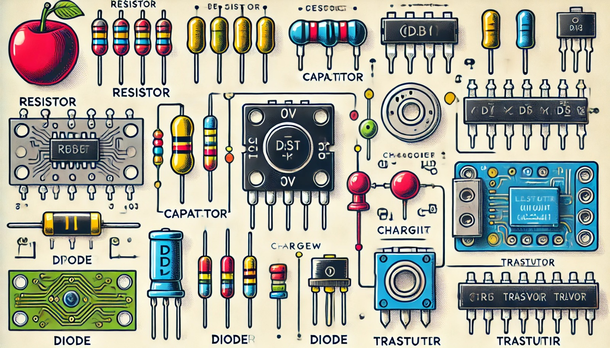

### Aula 9: Componentes Eletrônicos Básicos: Resistores, Capacitores, Diodos e Transistores

Bem-vindos à nossa nona aula! Hoje, vamos aprender sobre os componentes eletrônicos básicos que são fundamentais em qualquer circuito: resistores, capacitores, diodos e transistores. Esses componentes desempenham papéis essenciais no controle e na manipulação da eletricidade em dispositivos eletrônicos.

#### 1. Resistores

**O que são?**  
Resistores são componentes que limitam o fluxo de corrente elétrica em um circuito. Eles são usados para controlar a quantidade de corrente que passa por diferentes partes de um circuito.

**Como funcionam?**  
Os resistores oferecem resistência ao fluxo de elétrons. A quantidade de resistência é medida em ohms (Ω). Um resistor alto significa que ele deixa passar menos corrente, enquanto um resistor baixo permite mais corrente.

**Exemplo de uso:**  
Em um circuito com LEDs, os resistores são usados para evitar que o LED receba muita corrente e queime.

#### 2. Capacitores

**O que são?**  
Capacitores são componentes que armazenam energia elétrica temporariamente. Eles podem liberar essa energia rapidamente quando necessário.

**Como funcionam?**  
Os capacitores armazenam carga elétrica em duas placas separadas por um material isolante. Quando o capacitor está carregado, ele pode liberar energia para o circuito.

**Exemplo de uso:**  
Capacitores são usados em fontes de energia para suavizar flutuações na voltagem e fornecer energia constante a um circuito.

#### 3. Diodos

**O que são?**  
Diodos são componentes que permitem o fluxo de corrente em uma única direção. Eles são como válvulas de sentido único para eletricidade.

**Como funcionam?**  
Quando a corrente tenta fluir na direção correta, o diodo permite a passagem. Se a corrente tentar fluir na direção oposta, o diodo bloqueia o fluxo.

**Exemplo de uso:**  
Diodos são usados para converter corrente alternada (CA) em corrente contínua (CC), em fontes de energia.

#### 4. Transistores

**O que são?**  
Transistores são componentes que podem amplificar sinais elétricos ou funcionar como chaves que ligam e desligam a corrente.

**Como funcionam?**  
Um transistor tem três partes: base, coletor e emissor. Quando uma pequena corrente é aplicada à base, ela controla uma corrente maior entre o coletor e o emissor.

**Exemplo de uso:**  
Transistores são usados em amplificadores de áudio para aumentar o sinal de som e em computadores para formar as portas lógicas que fazem os cálculos.

### Aplicação Prática

Para entender melhor como esses componentes funcionam juntos, vamos montar um circuito simples usando todos eles:

1. **Resistor:** Limita a corrente que passa pelo LED para evitar que ele queime.
2. **Capacitor:** Armazena energia para suavizar flutuações no circuito.
3. **Diodo:** Garante que a corrente flua apenas em uma direção, protegendo o circuito de danos.
4. **Transistor:** Atua como uma chave para ligar e desligar o LED com um pequeno sinal de controle.

### Conclusão

Compreender esses componentes básicos é essencial para o desenvolvimento de qualquer projeto eletrônico. Eles são os blocos de construção de circuitos mais complexos e são usados em praticamente todos os dispositivos eletrônicos que você encontrar. Continuem praticando, explorando e aplicando esses conceitos em seus próprios projetos.