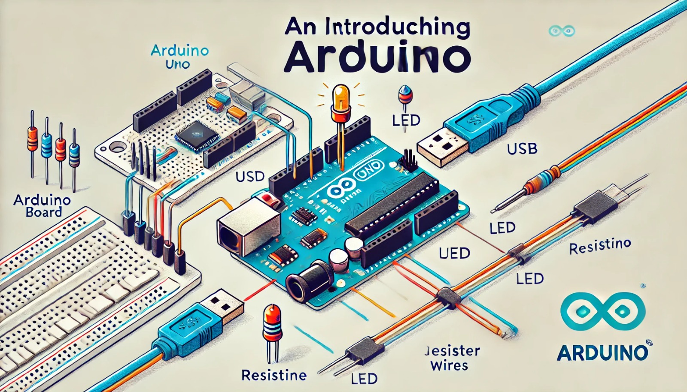

### Aula 10: Introdução ao Arduino - Configuração e Componentes Básicos

Bem-vindos à nossa décima aula! Hoje, vamos dar os primeiros passos com o Arduino, uma plataforma de prototipagem eletrônica muito popular. O Arduino permite que você crie projetos interativos, controlando sensores, motores, LEDs, e muito mais. Vamos aprender o que é o Arduino, como configurá-lo e conhecer os componentes básicos que você usará em seus projetos.

#### O que é o Arduino?

O Arduino é uma placa de microcontrolador fácil de usar, projetada para simplificar o desenvolvimento de projetos eletrônicos. Ele é amplamente utilizado por iniciantes e profissionais devido à sua versatilidade e ao suporte de uma vasta comunidade online.

**Principais características do Arduino:**
- **Microcontrolador:** Um pequeno computador que pode ser programado para controlar vários dispositivos eletrônicos.
- **Entradas e Saídas (I/O):** Permite que o Arduino se conecte a sensores, LEDs, botões, motores, etc.
- **Alimentação:** Pode ser alimentado por uma fonte de energia externa, como uma bateria, ou via USB.

#### Configuração Inicial do Arduino

1. **Escolha da Placa:** O modelo mais comum é o Arduino Uno, mas existem outros como o Arduino Nano, Mega, etc.
2. **Instalação do Software:** 
   - Faça o download do Arduino IDE (Integrated Development Environment) do site oficial https://www.arduino.cc.
   - Instale o software no seu computador.
3. **Conexão da Placa:**
   - Conecte a placa Arduino ao seu computador usando um cabo USB.
   - Abra o Arduino IDE e selecione a porta correta e o modelo da sua placa em "Ferramentas".
4. **Carregar um Código de Exemplo:**
   - No Arduino IDE, vá em "Arquivo" > "Exemplos" > "01.Basics" > "Blink".
   - Este código pisca um LED na placa. Clique em "Carregar" para enviar o código para o Arduino.
   - Se tudo estiver configurado corretamente, o LED na placa começará a piscar.

#### Componentes Básicos do Arduino

1. **LEDs:**
   - **O que é:** Um LED (Diodo Emissor de Luz) é um componente que emite luz quando a corrente elétrica passa por ele.
   - **Uso:** Você pode controlar quando um LED acende ou apaga através do Arduino.

2. **Resistores:**
   - **O que é:** Resistores limitam a quantidade de corrente que flui em um circuito.
   - **Uso:** Quando conectado a um LED, evita que o LED queime ao limitar a corrente.

3. **Sensores:**
   - **O que é:** Sensores detectam mudanças no ambiente, como temperatura, luz ou movimento.
   - **Uso:** Você pode usar sensores para que o Arduino reaja ao ambiente ao seu redor. Por exemplo, um sensor de temperatura pode ser usado para acionar um ventilador.

4. **Botões:**
   - **O que é:** Botões são componentes que permitem ao usuário enviar comandos para o Arduino.
   - **Uso:** Um botão pode ser usado para ligar ou desligar um LED, ou para iniciar uma sequência de ações.

5. **Motores:**
   - **O que é:** Motores convertem energia elétrica em movimento.
   - **Uso:** Você pode controlar a velocidade e a direção de motores usando o Arduino, útil para criar robôs ou veículos automatizados.

### Projeto Prático: Piscar um LED

Vamos criar um simples circuito para piscar um LED:

1. **Materiais Necessários:** Placa Arduino, LED, resistor de 220Ω, cabos jumper.
2. **Montagem:**
   - Conecte o anodo (perna longa) do LED ao pino digital 13 do Arduino.
   - Conecte o cátodo (perna curta) do LED a um resistor.
   - Conecte a outra extremidade do resistor ao pino GND do Arduino.
3. **Código:**
   - No Arduino IDE, abra o exemplo "Blink" e carregue o código para o Arduino.
   - O LED deve piscar em intervalos regulares.

### Conclusão

O Arduino é uma plataforma poderosa e acessível que permite criar uma vasta gama de projetos eletrônicos. Nesta aula, você aprendeu a configurar o Arduino e a trabalhar com componentes básicos. Esses conceitos são fundamentais para explorar projetos mais complexos no futuro. Continue praticando e experimentando diferentes combinações de componentes para expandir seu conhecimento! Na próxima aula, vamos aprofundar nosso conhecimento em programação no Arduino. Até lá!