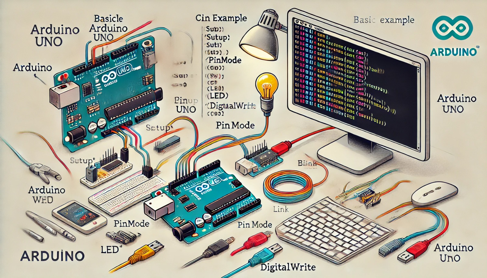

### Aula 11: Noções Básicas de Programação em C++ para Arduino

Bem-vindos à nossa décima primeira aula! Hoje, vamos aprender os conceitos básicos de programação em C++ para o Arduino. O Arduino utiliza a linguagem C++, que é uma das linguagens de programação mais populares e poderosas para controlar dispositivos eletrônicos. Vamos ver como usar essa linguagem para criar programas que controlam o comportamento do Arduino.

#### O que é C++?

C++ é uma linguagem de programação que permite escrever códigos para controlar os componentes conectados ao Arduino, como LEDs, sensores, e motores. A programação no Arduino envolve a escrita de "esboços" (ou "sketches"), que são basicamente programas simples que instruem o Arduino a executar ações específicas.

#### Estrutura Básica de um Programa Arduino

Todo programa para Arduino tem duas partes principais:

1. **void setup():**
   - Essa função é executada uma única vez, logo que o Arduino é ligado. É aqui que você configura os pinos e define os componentes que o Arduino vai controlar.
   - Exemplo:
     ```cpp
     void setup() {
       pinMode(13, OUTPUT);  // Configura o pino 13 como saída
     }
     ```

2. **void loop():**
   - Essa função é executada repetidamente em um ciclo infinito, enquanto o Arduino estiver ligado. Aqui é onde você coloca as instruções para o que o Arduino deve fazer continuamente.
   - Exemplo:
     ```cpp
     void loop() {
       digitalWrite(13, HIGH);  // Liga o LED no pino 13
       delay(1000);             // Aguarda 1 segundo
       digitalWrite(13, LOW);   // Desliga o LED no pino 13
       delay(1000);             // Aguarda 1 segundo
     }
     ```

#### Comandos Básicos

Aqui estão alguns comandos essenciais para programação no Arduino:

1. **pinMode(pino, modo):**
   - Define se um pino será usado como entrada (INPUT) ou saída (OUTPUT).
   - Exemplo: `pinMode(13, OUTPUT);`

2. **digitalWrite(pino, valor):**
   - Define o valor de um pino digital como ALTO (HIGH) ou BAIXO (LOW).
   - Exemplo: `digitalWrite(13, HIGH);` (liga o pino 13)

3. **digitalRead(pino):**
   - Lê o valor de um pino digital. Pode ser HIGH (ligado) ou LOW (desligado).
   - Exemplo: `int valor = digitalRead(2);` (lê o valor do pino 2)

4. **delay(ms):**
   - Pausa o programa por um número específico de milissegundos.
   - Exemplo: `delay(1000);` (pausa por 1 segundo)

#### Exemplo Prático: Piscar um LED

Vamos criar um código simples para fazer um LED piscar usando o Arduino:

1. **Montagem:**
   - Conecte um LED ao pino digital 13 e ao GND (terra).

2. **Código:**
   ```cpp
   void setup() {
     pinMode(13, OUTPUT);  // Configura o pino 13 como saída
   }

   void loop() {
     digitalWrite(13, HIGH);  // Liga o LED
     delay(1000);             // Espera 1 segundo
     digitalWrite(13, LOW);   // Desliga o LED
     delay(1000);             // Espera 1 segundo
   }
   ```

3. **O que está acontecendo:**
   - O LED é ligado por 1 segundo, depois desligado por 1 segundo. Isso continua em um loop infinito.

#### Comentários no Código

Os comentários são linhas que não são executadas pelo Arduino, mas servem para explicar o que o código faz. Eles são precedidos por `//` no início da linha.

#### Variáveis

As variáveis são usadas para armazenar valores que podem ser utilizados no programa. Existem diferentes tipos de variáveis, como `int` para números inteiros e `float` para números com decimais.

**Exemplo:**
```cpp
int ledPin = 13;  // Variável que armazena o pino do LED

void setup() {
  pinMode(ledPin, OUTPUT);  // Configura o pino armazenado na variável ledPin
}

void loop() {
  digitalWrite(ledPin, HIGH);  // Liga o LED
  delay(1000);                 // Aguarda 1 segundo
  digitalWrite(ledPin, LOW);   // Desliga o LED
  delay(1000);                 // Aguarda 1 segundo
}
```

#### Conclusão

Esses são os conceitos básicos de programação em C++ para o Arduino. Através de comandos simples como `pinMode()`, `digitalWrite()`, e `delay()`, você pode controlar dispositivos eletrônicos e criar projetos interativos.