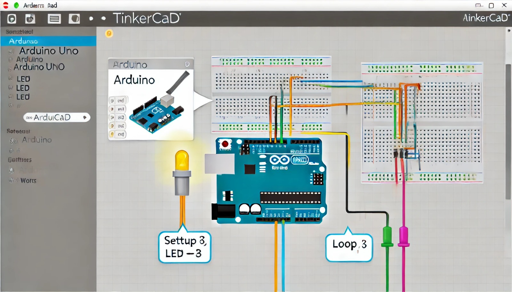

### Aula 12: Prática no Tinkercad - Programação de um Circuito Simples com Arduino

Nesta aula, vamos colocar em prática o que aprendemos sobre o Arduino, usando o **Tinkercad** para criar e programar um circuito simples. Utilizaremos um **LED**, um **resistor** e uma **placa de ensaio (breadboard)** para organizar o circuito e garantir que tudo funcione corretamente. O objetivo é fazer o LED piscar utilizando o Arduino e um código básico.

#### O que Vamos Fazer?

- Vamos criar um circuito simples onde o Arduino controlará o piscar de um LED.
- Usaremos o Tinkercad para simular e programar esse circuito.
- Você aprenderá como conectar componentes corretamente e como usar um resistor para proteger o LED.

#### Configurando o Tinkercad

1. **Acesse o Tinkercad:**
   - Vá para [tinkercad.com](https://www.tinkercad.com) no seu navegador.
   - Faça login ou crie uma conta, caso ainda não tenha.

2. **Criar um Novo Circuito:**
   - Clique em "Criar novo circuito" no painel de controle.

3. **Adicionar Componentes:**
   - Arraste uma **placa Arduino Uno** e uma **placa de ensaio (breadboard)** para o espaço de trabalho.
   - Adicione um **LED** e um **resistor de 220Ω** à breadboard.
   - **Conexões:**
     - Conecte o pino digital 13 do Arduino ao resistor na breadboard.
     - Conecte o outro terminal do resistor ao anodo (perna longa) do LED.
     - Conecte o cátodo (perna curta) do LED ao GND (terra) do Arduino.

4. **Programando o Arduino no Tinkercad:**
   Agora que o circuito está montado, vamos programar o Arduino para controlar o LED.

   **Código para piscar o LED:**
   ```cpp
   void setup() {
     pinMode(13, OUTPUT);  // Configura o pino 13 como saída
   }

   void loop() {
     digitalWrite(13, HIGH);  // Liga o LED
     delay(1000);             // Aguarda 1 segundo
     digitalWrite(13, LOW);   // Desliga o LED
     delay(1000);             // Aguarda 1 segundo
   }
   ```

   **O que o código faz:**
   - **setup():** Configura o pino 13 como saída, o que permite que o Arduino controle o LED.
   - **loop():** Liga o LED (`HIGH`), espera 1 segundo, desliga o LED (`LOW`), e repete o ciclo.

5. **Simulação:**
   - Clique em "Iniciar Simulação" no Tinkercad.
   - O LED deve começar a piscar de acordo com o código que você programou.

#### Modificações no Circuito

Agora que o circuito básico está funcionando, vamos fazer algumas modificações para torná-lo mais interessante:

1. **Alterar o Tempo de Piscar:**
   - Modifique o tempo de espera no comando `delay(1000)` para `delay(500)` e veja o LED piscar mais rapidamente.
   
2. **Adicionar mais LEDs:**
   - Adicione outro LED à breadboard e conecte-o ao pino digital 12 do Arduino.
   - No código, adicione uma linha para configurar o pino 12 como saída:
     ```cpp
     pinMode(12, OUTPUT);
     ```

3. **Piscar LEDs Alternadamente:**
   - Experimente programar para que os dois LEDs pisquem alternadamente, usando o `digitalWrite()` para ligar e desligar os LEDs em diferentes tempos.

#### Conclusão

O Tinkercad é uma ferramenta incrível para aprender e testar circuitos Arduino de forma simples e segura. Hoje, você aprendeu a montar um circuito com um LED e a programá-lo para piscar. Com essas habilidades, você pode continuar experimentando novos circuitos e ideias.

Continue praticando e explorando as possibilidades do Tinkercad! Na próxima aula, exploraremos sensores e motores para projetos mais interativos.