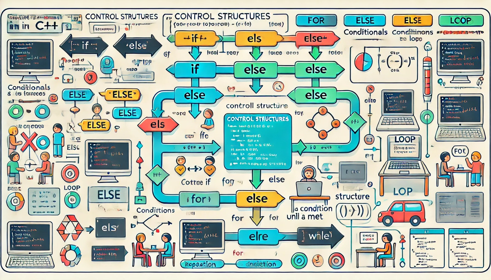

### Aula 13: Estruturas de Controle em C++ (Condicionais e Loops)

Bem-vindos à nossa décima terceira aula! Hoje vamos aprender sobre as **estruturas de controle** em C++, que são usadas para tomar decisões no código e executar ações repetidas. Elas são fundamentais para criar programas mais interativos e inteligentes.

#### O que são Estruturas de Controle?

As estruturas de controle permitem que você controle o fluxo de execução do seu programa, ou seja, decida **o que** e **quando** algo deve acontecer. As duas principais estruturas de controle são:

1. **Condicionais (if, else if, else)**
2. **Loops (while, for)**

#### 1. Condicionais

As estruturas condicionais permitem que seu programa tome decisões com base em determinadas condições. O código executa uma ação apenas se a condição for verdadeira.

- **if:** Executa um bloco de código se a condição for verdadeira.
- **else if:** Fornece uma alternativa caso a primeira condição seja falsa.
- **else:** Executa um bloco de código se todas as condições anteriores forem falsas.

**Exemplo:**
```cpp
int valor = 10;

if (valor > 5) {
  // Se o valor for maior que 5, esta linha será executada
  Serial.println("Valor é maior que 5");
} else if (valor == 5) {
  // Se o valor for exatamente 5, esta linha será executada
  Serial.println("Valor é igual a 5");
} else {
  // Se nenhuma das condições anteriores for verdadeira, esta linha será executada
  Serial.println("Valor é menor que 5");
}
```

**Explicação:**
- O programa verifica se `valor` é maior que 5. Se for, ele imprime "Valor é maior que 5".
- Se não for, ele verifica se `valor` é igual a 5. Se for, imprime "Valor é igual a 5".
- Se ambas as condições forem falsas, o código no `else` será executado, imprimindo "Valor é menor que 5".

#### 2. Loops

Os loops são usados para repetir uma parte do código várias vezes, até que uma determinada condição seja satisfeita.

- **while:** Repete o código enquanto a condição for verdadeira.
  
**Exemplo de while:**
```cpp
int contador = 0;

while (contador < 5) {
  // Este código será repetido enquanto 'contador' for menor que 5
  Serial.println("Contando: " + String(contador));
  contador++;  // Incrementa o valor de 'contador'
}
```
Neste exemplo, o loop imprime os números de 0 a 4, pois ele repete enquanto `contador` for menor que 5.

- **for:** Usado quando você sabe com antecedência quantas vezes deseja repetir o código.

**Exemplo de for:**
```cpp
for (int i = 0; i < 5; i++) {
  // Este código será repetido 5 vezes
  Serial.println("Valor de i: " + String(i));
}
```
Neste exemplo, o código dentro do loop é repetido 5 vezes. A variável `i` começa em 0 e é incrementada até chegar a 5.

#### Aplicação Prática

Vamos ver como usar condicionais e loops juntos em um programa para o Arduino:

**Exemplo: Controle de um LED com Condicional e Loop:**
```cpp
int ledPin = 13;
int estado = LOW;  // Começa com o LED desligado

void setup() {
  pinMode(ledPin, OUTPUT);
}

void loop() {
  // Condição para alternar o estado do LED
  if (estado == LOW) {
    estado = HIGH;  // Liga o LED
  } else {
    estado = LOW;   // Desliga o LED
  }

  digitalWrite(ledPin, estado);  // Aplica o novo estado ao LED
  delay(1000);  // Aguarda 1 segundo antes de repetir o loop
}
```

Neste exemplo, o LED é alternado entre ligado e desligado a cada segundo, graças à estrutura condicional `if`.

#### Conclusão

As estruturas de controle são essenciais para criar programas dinâmicos e interativos. Elas permitem que você tome decisões e repita ações no código de forma eficiente. Pratique utilizando **if**, **else if**, **else**, **while** e **for** em seus projetos para entender como essas estruturas controlam o fluxo do programa.

Na próxima aula, exploraremos como combinar essas estruturas para criar projetos mais complexos!